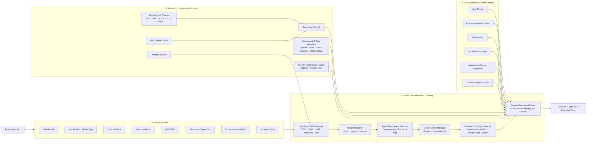
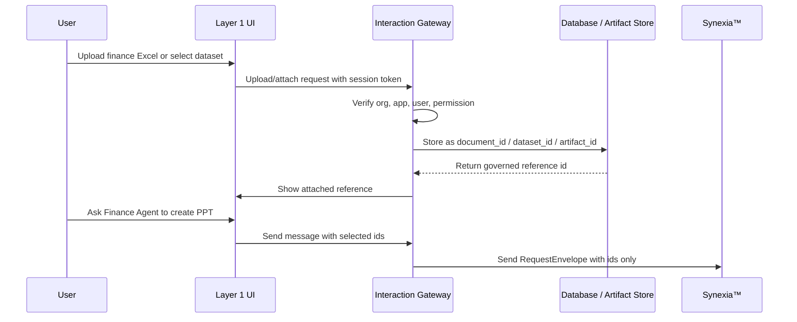
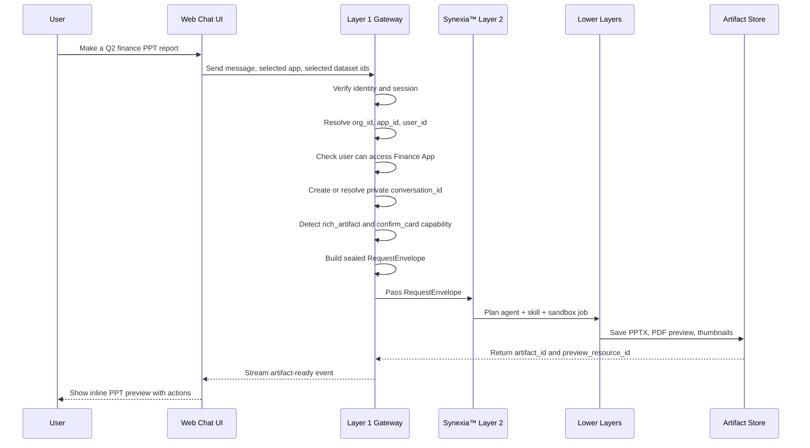

# Zhanlu™ Layer 1 — Enterprise Interaction & Identity Layer

**Version:** 1.1  
**Status:** Gao-review corrected implementation-ready draft  
**Owner:** Zhanlu™ / Synexia™ Enterprise AI Operating System  
**Layer Position:** Layer 1 of the Zhanlu™ Enterprise AI Operating System  
**Primary Function:** Enterprise entry point, identity resolution, workspace selection, conversation isolation, channel normalization, artifact preview, and governed handoff into Synexia™  

---

## 0. Executive Summary

Layer 1 is the governed interaction doorway of Zhanlu™. It is not the AI brain and it does not execute business logic. Its responsibility is to make every user interaction, from web, mobile, voice, API, plugins, embedded widgets, and business systems, enter Zhanlu™ through one secure, tenant-aware, permission-checked, and channel-normalized gateway.

The correct Layer 1 design principle is:

> **Anywhere, any device, one governed identity, one request envelope, one artifact experience.**

Layer 1 must make sure that every request entering Synexia™ already contains verified identity, tenant scope, app scope, conversation ownership, channel capability, user preferences, and attachment or artifact references. It must never pass uncontrolled raw local file paths, client-supplied identity fields, or unverified workspace context into the AI core.

---

## 1. Layer 1 Core Meaning

Layer 1 should be named:

> **Enterprise Interaction & Identity Layer**  
> **Anywhere · Any Device · One Governed Entry Point**

This layer covers:

1. Multi-channel user access.
2. Enterprise identity and tenant resolution.
3. App/workspace selection.
4. Per-user private conversation management.
5. Unified `RequestEnvelope` creation.
6. Channel capability detection.
7. Inline artifact preview and interaction.
8. Attachment and data ingestion.
9. Human confirmation cards.
10. Personalization and user context.
11. Admin console entry surface.

Layer 1 should not be described as only a UI layer. It is a **governed interaction gateway**.

---

## 2. Normative Scope Chain

All Layer 1 requests must resolve to this scope chain:

```text
Platform → Enterprise / Organization → App / Workspace → Conversation → RequestEnvelope
```

### 2.1 Scope Definitions

| Scope | Meaning | Isolation Rule |
|---|---|---|
| Platform | Zhanlu™ system operated by SYNEXIA | Platform operators do not receive normal tenant content access |
| Enterprise / Organization | The hard enterprise boundary | No data crosses `org_id` |
| App / Workspace | Shared or personal working area | App-owned data is scoped by `(org_id, app_id)` |
| Conversation | User-owned private chat/session | Conversation is owned by one `user_id` |
| RequestEnvelope | Sealed request passed to Synexia™ | Built server-side only, never trusted from client body |

### 2.2 Company App and Personal App

Zhanlu™ supports two workspace types:

| App Type | Owner | Access Model | Conversation Privacy | Execution Output Default |
|---|---|---|---|---|
| Company App | Enterprise/admin-created | Shared by user/group grants | Private to each user | App-shared by default |
| Personal App | User-created | Owner-only | Private to owner | Owner-only unless org policy changes |

Important rule:

> **Conversations are private drafts. Execution outputs are shared records inside company apps unless org policy says otherwise.**

Example: Two users may both access the Finance App, but they cannot read each other’s private conversations. However, a generated finance report, dashboard, alert, or PPT artifact may become part of the shared Finance App execution surface if created under a company app policy.

---

## 3. Layer 1 Full Architecture Diagram



---

## 4. Layer 1 Component Model

## 4.1 Channel Access Adapters

Layer 1 begins with many channels, but all channels must behave as thin adapters. They normalize inbound messages into a shared format and project outbound events back to the user.

### Supported Channel Types

| Channel | Purpose | Priority | Required Capabilities |
|---|---|---|---|
| Web Portal | Main enterprise workspace | P0 | Streaming chat, artifact preview, confirmation cards, upload |
| Mobile Web / Mobile App | Mobile access | P0/P1 | Chat, preview, notifications, confirmation |
| Chat Interface | Main conversational interface | P0 | Streaming, rich cards, artifact actions |
| Voice Interface | Voice input/output | P2 | ASR, TTS, transcript confirmation |
| API / SDK | Developer and system integration | P1 | REST, WebSocket/SSE, scoped service actors |
| Plugins & Connectors | External system connection | P1/P2 | Data handles, tool handles, scoped permissions |
| Embedded AI Widget | Zhanlu inside third-party product | P3 | iframe/JS SDK, scoped token, limited artifact preview |
| Business Apps | ERP/CRM/OA/BPM triggers | P2 | Event adapter, notification, approval handoff |

### Channel Rule

> **No channel has a direct logic path into Synexia™. Every channel must pass through the Enterprise Interaction Gateway and produce a validated `RequestEnvelope`.**

---

## 4.2 Identity & SSO Gateway

The Identity & SSO Gateway verifies who the user is before any AI or workspace action begins.

### Responsibilities

- Authenticate the user.
- Resolve `org_id`.
- Resolve `user_id`.
- Resolve user role.
- Resolve group memberships.
- Resolve enterprise app grants.
- Issue and validate sessions.
- Support enterprise login methods.
- Reject client-supplied identity fields.

### Recommended Technologies

| Function | Recommended Technology |
|---|---|
| Enterprise SSO | OIDC, OAuth 2.0, SAML 2.0 |
| Strong authentication | MFA, WebAuthn, passkeys |
| Session token | JWT access token + refresh token |
| API authentication | Scoped API keys, service actors |
| Session/device tracking | `sessions` table, device fingerprint metadata |
| Rate limiting | Redis-backed rate limiting |

### Identity Invariant

```text
Client body identity is never trusted.
actor, org_id, user_id, role, and grants are resolved by the server gateway.
```

If a client request contains `actor`, `org_id`, `user_id`, or role fields in the body, Layer 1 must discard those fields and log the attempt.

---

## 4.3 Tenant Resolver

The Tenant Resolver converts authenticated identity into enterprise scope.

### Required Resolved Fields

```text
org_id
user_id
roles
group_ids
can_audit_conversations
locale
deployment_tier
allowed_app_ids
```

`group_ids` must also be carried in the server-sealed `Actor` object so that later policy evaluation can support group-aware rules without re-resolving identity inside Synexia™.

### Tenant Rule

> **Enterprise is the hard isolation wall. Nothing crosses `org_id`.**

Layer 1 must not allow a user to probe another organization’s app, conversation, artifact, document, memory, or agent context.

---

## 4.4 App & Workspace Switcher

The App & Workspace Switcher presents only the apps the user is allowed to access.

### App Visibility Rule

```text
GET /apps = server-side projection of effective_apps(user)
```

Ungrantable or inaccessible apps must not be sent to the client. Direct probing of an inaccessible app should return **404**, not 403, so the system does not confirm the app exists.

### App Types

| Type | Creation | Access | Admin Data Path |
|---|---|---|---|
| Company App | Admin-created | User/group grant | Audit path only, if configured |
| Personal App | User-created | Owner only | No admin read path |

### UI Requirements

The app switcher should show:

- Company apps granted to the user.
- Personal apps owned by the user, if allowed by org policy.
- Current app name.
- Current app type.
- Current role/capability indicator.
- Recent artifacts/execution outputs for the current app.

---

## 4.5 Conversation Manager

The Conversation Manager creates and retrieves user-owned conversations.

### Rules

```text
conversation_id is owned by exactly one user_id.
A user can read only their own conversations.
Company app conversations are private drafts.
Personal app conversations are private and not audit-readable.
Admin audit reads use a dedicated audit API only.
```

### Conversation Metadata

Recommended fields:

```text
conversation_id
org_id
app_id
user_id
title
status
created_at
updated_at
last_message_at
channel_origin
```

### Conversation Privacy Rule

> **Shared company app does not mean shared conversations.**

This protects user privacy while still allowing the company app to maintain shared execution outputs, dashboards, reports, and artifacts.

---

## 4.6 Channel Capability Detector

Not every channel supports the same interaction type. Before sending a request to Synexia™, Layer 1 must record the channel’s capabilities.

### Capability Flags

```text
stream
rich_artifact
confirm_card
audio
file_upload
plain_text
notification
inline_edit
```

### Example Capability Matrix

| Channel | stream | rich_artifact | confirm_card | audio | file_upload |
|---|---:|---:|---:|---:|---:|
| Web Portal | Yes | Yes | Yes | Optional | Yes |
| Mobile Web | Yes | Partial | Yes | Optional | Yes |
| WeCom/DingTalk Bot | Partial | Limited | Template card | No | Limited |
| Voice | No | No | No | Yes | No |
| API/SDK | Event stream | JSON artifact ref | API confirm | No | Yes |
| Embedded Widget | Yes | Limited | Yes | No | Limited |

### Confirm Gate Rule

If a task requires confirmation but the originating channel cannot show a confirmation card, Layer 1 routes the confirmation to the user’s most capable channel, usually the web portal.

Example:

```text
Voice user: “Submit this approval.”
Layer 1: Voice cannot confirm high-impact write.
System: “I sent a confirmation card to your web portal. Please approve it there.”
```

---

## 4.7 Unified RequestEnvelope Builder

The `RequestEnvelope` is the most important Layer 1 contract. It is the sealed object passed from Layer 1 into Synexia™.

### RequestEnvelope Contract

```python
from datetime import datetime
from typing import Literal
from uuid import UUID
from pydantic import BaseModel

class Actor(BaseModel):
    user_id: UUID
    org_id: UUID
    roles: list[str]
    group_ids: list[UUID] = []
    can_audit_conversations: bool
    display_name: str
    locale: Literal["zh-CN", "en"]

class ChannelInfo(BaseModel):
    channel: Literal[
        "web",
        "mobile_web",
        "wecom",
        "dingtalk",
        "voice",
        "api",
        "embedded",
        "business_app"
    ]
    capabilities: set[Literal[
        "stream",
        "rich_artifact",
        "confirm_card",
        "audio",
        "file_upload",
        "plain_text",
        "notification",
        "inline_edit"
    ]]
    client_ref: str | None = None

class PreferenceSnapshot(BaseModel):
    response_format: dict
    notification_prefs: dict
    default_app_id: UUID | None = None

class RequestEnvelope(BaseModel):
    envelope_id: UUID
    actor: Actor
    channel: ChannelInfo
    app_id: UUID
    conversation_id: UUID | None
    preferences: PreferenceSnapshot
    history_ref: UUID | None
    payload: str
    attachments: list[UUID] = []
    selected_artifacts: list[UUID] = []
    selected_datasets: list[UUID] = []
    received_at: datetime
```

### RequestEnvelope Rules

1. `actor` is resolved by the gateway.
2. `org_id` is never client supplied.
3. `app_id` must exist in `effective_apps(actor)`.
4. `conversation_id` must be owned by `actor.user_id`.
5. Attachments must be database/artifact IDs, not local file paths.
6. Preferences are snapshotted before sending into Synexia™.
7. Channel capabilities are explicit.
8. Envelope is immutable after sealing.

---

## 4.8 Inline Artifact Experience

The inline artifact experience is a first-class part of Layer 1.

When a user asks an agent to create a PPT, DOCX, PDF, XLSX, chart, report, dashboard, or recommendation, lower layers generate the artifact. Layer 1 displays and manages the interaction experience around that artifact.

### Supported Artifact Types

| Artifact Type | Example | Preview Strategy |
|---|---|---|
| PPTX | Finance report deck | Convert to PDF/images, preview in chat |
| PDF | Formal report | PDF.js inline viewer |
| DOCX | Proposal, contract draft | PDF preview or ONLYOFFICE viewer |
| XLSX | Finance table, KPI sheet | Table preview + download/export |
| Chart | Revenue trend, risk chart | Image/SVG preview |
| Dashboard | Business monitoring view | Embedded secure iframe |
| Markdown/HTML | AI-generated report | Sanitized inline rendering |

### Artifact Actions

Layer 1 should support these user actions:

```text
Preview
Open full screen
Regenerate
Edit instruction
Approve
Reject
Export
Download
Share inside app
Send for review
View version history
```

### Artifact Storage Rule

> **Database is the source of truth. Layer 1 never treats the server disk as authoritative. In strict DB-first deployments, artifact binaries are stored in PostgreSQL `bytea` or Large Object records. In large enterprise deployments, encrypted object storage may hold binary blobs only when PostgreSQL remains the authority for metadata, permissions, versioning, checksums, signed preview access, and audit trail. Sandbox filesystems are temporary only.**

Layer 1 receives and displays:

```text
artifact_id
artifact_version_id
preview_resource_id
signed_preview_url or streamed preview response
```

It does not receive uncontrolled filesystem paths.

---

## 4.9 Attachment & Data Ingestion UI

Layer 1 must allow users to attach files, select datasets, paste content, or link existing artifacts to a request.

### Ingestion Methods

```text
Upload file
Paste table/text
Select existing dataset
Attach previous artifact
Connect enterprise datasource
Select database table/query through authorized UI
```

### Database-First Ingestion Flow



### Ingestion Rule

```text
Agents receive references, not raw local file paths.
Skills receive scoped handles, not credentials.
Sandbox receives temporary data packages, not permanent storage authority.
```

---

## 4.10 Human Confirmation Cards

Layer 1 must provide user-facing confirmation before high-impact writes or workflow actions.

### Confirmation Card Fields

```text
confirmation_id
action_title
action_type
requesting_agent
app_id
org_id
affected_data
risk_level
summary_of_change
required_permission
expires_at
approve_action
reject_action
edit_action
```

### Confirmation Required For

```text
Publishing an artifact
Submitting approval
Sending external email
Writing to enterprise system
Changing data
Triggering workflow
Running high-impact skill
Sharing artifact with app users
Deleting or archiving record
```

### Rule

> **No unconfirmed write.**

If a channel cannot confirm, the confirmation must be routed to a capable channel.

---

## 4.11 Personalization & User Context

Layer 1 should collect and snapshot lightweight personalization context. It should not perform deep reasoning. The snapshot is passed to Layer 2 for deterministic rendering and context selection.

### User Context Fields

```text
User Profile
Role & Permission
Preferences
Locale
Notification settings
Default app
Recent conversation reference
Interaction history reference
Device/session state
```

### Personalization Rule

Preferences should be applied deterministically where possible. For example, response formatting preferences should be used during final rendering and UI projection, not only as loose prompt instructions.

---

## 4.12 Admin Console Surface

The Admin Console is part of Layer 1 because it is the user-facing governance surface.

It should be the same frontend application, with role-gated views.

### Admin Console Functions

```text
Users
Groups
Apps
App grants
Skill review queue
Audit log
Conversation audit API screen
Retention policy
Personal app policy
Deployment tier settings
Security settings
```

### Admin Rule

> **Admin UI is not a bypass. Admin UI consumes the same authorization and audit APIs as every other interface.**

---

## 5. Finance PPT Example: Layer 1 Flow

User request:

```text
Finance Agent, make a Q2 finance PPT report for me.
```

Layer 1 behavior:



Layer 1 must show the result as an inline artifact card:

```text
Q2 Finance Report.pptx
Status: Ready
Preview: available
Actions: Open · Regenerate · Edit instruction · Approve · Export
```

---

## 6. Layer 1 Data Model Additions

Layer 1 depends on the core tenancy tables, but should also include interaction-specific tables.

### 6.1 Core Identity and Tenancy Tables

```text
organizations
users
groups
group_members
apps
app_grants
conversations
user_preferences
audit_log
```

### 6.2 Recommended Layer 1 Interaction Tables

```sql
CREATE TABLE sessions (
    id UUID PRIMARY KEY,
    org_id UUID NOT NULL,
    user_id UUID NOT NULL,
    channel TEXT NOT NULL,
    device_label TEXT,
    ip_hash TEXT,
    user_agent_hash TEXT,
    status TEXT NOT NULL DEFAULT 'active',
    created_at TIMESTAMPTZ NOT NULL DEFAULT now(),
    last_seen_at TIMESTAMPTZ NOT NULL DEFAULT now()
);

CREATE TABLE request_envelopes (
    id UUID PRIMARY KEY,
    org_id UUID NOT NULL,
    app_id UUID NOT NULL,
    user_id UUID NOT NULL,
    conversation_id UUID,
    channel TEXT NOT NULL,
    capability_snapshot JSONB NOT NULL,
    preference_snapshot JSONB NOT NULL,
    payload_hash TEXT NOT NULL,
    attachment_ids UUID[] NOT NULL DEFAULT '{}',
    selected_artifact_ids UUID[] NOT NULL DEFAULT '{}',
    selected_dataset_ids UUID[] NOT NULL DEFAULT '{}',
    status TEXT NOT NULL DEFAULT 'sealed',
    created_at TIMESTAMPTZ NOT NULL DEFAULT now()
);

CREATE TABLE artifact_interactions (
    id UUID PRIMARY KEY,
    org_id UUID NOT NULL,
    app_id UUID NOT NULL,
    user_id UUID NOT NULL,
    conversation_id UUID,
    artifact_id UUID NOT NULL,
    artifact_version_id UUID,
    action TEXT NOT NULL,
    -- preview_opened | regenerate_requested | approved | rejected | exported | shared | downloaded
    created_at TIMESTAMPTZ NOT NULL DEFAULT now()
);

CREATE TABLE confirmation_requests (
    id UUID PRIMARY KEY,
    org_id UUID NOT NULL,
    app_id UUID NOT NULL,
    user_id UUID NOT NULL,
    conversation_id UUID,
    action_type TEXT NOT NULL,
    requesting_agent_id UUID,
    risk_level TEXT NOT NULL DEFAULT 'low',
    summary JSONB NOT NULL,
    status TEXT NOT NULL DEFAULT 'pending',
    -- pending | approved | rejected | expired | cancelled
    expires_at TIMESTAMPTZ,
    created_at TIMESTAMPTZ NOT NULL DEFAULT now(),
    resolved_at TIMESTAMPTZ
);
```

---

## 7. Layer 1 API Surface

### App and Workspace

```text
GET    /apps
GET    /apps/{app_id}
POST   /apps/{app_id}/conversations
GET    /apps/{app_id}/conversations
GET    /conversations/{conversation_id}
```

### Interaction Gateway

```text
POST   /gateway/message
GET    /gateway/events/{conversation_id}          # conversation-scoped projection stream
WS     /gateway/ws/{conversation_id}              # primary UI stream; multiplexes execution events
GET    /executions/{execution_id}/events          # per-execution SSE, mainly for API/SDK clients
```

Stream topology rule: the web and mobile UI should primarily use the conversation-scoped WebSocket because one conversation may contain multiple executions and artifact events. The per-execution SSE endpoint is retained for API/SDK clients, automation clients, and debugging.

### Attachment and Artifact

```text
POST   /apps/{app_id}/attachments
GET    /artifacts/{artifact_id}/preview
GET    /artifacts/{artifact_id}/versions
POST   /artifacts/{artifact_id}/actions/regenerate
POST   /artifacts/{artifact_id}/actions/approve
POST   /artifacts/{artifact_id}/actions/export
```

### Confirmation

```text
GET    /confirmations/pending
POST   /confirmations/{confirmation_id}/approve
POST   /confirmations/{confirmation_id}/reject
POST   /confirmations/{confirmation_id}/edit
```

### Admin

```text
GET    /admin/users
POST   /admin/users
PATCH  /admin/users/{user_id}
GET    /admin/groups
POST   /admin/groups
GET    /admin/apps
POST   /admin/apps
POST   /admin/app-grants
DELETE /admin/app-grants/{grant_id}
GET    /admin/audit/logs
POST   /admin/audit/conversations/{conversation_id}/read
GET    /admin/skills/review-queue
POST   /admin/skills/{skill_id}/approve
```

---

## 8. Layer 1 Event Projection Contract

Layer 2 is the canonical producer of execution events. Layer 1 should not invent a competing event vocabulary. Layer 1 maps the canonical Synexia™ execution events into channel-appropriate UI projections.

### 8.1 Canonical Producer Events from Layer 2

```text
execution.started
understanding.ready
context.ready
plan.ready
gate.confirm_required
plan.edited
node.started
node.completed
node.failed
artifact.preview_ready
artifact.validation_failed
verification.ready
output.ready
execution.failed
execution.done
```

### 8.2 Layer 1 Projection Events

```text
message.delta
message.final
activity.understanding_ready
activity.context_ready
activity.plan_ready
activity.node_started
activity.node_completed
artifact.preview_ready
artifact.validation_failed
confirmation.required
confirmation.resolved
workflow.pending
workflow.completed
notification.info
error.user_recoverable
error.permission_denied
```

### 8.3 Event Mapping

| Layer 2 canonical event | Layer 1 projection |
|---|---|
| `execution.started` | `message.delta` / activity rail starts |
| `understanding.ready` | `activity.understanding_ready` |
| `context.ready` | `activity.context_ready` |
| `plan.ready` | `activity.plan_ready` |
| `gate.confirm_required` | `confirmation.required` |
| `plan.edited` | `activity.plan_ready` with new plan version |
| `node.started` | `activity.node_started` |
| `node.completed` | `activity.node_completed` |
| `node.failed` | `error.user_recoverable` or activity failure state |
| `artifact.preview_ready` | `artifact.preview_ready` |
| `artifact.validation_failed` | `artifact.validation_failed` |
| `verification.ready` | activity rail verification state |
| `output.ready` | `message.final` |
| `execution.failed` | `error.user_recoverable` or `error.execution_failed` |
| `execution.done` | final conversation state update |

### 8.4 Example Artifact Projection Event

```json
{
  "event_type": "artifact.preview_ready",
  "conversation_id": "...",
  "execution_id": "...",
  "artifact_id": "...",
  "artifact_version_id": "...",
  "artifact_type": "pptx",
  "title": "Q2 Finance Report",
  "preview": {
    "kind": "pdf",
    "preview_resource_id": "..."
  },
  "actions": ["open", "regenerate", "approve", "export"]
}
```

### 8.5 Stream Topology

```text
Primary UI stream: WS /gateway/ws/{conversation_id}
API/SDK stream:   GET /executions/{execution_id}/events
```

The conversation-scoped WebSocket multiplexes all execution, artifact, confirmation, and notification events for that conversation. The per-execution SSE endpoint remains available for API/SDK clients and debugging.

---

## 9. Layer 1 Security Rules

### Required Invariants

```text
INT-1: Actor is gateway-resolved from token; client-supplied identity fields are discarded and logged.
INT-2: App visibility is server-side projection; inaccessible resources return 404.
INT-3: Conversations are readable only by the owner or by the audited admin API path.
INT-4: Admin and member use the same application; admin capability is role-gated.
INT-5: Users and groups are both grant principals.
INT-6: Admin cannot self-elevate audit capability.
INT-7: Last active admin cannot be deactivated or demoted.
INT-8: RequestEnvelope is immutable after sealing.
INT-9: Attachments and artifacts are passed as IDs, not local paths.
INT-10: No unconfirmed write on any channel.
INT-11: Confirm gates are channel-capability aware; if the originating channel cannot confirm, the confirmation is routed to the user's most capable channel and no write occurs until approval.
```

---

## 10. Layer 1 Technology Stack

| Area | Recommended Technology |
|---|---|
| Frontend | React 19, Vite, TypeScript, Tailwind, Radix UI |
| Chat Streaming | SSE for simple streaming, WebSocket for bidirectional sessions |
| Mobile | Responsive web first, native app later |
| Identity | OIDC, OAuth 2.0, SAML 2.0, JWT, MFA, WebAuthn/passkeys |
| Gateway | FastAPI or NestJS, OpenAPI contracts, middleware-based envelope sealing |
| Session Store | PostgreSQL + Redis cache |
| App Projection | Backend authorization function, never client-only filtering |
| Artifact Preview | PDF.js, slide thumbnails, self-hosted ONLYOFFICE Docs optional, sandboxed iframe |
| Upload | Backend ingestion API, database/artifact references only |
| Notifications | Web push, email, enterprise IM bot, in-app notification center |
| Admin Console | Same frontend application, role-gated routes |
| Audit | Append-only audit table, API-first audit reads |
| Observability | Request envelope id, trace id, frontend event logs, backend structured logs |

---

## 11. What Should Appear in the Big Architecture Diagram

In the main Zhanlu™ full-system diagram, Layer 1 can remain compact, but it should be revised from:

```text
Enterprise Interaction Layer
Anywhere, Anytime, Any Device
```

to:

```text
Enterprise Interaction & Identity Layer
Anywhere · Any Device · One Governed Entry Point
```

### Existing Channel Icons to Keep

```text
Web Portal
Mobile App
Chat Interface
Voice Interface
API / SDK
Plugins & Connectors
Embedded AI
Business Apps
```

### New Small Blocks to Add

```text
Identity & Tenant Gateway
SSO · MFA · org_id · app_id · user_id

Workspace & Conversation
Company App · Personal App · Private Conversation

Inline Artifact Experience
PPT · PDF · DOCX · XLSX Preview
```

### Personalization Box Revision

Current:

```text
Personalization & User Context
User Profile · Role & Permission · Preferences · Interaction History
```

Recommended:

```text
Personalization & User Context
User Profile · Role & Permission · Preferences · Locale · Interaction History · Session State
```

---

## 12. Implementation Priority

### P0 — Required for First Working Enterprise Version

```text
Web portal interaction
JWT login
org_id / app_id / user_id resolution
GET /apps server-side projection
Private conversations
RequestEnvelope builder
Streaming chat
Basic artifact preview card
Attachment references by ID
```

### P1 — Required for Enterprise-Ready Version

```text
OIDC / SAML SSO
Groups and app grants
Admin console
Audit API
Confirmation cards
Artifact version history
API / SDK channel
WeCom / DingTalk adapter
```

### P2 — Advanced Enterprise Interaction

```text
Voice channel
Business app adapter
Notification routing
Mobile optimization
ONLYOFFICE embedded editing
Dataset selector UI
```

### P3 — Expansion

```text
Embedded AI widget
JS SDK
External customer portal embedding
Cross-application artifact sharing policy
Advanced session/device governance
```

---

## 13. Acceptance Criteria

### Identity and Tenancy

- [ ] Client-supplied `org_id`, `user_id`, or `actor` fields are discarded and logged.
- [ ] User can only see apps returned by `effective_apps(user)`.
- [ ] Direct probing of inaccessible app returns 404.
- [ ] All request envelopes include resolved `org_id`, `app_id`, `user_id`, and `conversation_id`.
- [ ] Deactivated user token fails closed.

### Conversation Privacy

- [ ] User cannot read another user’s conversation inside the same company app.
- [ ] Personal app conversations are not admin-readable.
- [ ] Company app audit read requires audited API path and justification.

### RequestEnvelope

- [ ] Every channel produces the same envelope structure.
- [ ] Envelope is sealed before Synexia™ loop begins.
- [ ] Attachments are ID references only.
- [ ] Channel capability snapshot is present.
- [ ] Preference snapshot is present.

### Artifact Experience

- [ ] PPT generation result appears as inline artifact card.
- [ ] PPT preview is shown through PDF/images or document viewer.
- [ ] Artifact version is recorded.
- [ ] Regenerate, approve, and export actions are logged.
- [ ] Artifact preview does not expose raw server file paths.

### Confirmation

- [ ] High-impact write requires confirmation.
- [ ] Plain-text or voice channel cannot bypass confirmation.
- [ ] Confirmation can be routed to web portal or another capable channel.
- [ ] No write occurs before approval.
- [ ] INT-11 is tested: a confirmation-required action from voice/plain-text creates a pending confirmation on a capable channel and does not dispatch the write node.

### Admin Console

- [ ] Admin console uses same application, not separate bypass.
- [ ] Admin actions are permission-checked and audited.
- [ ] Admin cannot self-elevate audit permission.
- [ ] Last-admin guard is enforced.

---

## 14. Repo Touch List

```text
backend/
  auth/
    models.py
    authorization.py
    sessions.py
    audit.py
  api/
    gateway.py
    apps.py
    conversations.py
    artifacts.py
    confirmations.py
    admin/
      users.py
      groups.py
      apps.py
      grants.py
      audit.py
      skills.py
  adapters/
    web.py
    api_sdk.py
    wecom.py
    dingtalk.py
    voice.py
    embedded.py
  interaction/
    envelope.py
    channel_capabilities.py
    event_stream.py
    artifact_projection.py
    confirmation_router.py
  database/
    rls/
    migrations/

frontend/
  features/
    auth/
    app-switcher/
    chat/
    artifacts/
    confirmations/
    uploads/
    notifications/
    admin/
  components/
    ArtifactCard.tsx
    ArtifactPreview.tsx
    ConfirmationCard.tsx
    AppSwitcher.tsx
    ChannelStatus.tsx
    InlinePreviewFrame.tsx
```

---

## 15. Final Layer 1 Principle

> **Layer 1 does not make AI decisions. It verifies identity, resolves tenant and app context, manages private conversations, normalizes every channel into a sealed RequestEnvelope, presents generated artifacts inline, collects user confirmations, and passes only governed, permission-checked requests into Synexia™.**

For the Finance Agent PPT example, Layer 1 is responsible for:

```text
Who is asking?
Which enterprise do they belong to?
Which app are they using?
Which conversation is private to them?
Which dataset or document did they attach?
Can this channel preview a PPT?
Does this action need confirmation?
How should the generated artifact be shown back to the user?
```

Lower layers are responsible for reasoning, agent selection, sandbox execution, database access, workflow execution, validation, and storage. Layer 1 is responsible for making the interaction safe, governed, and usable.
