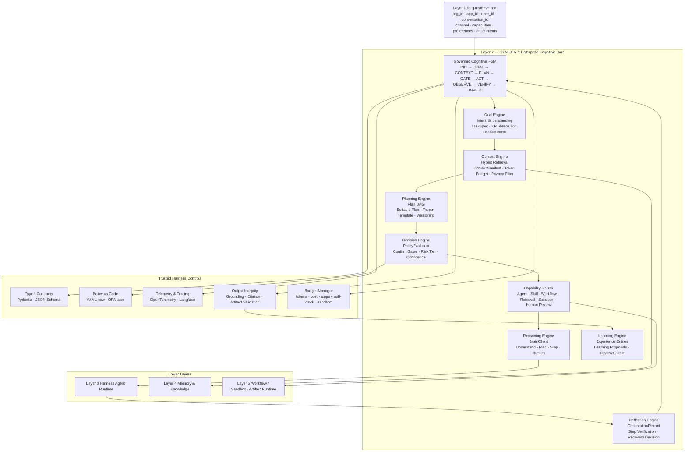
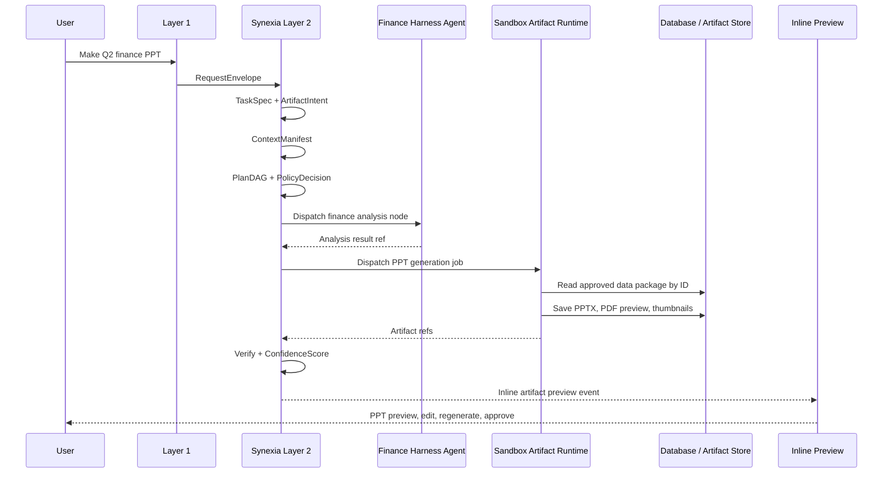

# Zhanlu™ Layer 2 — Synexia™ Enterprise Cognitive Core

## 0. Executive Summary

Layer 2 is the **Synexia™ Enterprise Cognitive Core**. It is the decision brain of Zhanlu.

Layer 2 should not be implemented as seven separate microservices or many role-play agents. It should be implemented as **one governed cognitive loop** with seven named capability engines:

1. Goal Engine  
2. Context Engine  
3. Planning Engine  
4. Reasoning Engine  
5. Decision Engine  
6. Reflection Engine  
7. Learning Engine  

The seven engines are presentation and product capabilities. In code, they are a controlled **plan-act-observe finite-state loop** inside the trusted Synexia harness. The LLM is only a swappable reasoning brain. It proposes understanding, plans, or step reasoning. The trusted harness validates, authorizes, persists, executes, observes, verifies, and finalizes.

The most important design sentence:

> **Synexia™ consumes the sealed RequestEnvelope from Layer 1, converts user intent into a typed TaskSpec, assembles project-isolated context, creates a validated and editable plan DAG, applies policy and confirmation gates, routes approved steps to Harness Agents and skills, records observations, verifies outputs, computes deterministic confidence, and captures learning proposals for human-reviewed improvement.**

---

## 1. Position in the Zhanlu System

```text
Layer 1: Enterprise Interaction & Identity Layer
  - Web, mobile, chat, voice, API, embedded, business apps
  - Identity, tenant, app, conversation, preferences
  - Produces sealed RequestEnvelope

Layer 2: Synexia™ Enterprise Cognitive Core
  - Understands, plans, decides, gates, routes, observes, verifies, learns
  - Produces typed event stream, plan DAG, policy decisions, execution requests

Layer 3: Enterprise Harness Agent Runtime
  - Finance Agent, HR Agent, Report Agent, Data Analyst Agent, Compliance Agent
  - Every agent is a Harness Agent

Layer 4: Enterprise Memory & Knowledge Layer
  - Short-term memory, long-term memory, decision memory
  - Semantic KG, kinetic KG, dynamic security KG

Layer 5: Enterprise Execution Layer
  - Workflow engine, automation engine, sandboxed artifact execution
  - PPT, DOCX, PDF, XLSX, chart and dashboard generation

Layer 6: Enterprise Platform Services
  - Security, observability, cost control, governance, model management

Layer 7: Infrastructure Layer
  - Cloud, Kubernetes, database, object/blob storage, network, GPU/CPU runtime
```

Layer 2 should never directly bypass Layer 3, Layer 4, or Layer 5. It decides and routes. It does not secretly read data, execute code, or write business records without policy gates.

---

## 2. Core Architecture Principle

### 2.1 Harness vs. Brain

```text
Trusted Harness = Synexia code
Untrusted Brain = LLM provider/model
Untrusted Skills = tenant-authored code, external tools, sandbox jobs
```

The model may propose:

```text
understanding
plan
step reasoning
replan suggestion
draft answer
```

The harness must enforce:

```text
identity
tenant scope
app scope
conversation privacy
context selection
skill access
tool access
workflow permission
sandbox boundary
output validation
artifact storage
audit logging
confidence scoring
learning approval
```

No model instruction is a security boundary.

### 2.2 One Loop, Seven Named Engines

```text
Seven engine names on the diagram.
One finite-state machine in implementation.
Every engine maps to a real artifact, contract, or harness module.
```

| Diagram Engine | Implementation Home | Main Artifact |
|---|---|---|
| Goal Engine | Brain proposal + harness parser | `TaskSpec` |
| Context Engine | Harness module | `ContextManifest` |
| Planning Engine | Brain proposal + harness validator | `PlanDAG`, `plans`, `plan_nodes` |
| Reasoning Engine | Swappable BrainClient | model step output |
| Decision Engine | Harness module | `PolicyDecision`, `ConfirmGate`, `ConfidenceScore` |
| Reflection Engine | Harness loop module | `ObservationRecord` |
| Learning Engine | Offline background workers | `experience_entries`, `learning_proposals` |

---

## 3. Modern Technology Direction

Layer 2 should be modern, but not overcomplicated. The best pattern is:

```text
thin model brain
strong harness
typed contracts
governed tool dispatch
human-in-the-loop gates
traceable executions
artifact-aware outputs
offline learning
```

### 3.1 Recommended Technology Choices

| Need | Recommended Technology | Use in Zhanlu |
|---|---|---|
| Agent loop pattern | Custom FSM first; optional LangGraph later | Controlled Synexia loop |
| Typed contracts | Pydantic v2 + JSON Schema | TaskSpec, ContextManifest, ObservationRecord |
| Plan validation | NetworkX | DAG acyclic validation |
| Policy engine | Python YAML evaluator first; OPA/Rego later | PolicyEvaluator |
| Tool interface reference | MCP-style adapter, wrapped by Zhanlu permission gates | Skill and tool standardization |
| Context retrieval | PostgreSQL + pgvector, BM25/OpenSearch, Neo4j, reranker | Context Engine |
| Observability | OpenTelemetry + Langfuse or Phoenix-style traces | Trace every brain call, plan, skill dispatch |
| Durable workflows | Celery/Dramatiq first; Temporal later | Frozen-plan pipelines and long-running jobs |
| Human-in-loop | ConfirmGate + editable plan artifact | Safe enterprise execution |
| Artifact orchestration | Layer 5 sandbox, artifact store, preview pipeline | PPT, DOCX, PDF, XLSX generation |

### 3.2 External Reference Technologies

These are reference technologies, not mandatory dependencies:

- OpenAI Agents SDK: agent loop, tools, handoffs, guardrails, structured outputs, tracing  
  https://openai.github.io/openai-agents-python/
- Google Agent Development Kit: enterprise-scale agent building, debugging, evaluation, deployment  
  https://docs.cloud.google.com/gemini-enterprise-agent-platform/build/adk
- LangGraph: durable execution, streaming, human-in-the-loop interrupts  
  https://docs.langchain.com/oss/python/langgraph/overview
- Model Context Protocol: standardized connection between LLM applications, data sources, and tools  
  https://modelcontextprotocol.io/specification/2025-06-18
- OpenTelemetry GenAI conventions: observability schema for GenAI systems  
  https://opentelemetry.io/docs/specs/semconv/gen-ai/
- Open Policy Agent: policy-as-code and Rego policy language  
  https://www.openpolicyagent.org/
- Pydantic v2: typed validation and JSON Schema generation  
  https://pydantic.dev/
- Temporal: durable execution for workflows that must survive crashes and long execution times  
  https://temporal.io/

---

## 4. Layer 2 Detailed Architecture Diagram



---

## 5. Runtime FSM

### 5.1 States

```text
INIT
  ↓
GOAL
  ↓
CONTEXT
  ↓
PLAN
  ↓
GATE
  ↓
ACT
  ↓
OBSERVE
  ├─→ ACT
  ├─→ REPLAN → PLAN
  ├─→ VERIFY → FINALIZE → DONE
  └─→ FAIL
```

### 5.2 State Responsibility

| State | Owner | Responsibility |
|---|---|---|
| `INIT` | Harness | Consume validated RequestEnvelope, open execution record, start telemetry |
| `GOAL` | Brain + Harness | Convert user request into `TaskSpec`; harness injects identity and validates KPIs/entities |
| `CONTEXT` | Harness | Build `ContextManifest` using retrieval, memory, graph, experience, skill summaries |
| `PLAN` | Brain + Harness | Generate and validate `PlanDAG`; persist versioned plan nodes |
| `GATE` | Harness + User | Evaluate plan policy, show editable plan, require confirmation if needed |
| `ACT` | Harness | Dispatch approved plan node to agent, skill, workflow, retrieval, or sandbox |
| `OBSERVE` | Harness | Record result as `ObservationRecord`; verify step result |
| `REPLAN` | Harness decides, brain proposes | Mode A only; create new plan version after recoverable deviation |
| `VERIFY` | Harness | Validate final output, artifact integrity, citations, provenance |
| `FINALIZE` | Harness | Persist output, compute confidence, render final response and artifact cards |
| `FAIL` | Harness | Structured failure surface with retained partial state |
| `DONE` | Harness | Execution complete |

### 5.3 Loop Budget

```python
class LoopBudget(BaseModel):
    max_plan_versions: int = 3
    max_steps: int = 24
    max_step_retries: int = 2
    max_wall_clock_s: int = 900
    max_llm_calls: int = 20
    max_tool_calls: int = 32
    max_sandbox_jobs: int = 4
    max_estimated_cost: float | None = None
    budget_currency: Literal["CNY", "USD"] = "CNY"
```

Budget exhaustion must fail visibly:

```text
budget_exhausted → FAIL
```

Never silently downgrade to an ungrounded answer.

---

## 6. Execution Modes

### 6.1 Mode A — Dynamic Chat Execution

Use for normal user requests.

```text
User asks → Synexia understands → context → plan → gate → act → observe → replan if needed
```

Properties:

- Brain can propose the plan.
- Brain can propose replan only when harness permits.
- User may edit the plan at GATE.
- Best for analysis, reports, PPT creation, ad-hoc tasks.

### 6.2 Mode B — Frozen Plan Execution

Use for automations and repeatable enterprise workflows.

```text
Human-approved template plan → scheduled/triggered run → GATE → ACT → OBSERVE → VERIFY
```

Properties:

- Brain cannot control workflow structure.
- No replan in Mode B.
- If the run fails, create a `template_revision` learning proposal.
- Best for weekly reports, monthly finance analysis, routine alerts, recurring compliance checks.

### 6.3 Artifact Execution Profile, not a third mode

PPT, DOCX, PDF, dashboard, and other high-value deliverables do **not** require a separate FSM mode. They are **Mode A dynamic executions with non-empty `artifact_intents`**, or Mode B template runs that produce artifacts.

```text
User asks for artifact → Mode A plan → artifact_intents present → editable plan → sandbox artifact generation → inline preview → user edits/regenerates/approves
```

Rules:

- `ArtifactIntent` is a first-class TaskSpec field.
- Artifact preview is a rendering and Layer 1 projection concern.
- Artifact versioning is an artifact-store concern.
- Artifact generation still follows the same FSM transitions as Mode A or Mode B.
- `TaskSpec.mode` remains two-valued: `dynamic` or `frozen`.

---

## 7. Core Data Contracts

### 7.1 TaskSpec

```python
class ArtifactIntent(BaseModel):
    artifact_type: Literal["pptx", "docx", "pdf", "xlsx", "html", "chart", "dashboard"]
    preview_required: bool = True
    editable: bool = True
    template_id: UUID | None = None
    delivery_mode: Literal["inline_chat", "app_workspace", "download", "email"] = "inline_chat"
    title_hint: str | None = None

class KPIRef(BaseModel):
    metric_key: str
    direction: Literal["maximize", "minimize", "monitor"] | None = None

class EntityRef(BaseModel):
    name: str
    entity_type: str | None = None
    resolved_id: UUID | None = None
    resolution: Literal["exact", "fuzzy", "unresolved"]

class TaskSpec(BaseModel):
    org_id: UUID
    app_id: UUID
    envelope_id: UUID
    execution_id: UUID
    user_id: UUID
    conversation_id: UUID | None
    mode: Literal["dynamic", "frozen"]
    goal: str
    task_kind: Literal[
        "report", "dashboard", "alert", "recommendation",
        "analysis", "forecast", "automation", "action", "qa",
        "artifact_generation"
    ]
    entities: list[EntityRef] = []
    kpis: list[KPIRef] = []
    time_scope: str | None = None
    output_targets: list[str] = []
    artifact_intents: list[ArtifactIntent] = []
    assumptions: list[str] = []
    risk_hint: Literal["low", "medium", "high"] | None = None
```

Rules:

- The brain may suggest goal, task kind, entities, KPIs, time scope, assumptions, and artifact intent.
- The harness injects `org_id`, `app_id`, `user_id`, `conversation_id`, `envelope_id`, and `execution_id`.
- Brain-supplied identity fields are discarded and logged.
- Undefined KPIs cause structured refusal or clarification.
- Write/action tasks with unresolved entities must suspend at GATE.
- Channel literals follow Layer 1. Use `business_app`, not the older `bpm` label.

### 7.2 ContextManifest

```python
class ContextItem(BaseModel):
    source_kind: Literal[
        "memory_entry", "file_chunk", "schema_element",
        "execution_output", "experience_entry", "metric_definition",
        "conversation", "skill_summary", "artifact_version"
    ]
    source_id: UUID
    owner_scope: Literal["app", "user"]
    retrieval_score: float
    retrieval_path: Literal["vector", "bm25", "graph", "metadata", "pinned", "skill_search"]
    token_estimate: int
    included: bool
    exclusion_reason: str | None = None

class ContextManifest(BaseModel):
    org_id: UUID
    app_id: UUID
    execution_id: UUID
    plan_version: int
    items: list[ContextItem]
    token_budget: int
    tokens_used: int
    excluded_count: int
    assembled_at: datetime
```

Rules:

- Brain never selects raw context sources by itself.
- Conversation context is limited to the current actor's own conversations.
- Experience entries derive from app-shared outputs and execution records, not private conversation text.
- Credentials are never context items.
- Large observations are summarized with `result_ref` pointers.
- `RequestEnvelope.selected_artifacts` and `RequestEnvelope.selected_datasets` become pinned `ContextItem`s with `retrieval_path="pinned"` and `included=true`. User-selected material is guaranteed context, not retrieval-lottery context.

### 7.3 PlanDAG and PlanNode

```python
class PlanNode(BaseModel):
    node_key: str
    title: str
    node_type: Literal[
        "reasoning", "agent_call", "skill_call", "workflow_call",
        "retrieval", "sandbox_artifact", "human_confirm", "validation"
    ]
    capability_target: str
    skill_identity: dict | None = None
    agent_identity: dict | None = None
    workflow_identity: dict | None = None
    args_schema_ref: str | None = None
    skill_args_draft: dict = {}
    depends_on: list[str] = []
    requires_confirm: bool = False
    risk_tier: Literal["low", "medium", "high"] = "low"

class PlanDAG(BaseModel):
    org_id: UUID
    app_id: UUID
    execution_id: UUID
    version: int
    nodes: list[PlanNode]
    status: Literal["active", "superseded", "completed", "failed", "template"]
    edited_by_user: UUID | None = None
    parent_plan_id: UUID | None = None
    template_id: UUID | None = None
```

Validation rules:

- Plan must be acyclic.
- Every dependency must reference an existing node.
- Every skill/agent/workflow must resolve in the effective registry.
- `requires_confirm` and `risk_tier` are written by the PolicyEvaluator, not the brain.
- Brain-proposed `human_confirm` nodes are additive UX hints only. They never replace PolicyEvaluator-written `requires_confirm`, and their absence can never remove a confirm gate.
- Brain-proposed `validation` nodes are additive checks only. Structural `VERIFY` always runs, and absence of a validation node can never skip final verification.
- Human-edited plans must pass the same validation as brain-proposed plans.

### 7.4 PolicyDecision

```python
class PolicyDecision(BaseModel):
    allow: bool
    requires_confirm: bool = False
    risk_tier: Literal["low", "medium", "high"] = "low"
    reasons: list[str] = []
    blocking_rule_id: str | None = None
```

PolicyEvaluator runs:

```text
1. whole-plan evaluation at GATE
2. per-node dispatch evaluation before every ACT step
```

### 7.5 ObservationRecord

```python
class ObservationRecord(BaseModel):
    org_id: UUID
    app_id: UUID
    execution_id: UUID
    plan_id: UUID
    node_key: str
    node_type: str
    capability_target: str
    outcome: Literal[
        "success", "empty", "error", "schema_violation",
        "verification_failed", "policy_blocked", "masked", "timeout"
    ]
    result_summary: str
    result_ref: UUID | None
    deviation: str | None
    verification: dict | None
    duration_ms: int
    created_at: datetime
```

### 7.6 ConfidenceScore

```python
class ConfidenceScore(BaseModel):
    grounding_ratio: float
    retrieval_strength: float
    data_freshness: float
    verification_passes: int
    verification_failures: int
    policy_risk_penalty: float = 0.0
    artifact_validation_passed: bool = True
    composite: float
    formula_version: str = "v2"
```

Rules:

```text
No model self-grade can enter ConfidenceScore.
The composite formula is versioned in this spec and must not be changed without a spec version bump.
```

### Confidence Formula v2

```text
base = 0.45 * grounding_ratio
     + 0.20 * retrieval_strength
     + 0.20 * data_freshness
     + 0.15 * (verification_passes / max(1, verification_passes + verification_failures))

artifact_gate = 1.0 if artifact_validation_passed else 0.65
composite = max(0.0, min(1.0, (base * artifact_gate) - policy_risk_penalty))
```

`policy_risk_penalty` is deterministic and policy-versioned. Suggested defaults: low = 0.00, medium = 0.05, high = 0.10. The penalty reflects risk and required review, not model uncertainty.

### 7.7 VersionStamp

Every execution should store a version stamp.

```python
class ExecutionVersionStamp(BaseModel):
    synexia_version: str
    brain_provider: str
    brain_model: str
    prompt_pack_version: str
    policy_version: str
    skill_registry_snapshot_id: UUID
    context_manifest_id: UUID
    plan_version: int
    output_validator_version: str
    artifact_runtime_version: str | None = None
```

This is necessary for reproducibility, debugging, audit, and enterprise trust.

---

## 8. Engine 1 — Goal Engine

### Purpose

The Goal Engine converts the user request into a typed, validated enterprise task.

### Input

```text
RequestEnvelope.payload
RequestEnvelope.actor
RequestEnvelope.app_id
RequestEnvelope.channel
RequestEnvelope.preferences
attachments/document/artifact references
```

### Output

```text
TaskSpec
```

### Responsibilities

- Understand user intent.
- Classify task type.
- Detect artifact needs, such as PPT, DOCX, PDF, XLSX, dashboard.
- Extract entities, time scope, KPI names, output targets.
- Surface assumptions as editable chips.
- Resolve entities against the knowledge layer.
- Validate KPIs against metric definitions.
- Refuse or clarify when required definitions are missing.

### Finance PPT Example

User:

```text
Make a finance PPT report for Q2.
```

TaskSpec summary:

```json
{
  "task_kind": "artifact_generation",
  "goal": "Generate a Q2 finance PowerPoint report",
  "entities": ["finance", "Q2"],
  "time_scope": "Q2",
  "artifact_intents": [
    {
      "artifact_type": "pptx",
      "preview_required": true,
      "editable": true,
      "delivery_mode": "inline_chat"
    }
  ],
  "assumptions": [
    "Use the current Finance App data unless the user selects another dataset."
  ]
}
```

---

## 9. Engine 2 — Context Engine

### Purpose

The Context Engine chooses what Synexia should know before planning and reasoning.

### Retrieval Methods

```text
vector retrieval
BM25 keyword retrieval
graph traversal
metadata filter
pinned context
recent execution output retrieval
experience retrieval
skill summary retrieval
artifact version retrieval
reranking
```

### Recommended Storage

```text
PostgreSQL + pgvector for memory and embeddings
OpenSearch or PostgreSQL full-text search for BM25-style search
Neo4j for semantic business relationships
Redis only for cache, not source of truth
```

### Context Privacy Rules

```text
org_id filter always
app_id filter for app-owned data
user_id filter for private conversation history
no cross-org context
no other user's private conversation context
no credentials in context
no raw sandbox filesystem paths in context
```

### Context Engineering Rules

1. Stable prefix: fixed system prefix should not change during one execution.
2. Append-only event history: previous execution events are not rewritten.
3. Observation compression: long tool outputs become harness summaries with result references.
4. Failure retention: failed observations remain available for replanning.
5. Mask, do not remove: tool/skill list remains stable during execution; unavailable skills are masked at dispatch.

---

## 10. Engine 3 — Planning Engine

### Purpose

The Planning Engine turns the task into a versioned executable plan.

### Output

```text
PlanDAG
plans table
plan_nodes table
```

### Plan Requirements

A plan must be:

```text
visible
editable
versioned
auditable
validatable
freezable
replayable
```

### Example Finance PPT Plan

```text
1. Resolve finance report scope and Q2 date range.
2. Retrieve approved finance datasets.
3. Analyze revenue, cost, profit, margin, cash flow, and risk indicators.
4. Generate a slide outline.
5. Generate charts and summary tables.
6. Build PPTX in sandbox artifact runtime.
7. Convert PPTX to PDF and slide thumbnails.
8. Validate numbers, sources, and formatting.
9. Save artifact version.
10. Return inline preview to chat.
```

### Editable Plan at GATE

Before high-impact or artifact-generating tasks, Layer 1 should show a plan card:

```text
Synexia will:
[ ] Query Q2 finance database
[ ] Analyze KPI changes
[ ] Generate finance PPT
[ ] Save as app artifact
[ ] Show inline preview

Approve · Edit · Cancel
```

User may:

```text
reorder nodes
remove nodes
rescope nodes
change artifact target
change template
ask for shorter or longer report
```

The edited plan must pass the same validation as the original.

---

## 11. Engine 4 — Reasoning Engine

### Purpose

The Reasoning Engine is the LLM brain, accessed only through `BrainClient`.

### BrainClient Interface

```python
class BrainClient(Protocol):
    def understand(self, request: dict) -> str: ...
    def plan(self, request: dict) -> str: ...
    def step(self, request: dict) -> str: ...
    def replan(self, request: dict) -> str: ...
```

### Rules

- Brain has no direct database access.
- Brain has no direct credential access.
- Brain cannot call tools directly.
- Brain cannot decide permission.
- Brain cannot self-grade confidence.
- Brain output that controls flow must be parsed and validated.
- Provider/model can be swapped by changing the BrainClient adapter.

### Provider Strategy

```text
v1: MiniMax M1 or existing Synexia model route
future: per-org model provider key for dedicated deployment
never: direct LLM calls from frontend or generic backend
```

---

## 12. Engine 5 — Decision Engine

### Purpose

The Decision Engine is the enterprise safety layer between model proposals and actual execution.

### What It Decides

```text
Is the user allowed?
Is the app allowed?
Is the skill approved?
Can this skill be used in this app?
Is the datasource inside this app?
Does this action require confirmation?
Is it high impact?
Is this plan deterministic enough?
Can the artifact be saved to shared workspace?
Can the workflow be triggered?
```

### PolicyEvaluator Locations

```text
GATE: whole-plan evaluation
ACT: per-node dispatch evaluation
FINALIZE: output and artifact publication evaluation
```

### Example Policy YAML

```yaml
version: 2
rules:
  - id: write-gate
    match: { skill_effect: "write" }
    effect: { requires_confirm: true, risk_tier: high }

  - id: skill-approval-status
    match: { any_skill: true }
    require: [ "skill.status == 'approved'" ]

  - id: skill-scope-resolution
    match: { any_skill: true }
    require: [ "can_invoke_skill(actor, app, skill)" ]

  - id: datasource-query-scope
    match: { skill: "DatasourceQuerySkill" }
    require: [ "args.datasource_id in app.allowed_datasources" ]
    effect: { risk_tier: medium }

  - id: artifact-shared-save
    match: { action: "artifact.save_app_shared" }
    effect: { requires_confirm: true, risk_tier: medium }

  - id: external-send
    match: { action: "email.send_external" }
    effect: { requires_confirm: true, risk_tier: high }

  - id: high-impact-review
    match: { skill_tag: "high_impact" }
    require: [ "skill.approved_by_reviewer == true" ]
    effect: { risk_tier: high }
```

### Confirm Gate

A confirm gate pauses execution. It resumes only when the user or authorized reviewer approves.

```text
No unconfirmed write.
No hidden business action.
No model-only permission.
```

---

## 13. Engine 6 — Reflection Engine

### Purpose

The Reflection Engine observes every execution step and decides whether the system should continue, retry, replan, verify, or fail.

### Inputs

```text
PlanNode
PolicyDecision
Skill result
Workflow result
Sandbox result
Artifact validation result
Timeout/error/success status
```

### Output

```text
ObservationRecord
```

### Reflection Decisions

```text
continue
retry same node
skip optional node
replan, Mode A only
verify final output
fail visibly
```

### Recovery Example

```text
PPTX generation succeeded.
PDF conversion failed.
Reflection Engine records failure.
Harness decides recoverable deviation.
Replan uses fallback preview renderer.
```

---

## 14. Engine 7 — Learning Engine

### Purpose

The Learning Engine improves Zhanlu over time without unsafe live mutation.

### Rule

```text
No live learning in the hot path.
Learning creates proposals.
Humans approve proposals.
Only approved proposals affect production behavior.
```

### Data Tables

```sql
CREATE TABLE experience_entries (
    id UUID PRIMARY KEY,
    org_id UUID NOT NULL,
    app_id UUID NOT NULL,
    execution_id UUID NOT NULL,
    task_kind TEXT NOT NULL,
    task_spec JSONB NOT NULL,
    plan_summary JSONB NOT NULL,
    outcome TEXT NOT NULL,
    confidence JSONB,
    human_feedback JSONB,
    embedding vector(1024),
    created_at TIMESTAMPTZ NOT NULL DEFAULT now()
);

CREATE TABLE learning_proposals (
    id UUID PRIMARY KEY,
    org_id UUID NOT NULL,
    app_id UUID,
    kind TEXT NOT NULL,
    payload JSONB NOT NULL,
    status TEXT NOT NULL DEFAULT 'pending',
    reviewed_by UUID,
    created_at TIMESTAMPTZ NOT NULL DEFAULT now()
);
```

### Proposal Types

```text
memory_evolution
template_revision
contradiction
prompt_update
policy_update
skill_improvement
champion_change
artifact_template_improvement
```

---

## 15. Capability Router

Layer 2 needs a new explicit component: **Capability Router**.

### Purpose

The Capability Router maps plan nodes to the right lower-layer execution target.

```text
Plan node → agent call
Plan node → skill call
Plan node → workflow call
Plan node → retrieval call
Plan node → sandbox artifact job
Plan node → human review
```
### Harness Agent Definition, no role-play hierarchy

A **Harness Agent** is not an independent reasoning service and not a role-play micro-agent. A Harness Agent is a configuration bundle executed by the same Synexia™ governed loop.

```text
Harness Agent = prompt pack + skill allowlist + policy profile + memory scope + artifact profile
```

Examples such as Finance Agent, HR Agent, Report Agent, Data Analyst Agent, and Compliance Agent are Harness Agent configurations. They may be executed inline by the parent loop, or as a depth-1 `SubTaskSpec` child for context isolation. They must never become separate autonomous orchestrators with their own ungoverned planning loop.

This preserves COG-1: one governed loop per execution, no nested orchestrators. Sub-agents exist only through the `SubTaskSpec` contract below.

### Tool / Skill Gateway

The Capability Router dispatches through a Tool / Skill Gateway before reaching Layer 3, Layer 4, or Layer 5.

```text
Capability Router
  → Tool / Skill Gateway
  → Harness Agent Runtime / Skill Runtime / Workflow Engine / Sandbox Runtime
```

The Tool / Skill Gateway performs schema validation, permission check, timeout, retry policy, audit logging, structured error normalization, and output validation handshake. MCP-style adapters may be used behind this gateway, but MCP does not replace Zhanlu's own identity, tenant, policy, and audit controls.


### Routing Table

| Node Type | Target Layer | Example |
|---|---|---|
| `agent_call` | Layer 3 Harness Agent Runtime | Finance Harness Agent |
| `skill_call` | Layer 3 or Layer 5 Skill Runtime | ChartGenerationSkill |
| `workflow_call` | Layer 5 Workflow Engine | Approval workflow |
| `retrieval` | Layer 4 Memory & Knowledge | Retrieve metric definitions |
| `sandbox_artifact` | Layer 5 Sandbox Runtime | Generate PPTX |
| `human_confirm` | Layer 1 Confirmation UI | Approve shared artifact save |
| `validation` | Layer 2/5 Output Validator | Validate citations and files |

### Routing Rules

- Capability Router never bypasses PolicyEvaluator.
- Capability Router never dispatches directly to raw tools; it dispatches through the Tool / Skill Gateway.
- Every dispatch receives `org_id`, `app_id`, `execution_id`, `plan_id`, `node_key`.
- Every dispatch returns an ObservationRecord-compatible result.
- Sandboxes receive data packages by ID, not raw server disk paths.
- Workflow Engine receives structured action requests, not free prose.

### SubTaskSpec Contract

SubTaskSpec is the only sanctioned way to create a nested cognitive task. It exists for context isolation, bulk reads, or bounded parallel research. It does not create a role-play agent hierarchy.

```python
class SubTaskSpec(BaseModel):
    parent_execution_id: UUID
    org_id: UUID
    app_id: UUID
    envelope_id: UUID
    goal: str
    allowed_skills: list[dict]
    budget: LoopBudget
    return_contract: Literal["summary", "structured"]
```

Rules:

- Sub-agents run the same FSM with inherited `org_id`, `app_id`, `envelope_id`, actor scope, policy gates, and privacy rules.
- A child may only use a subset of the parent's effective skill registry.
- A child budget must be less than or equal to the parent's remaining budget.
- Depth is limited to 1 in v1.1. A child cannot spawn a grandchild.
- The child result becomes exactly one parent `ObservationRecord`.

---

## 16. Artifact-Aware Execution

Layer 2 must understand artifacts, even though Layer 5 generates them.

### Artifact Types

```text
pptx
docx
pdf
xlsx
html
chart
dashboard
image
markdown report
```

### Artifact Lifecycle

```text
1. User asks for artifact.
2. Goal Engine creates ArtifactIntent.
3. Context Engine retrieves source data and prior artifacts.
4. Planning Engine creates artifact plan.
5. Decision Engine checks policy and confirmation requirements.
6. Capability Router dispatches to Harness Agent and Artifact Skill.
7. Sandbox Runtime generates artifact.
8. Reflection Engine records result.
9. Verification validates artifact integrity and provenance.
10. FINALIZE returns inline preview event to Layer 1.
```

### Finance PPT Flow



---

## 17. Skill and Tool Disclosure

The model should not see every tool manifest all at once.

### Progressive Disclosure

```text
Small registry:
  show skill summaries

Large registry:
  retrieve candidate skills by semantic match

On demand:
  LoadSkillSkill loads full SKILL.md for selected skill
```

### Rules

- No global skill registry.
- Effective registry is per envelope.
- Skill identity is full tuple:
  `(org_id, scope, app_id_or_owner, skill_id, version)`
- Brain sees summaries, not raw credentials or implementation details.
- Disabled skills are masked at dispatch, not removed from the already-shown list.

---

## 18. Telemetry and Activity Rail

Layer 2 emits one typed event stream to Layer 1.

### Six Activity Rail Phases

| Phase | Source |
|---|---|
| Input | RequestEnvelope + TaskSpec echo |
| Understanding | Parsed TaskSpec and editable assumptions |
| Planning | Current `plans` and `plan_nodes` rows |
| Tool Use | Harness dispatch events |
| Execution | ObservationRecords |
| Output | ExecutionOutput, ArtifactPreview, ConfidenceScore |

### Rule

```text
No activity rail phase renders raw brain prose.
Frontend is a projection of typed events.
```

### Canonical Execution Event Vocabulary

Layer 2 is the canonical producer of execution events. Layer 1 maps these events into channel-specific UI projection events.

```text
execution.started
understanding.ready
context.ready
plan.ready
gate.confirm_required
plan.edited
node.started
node.completed
node.failed
artifact.preview_ready
artifact.validation_failed
verification.ready
output.ready
execution.failed
execution.done
```

### Stream Topology

```text
Primary UI stream: WS /gateway/ws/{conversation_id}
API/SDK stream:   GET /executions/{execution_id}/events
```

The conversation-scoped WebSocket multiplexes execution event streams because an execution belongs to a conversation. The per-execution SSE endpoint is kept for API/SDK clients, automation clients, and debugging.

### Required Trace Fields

```text
trace_id
envelope_id
execution_id
org_id
app_id
user_id
conversation_id
plan_id
plan_version
node_key
brain_model
prompt_version
policy_version
skill_version
artifact_id
confidence_score
risk_tier
```

---

## 19. Database Schema Additions

### 19.1 Executions

```sql
CREATE TABLE executions (
    id UUID PRIMARY KEY DEFAULT gen_random_uuid(),
    org_id UUID NOT NULL,
    app_id UUID NOT NULL,
    user_id UUID NOT NULL,
    conversation_id UUID,
    envelope_id UUID NOT NULL,
    mode TEXT NOT NULL,
    fsm_state TEXT NOT NULL DEFAULT 'init',
    task_spec JSONB,
    version_stamp JSONB,
    status TEXT NOT NULL DEFAULT 'running',
    error_code TEXT,
    created_at TIMESTAMPTZ NOT NULL DEFAULT now(),
    updated_at TIMESTAMPTZ NOT NULL DEFAULT now()
);
```

### 19.2 Plans

```sql
CREATE TABLE plans (
    id UUID PRIMARY KEY DEFAULT gen_random_uuid(),
    org_id UUID NOT NULL,
    app_id UUID NOT NULL,
    execution_id UUID REFERENCES executions(id),
    version INT NOT NULL,
    parent_plan_id UUID REFERENCES plans(id),
    template_id UUID REFERENCES plans(id),
    status TEXT NOT NULL DEFAULT 'active',
    edited_by_user UUID,
    replan_reason TEXT,
    created_at TIMESTAMPTZ NOT NULL DEFAULT now()
);
```

### 19.3 Plan Nodes

```sql
CREATE TABLE plan_nodes (
    id UUID PRIMARY KEY DEFAULT gen_random_uuid(),
    plan_id UUID NOT NULL REFERENCES plans(id),
    org_id UUID NOT NULL,
    app_id UUID NOT NULL,
    node_key TEXT NOT NULL,
    title TEXT NOT NULL,
    node_type TEXT NOT NULL,
    capability_target TEXT NOT NULL,
    skill_identity JSONB,
    agent_identity JSONB,
    workflow_identity JSONB,
    skill_args_draft JSONB,
    depends_on TEXT[] NOT NULL DEFAULT '{}',
    status TEXT NOT NULL DEFAULT 'pending',
    requires_confirm BOOLEAN NOT NULL DEFAULT false,
    risk_tier TEXT NOT NULL DEFAULT 'low',
    retry_count INT NOT NULL DEFAULT 0
);
```

### 19.4 Context Manifests

```sql
CREATE TABLE context_manifests (
    id UUID PRIMARY KEY DEFAULT gen_random_uuid(),
    org_id UUID NOT NULL,
    app_id UUID NOT NULL,
    execution_id UUID NOT NULL REFERENCES executions(id),
    plan_version INT NOT NULL,
    manifest JSONB NOT NULL,
    token_budget INT NOT NULL,
    tokens_used INT NOT NULL,
    created_at TIMESTAMPTZ NOT NULL DEFAULT now()
);
```

### 19.5 Observation Records

```sql
CREATE TABLE observation_records (
    id UUID PRIMARY KEY DEFAULT gen_random_uuid(),
    org_id UUID NOT NULL,
    app_id UUID NOT NULL,
    execution_id UUID NOT NULL REFERENCES executions(id),
    plan_id UUID NOT NULL REFERENCES plans(id),
    node_key TEXT NOT NULL,
    outcome TEXT NOT NULL,
    result_summary TEXT NOT NULL,
    result_ref UUID,
    deviation TEXT,
    verification JSONB,
    duration_ms INT,
    created_at TIMESTAMPTZ NOT NULL DEFAULT now()
);
```

### 19.6 Learning

```sql
CREATE TABLE experience_entries (
    id UUID PRIMARY KEY DEFAULT gen_random_uuid(),
    org_id UUID NOT NULL,
    app_id UUID NOT NULL,
    execution_id UUID NOT NULL,
    task_kind TEXT NOT NULL,
    task_spec JSONB NOT NULL,
    plan_summary JSONB NOT NULL,
    outcome TEXT NOT NULL,
    confidence JSONB,
    human_feedback JSONB,
    embedding vector(1024),
    created_at TIMESTAMPTZ NOT NULL DEFAULT now()
);

CREATE TABLE learning_proposals (
    id UUID PRIMARY KEY DEFAULT gen_random_uuid(),
    org_id UUID NOT NULL,
    app_id UUID,
    kind TEXT NOT NULL,
    payload JSONB NOT NULL,
    status TEXT NOT NULL DEFAULT 'pending',
    reviewed_by UUID,
    created_at TIMESTAMPTZ NOT NULL DEFAULT now()
);
```

---

## 20. API Contracts

### 20.1 Start Execution

```http
POST /api/v1/apps/{app_id}/executions
```

Input:

```json
{
  "conversation_id": "uuid",
  "payload": "Make a Q2 finance PPT report",
  "attachments": ["document_id_or_artifact_id"],
  "mode": "dynamic"
}
```

Output:

```json
{
  "execution_id": "uuid",
  "stream_url": "/api/v1/executions/{execution_id}/events"
}
```

### 20.2 Event Stream

For API/SDK clients and debugging:

```http
GET /api/v1/executions/{execution_id}/events
```

For web/mobile UI, Layer 1 should multiplex these events through:

```http
WS /gateway/ws/{conversation_id}
```

Event types:

```text
execution.started
understanding.ready
context.ready
plan.ready
gate.confirm_required
plan.edited
node.started
node.completed
node.failed
artifact.preview_ready
verification.ready
output.ready
execution.failed
execution.done
```

### 20.3 Confirm Plan or Node

```http
POST /api/v1/executions/{execution_id}/confirm
```

Input:

```json
{
  "target": "plan|node|artifact_publish",
  "target_id": "uuid_or_node_key",
  "decision": "approve|reject|edit",
  "edited_plan": {}
}
```

### 20.4 Retrieve Execution State

```http
GET /api/v1/executions/{execution_id}
```

Returns:

```text
TaskSpec
current FSM state
current plan
context manifest summary
observation records
artifact previews
confidence score
risk tier
```

---

## 21. Prompt, Policy, and Version Management

### Prompt Packs

```text
prompts/
  understand/
    report.md
    artifact_generation.md
    qa.md
  plan/
    report.md
    artifact_generation.md
    automation.md
  step/
    default.md
  replan/
    default.md
```

Rules:

- Prompt files are versioned.
- Prompt changes require review.
- Prompt version is saved in ExecutionVersionStamp.
- Prompts do not contain tenant secrets.
- Prompts do not act as security policy.

### Policy Packs

```text
policies/
  default.yaml
  finance.yaml
  compliance.yaml
  artifact.yaml
```

Rules:

- Policy version is saved in ExecutionVersionStamp.
- Policy changes require review.
- High-impact policies require admin or reviewer approval.
- OPA/Rego can be introduced later if policy complexity grows.

---

## 22. Evaluation Harness

Layer 2 needs testable quality.

### Golden Task Set

Create test cases for:

```text
finance PPT generation
sales dashboard generation
HR policy Q&A
compliance risk check
database query analysis
artifact regeneration
workflow approval
read-only analysis
write action requiring confirmation
failed sandbox recovery
```

### Evaluation Dimensions

```text
TaskSpec correctness
context selection correctness
plan validity
policy decision correctness
artifact intent detection
tool/skill routing correctness
output grounding
confidence score calculation
telemetry completeness
privacy leakage absence
```

### Regression Tests

```text
same input + same data snapshot → same frozen plan nodes
undefined KPI → structured refusal
unknown skill → fail at plan validation
write action → confirm gate
user-private conversation → never used by another user
draft skill → blocked
disabled skill mid-run → masked at dispatch
sandbox failure → ObservationRecord + visible recovery/failure
```

---

## 23. Security and Governance Invariants

```text
COG-1  One governed loop per execution.
COG-2  Every control-flow brain output is parsed into typed contracts.
COG-3  org_id, app_id, user_id, envelope_id are harness-injected.
COG-4  PolicyEvaluator runs before every dispatch.
COG-5  requires_confirm and risk_tier are harness-written.
COG-6  Confidence is deterministic, no model self-grade.
COG-7  Replan is harness-decided and budget-bounded.
COG-8  Learning reaches production only through approved proposals.
COG-9  FSM state persists on every transition.
COG-10 Failure is visible, never silent.
COG-11 Conversation context is limited to the actor's own conversations.
COG-12 Experience entries derive from executions and app-shared outputs, not private chat text.
COG-13 Frozen-plan runs never invoke the brain for control flow.
COG-14 Human plan edits pass the same validation as brain plans.
COG-15 Skill lists are stable per execution; unavailability is masked at dispatch.
COG-16 Artifact generation must use ArtifactIntent and versioned artifact records.
COG-17 Sandbox jobs receive approved data packages by ID, not raw server paths.
COG-18 Every final output records prompt, policy, model, plan, context, and validator versions.
COG-19 Harness Agents are configuration bundles executed by the Synexia loop; they are not independent role-play reasoning services.
COG-20 Brain-proposed `human_confirm` nodes and `validation` nodes are additive only; policy confirmations and structural VERIFY cannot be removed by plan structure.
COG-21 User-selected artifacts and datasets are pinned context items.
```

---

## 24. Implementation Touch List

```text
backend/
  synexia/
    fsm.py
    orchestrator.py
    capability_router.py
    brain_client.py

    contracts/
      task_spec.py
      artifact_intent.py
      context_manifest.py
      plan.py
      policy_decision.py
      observation.py
      confidence.py
      version_stamp.py
      budget.py

    goal/
      parser.py
      entity_resolver.py
      metric_resolver.py

    context/
      assembly.py
      hybrid_retrieval.py
      graph_retrieval.py
      reranker.py
      skill_disclosure.py
      token_budget.py

    planning/
      plan_parser.py
      dag_validator.py
      plan_repository.py
      template_manager.py

    decision/
      evaluator.py
      policies/default.yaml
      confirm_gate.py
      risk_scoring.py

    reflection/
      observation_writer.py
      recovery_decider.py
      verifier_adapter.py

    learning/
      experience_capture.py
      proposal_generator.py
      memory_evolution.py
      template_revision.py

    telemetry/
      event_stream.py
      traces.py
      activity_rail_events.py

  migrations/
    xxxx_executions.py
    xxxx_plans.py
    xxxx_plan_nodes.py
    xxxx_context_manifests.py
    xxxx_observation_records.py
    xxxx_learning.py

frontend/
  activity-rail/
  plan-editor/
  confirm-card/
  artifact-preview-card/
  execution-timeline/

docs/
  Zhanlu_Layer_2_Synexia_Cognitive_Core.md
```

---

## 25. Acceptance Criteria

### Goal Engine

- [ ] Undefined KPI causes structured refusal or clarification.
- [ ] Brain-supplied identity fields are discarded.
- [ ] Brain-supplied `org_id`, `app_id`, `user_id`, `conversation_id`, or `envelope_id` are discarded and logged.
- [ ] PPT request creates ArtifactIntent.
- [ ] Assumptions appear as editable chips.

### Context Engine

- [ ] ContextManifest persists per execution.
- [ ] `selected_artifacts` and `selected_datasets` from the envelope are included as pinned ContextItems.
- [ ] Other user's private conversation never enters context.
- [ ] Cross-org retrieval returns zero rows.
- [ ] Credentials never appear in context.
- [ ] Skill summaries are used before full manifests.

### Planning Engine

- [ ] Cyclic plan is rejected.
- [ ] Unknown or draft skill is rejected.
- [ ] Human-edited plan is revalidated.
- [ ] Plan without `human_confirm` node on a write skill still triggers a confirm gate.
- [ ] Plan without `validation` node still runs structural VERIFY.
- [ ] Frozen plan produces deterministic node sequence.
- [ ] Artifact request uses Mode A with non-empty `artifact_intents`, not a third FSM mode.

### Decision Engine

- [ ] Write action requires confirmation.
- [ ] Out-of-app datasource is blocked.
- [ ] Disabled skill mid-execution is masked.
- [ ] Confidence score contains no model self-grade.
- [ ] Confidence composite is computed using the versioned v2 formula.

### Reflection Engine

- [ ] Every dispatch creates ObservationRecord.
- [ ] Failed step is retained for replan context.
- [ ] Recovery failure produces visible failure.
- [ ] Budget exhaustion fails visibly.

### Learning Engine

- [ ] Learning creates proposals, not live mutations.
- [ ] Failed execution can become template revision proposal.
- [ ] Private conversation text is not stored in experience entries.

### Artifact Execution

- [ ] PPT generation plan includes artifact nodes.
- [ ] Sandbox receives data package IDs, not raw file paths.
- [ ] PPTX, PDF preview and thumbnails are saved as artifact versions.
- [ ] Inline preview event is emitted to Layer 1.

### Harness Agents and SubTasks

- [ ] Finance Agent / HR Agent / Report Agent are configuration bundles, not independent reasoning services.
- [ ] SubTaskSpec child inherits envelope scope, skill subset, and budget.
- [ ] Child attempting to spawn grandchild is rejected.
- [ ] Child result becomes exactly one parent ObservationRecord.

### Telemetry

- [ ] Each execution has trace_id, envelope_id, execution_id.
- [ ] Activity rail renders typed events only.
- [ ] Prompt, policy, model, plan and context versions are stored.

---

## 26. Presentation Guidance

For architecture diagrams and sales decks, present Layer 2 like this:

```text
SYNEXIA™ Enterprise Cognitive Core
One governed cognitive loop with seven capabilities:
Goal, Context, Planning, Reasoning, Decision, Reflection, Learning.
```

Do not say:

```text
seven independent AI engines
seven microservices
seven autonomous agents
role-play agent hierarchy
```

Say:

```text
Synexia is the brain.
The model proposes.
The harness enforces.
Plans are visible and editable.
Policies gate every action.
Artifacts are generated through sandboxed skills.
Learning is privacy-preserving and human-reviewed.
```

---

## 27. Final Layer 2 Summary

Layer 2 is the most important intelligence layer of Zhanlu. It should be designed as a modern production agent core, but with enterprise control stronger than typical chatbot frameworks.

The correct design is:

```text
RequestEnvelope
  → TaskSpec
  → ContextManifest
  → PlanDAG
  → PolicyDecision
  → CapabilityRouter
  → Harness Agent / Skill / Workflow / Sandbox
  → ObservationRecord
  → Verification
  → ConfidenceScore
  → ExecutionOutput and ArtifactPreview
  → ExperienceEntry or LearningProposal
```

The key value of Synexia is not simply "LLM reasoning." The key value is **governed enterprise cognition**:

```text
understand correctly
retrieve safely
plan visibly
decide with policy
execute through harness agents
observe every step
verify outputs
learn only with approval
```
