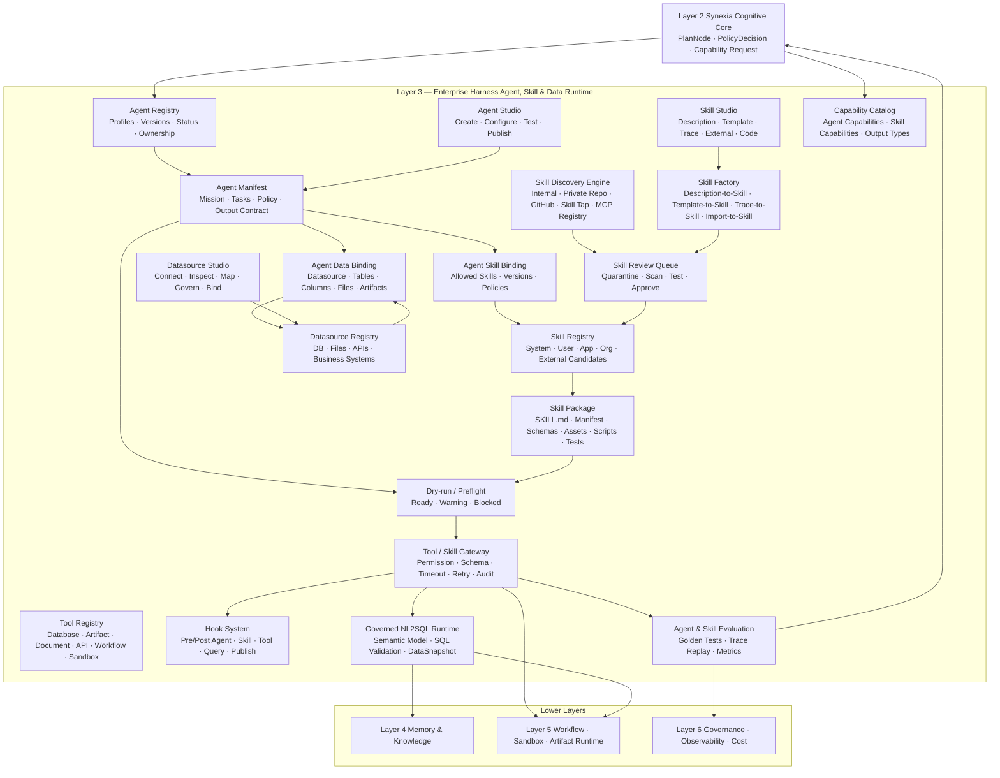
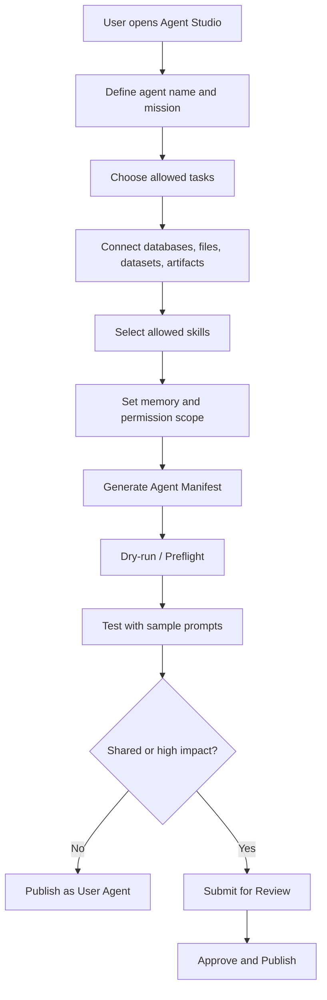
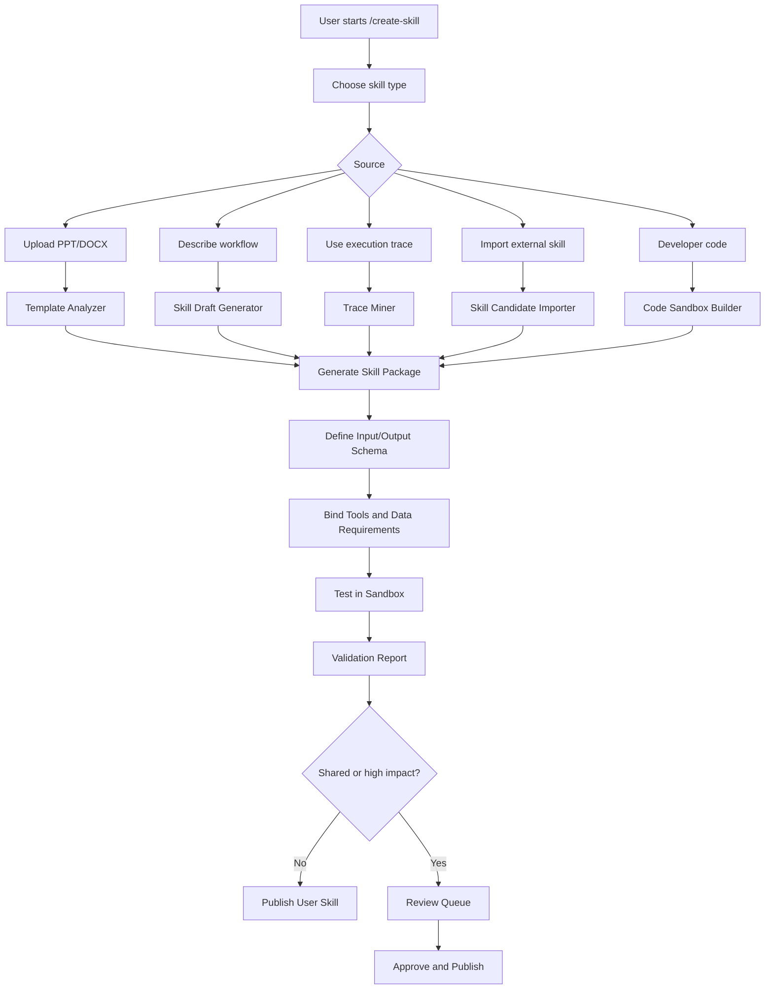
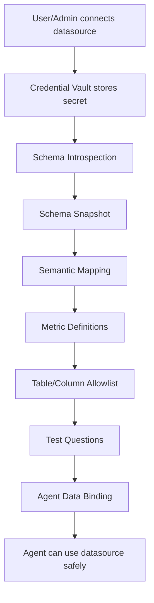
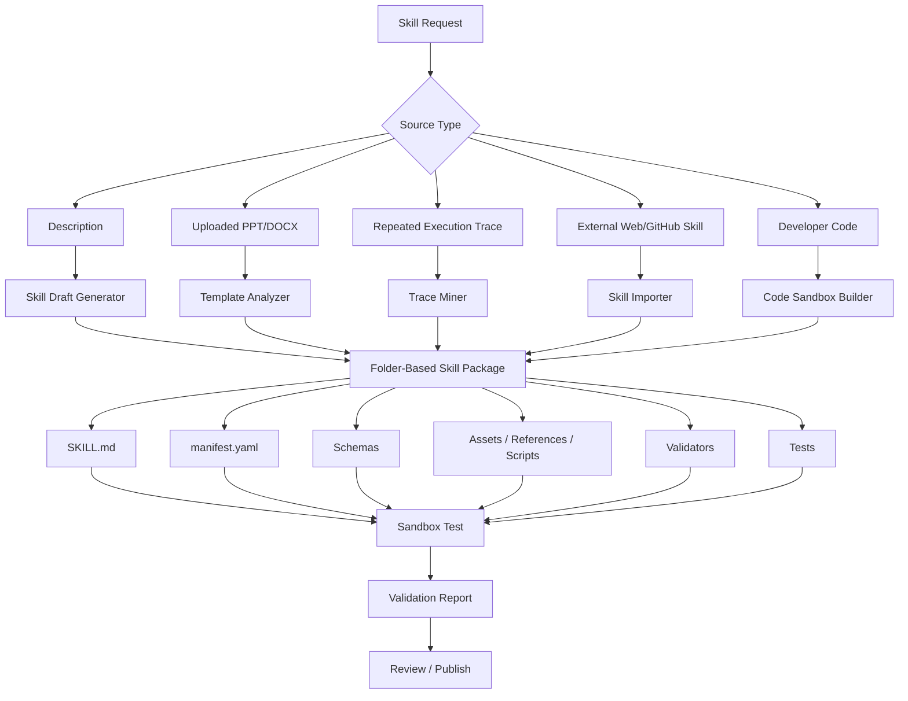
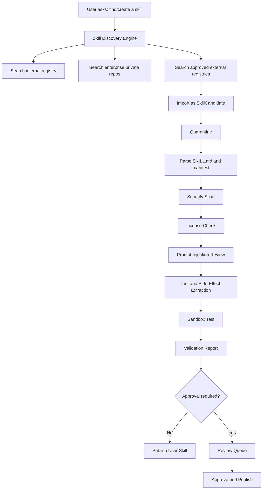

# Zhanlu™ Layer 3 — Enterprise Harness Agent, Skill & Data Runtime

## 0. Executive Summary

Layer 3 is the **Enterprise Harness Agent, Skill & Data Runtime** of Zhanlu™.

It is the layer where enterprise users can create, configure, test, publish, and use custom agents and custom skills. It connects agents to specific databases, files, datasets, document collections, artifact templates, and business systems through governed bindings.

The key design principle is:

> **Every Zhanlu™ agent is a Harness Agent. Every Harness Agent is a versioned, governed execution profile, not an independently reasoning service.**

Layer 3 does not replace Synexia™. Synexia™ remains the cognitive controller in Layer 2. Layer 3 executes approved plan nodes by loading the correct agent profile, checking its data and skill bindings, dispatching approved skills through the Tool / Skill Gateway, and returning structured results, traces, and artifacts.

Layer 3 also introduces three user-facing creation systems:

1. **Agent Studio** — create and configure custom Harness Agents.
2. **Skill Studio** — create custom skills from descriptions, templates, traces, external candidates, or developer code.
3. **Datasource Studio** — connect and govern databases, files, APIs, datasets, and business systems for agent use.

The official Layer 3 sentence:

> **Layer 3 is the Enterprise Harness Agent, Skill & Data Runtime. Every Zhanlu™ agent is a versioned Harness Agent profile controlled by Synexia™, and every agent can be customized through Agent Studio with explicit task scope, data bindings, skill bindings, memory scope, policy profile, and output contracts. Users can create custom skills through Skill Studio from descriptions, uploaded PPT/DOCX templates, execution traces, external skill repositories, or developer code, but all discovered or generated skills enter a quarantine-review-test-publish pipeline before use. Database-connected agents use governed NL2SQL through semantic data bindings, SQL validation, read-only execution, and DataSnapshots. No agent or skill directly accesses credentials, raw file paths, databases, sandboxes, or external tools; every action passes through the Tool / Skill Gateway and is versioned, audited, evaluated, and project-isolated.**

---

## 1. Position in the Zhanlu™ Architecture

```text
Layer 1 — Enterprise Interaction & Identity Layer
  - User channels, identity, app selection, RequestEnvelope, inline artifact preview

Layer 2 — Synexia™ Enterprise Cognitive Core
  - Goal, context, planning, reasoning, decision, reflection, learning
  - Creates TaskSpec, ContextManifest, PlanDAG, PolicyDecision

Layer 3 — Enterprise Harness Agent, Skill & Data Runtime
  - Harness Agent profiles
  - Custom agents
  - Skill packages
  - Agent data bindings
  - Agent skill bindings
  - Tool / Skill Gateway
  - Governed NL2SQL
  - Skill discovery and skill factory

Layer 4 — Enterprise Memory & Knowledge Layer
  - Memory, knowledge graph, semantic model, metric definitions, experience library

Layer 5 — Enterprise Execution Layer
  - Workflow engine, automation engine, sandbox runtime, artifact generation

Layer 6 — Enterprise Platform Services
  - Security, observability, governance, cost, model management

Layer 7 — Infrastructure Layer
  - Cloud, Kubernetes, database, object/blob storage, messaging, network, compute
```

Layer 3 is the bridge between **Synexia's cognitive decisions** and **actual enterprise capabilities**.

---

## 2. Core Architecture Principle

### 2.1 Harness Agent, Not Role-Play Agent

A Zhanlu™ agent is not an independent AI brain.

```text
Wrong:
Finance Agent = separate autonomous reasoning service
HR Agent = separate autonomous reasoning service
Report Agent = separate autonomous reasoning service
```

Correct:

```text
Finance Agent = Harness Agent Profile
HR Agent = Harness Agent Profile
Report Agent = Harness Agent Profile
```

A Harness Agent is:

```text
Harness Agent
= Agent Manifest
+ Mission
+ Task Scope
+ Data Bindings
+ Skill Bindings
+ Memory Scope
+ Policy Profile
+ Context Rules
+ Tool / Skill Gateway
+ Output Contract
+ Verification Rules
+ Evaluation Rules
+ Audit Trail
```

### 2.2 Synexia™ Remains the Cognitive Controller

Layer 3 must never create hidden nested orchestrators.

```text
Synexia™ decides.
Harness Agents execute approved plan nodes.
Tool / Skill Gateway mediates all capabilities.
Layer 5 runs sandbox/workflow/artifact jobs.
Layer 3 returns structured AgentResult and SkillRun results.
```

### 2.3 Narrow Core, Extensible Capabilities

Zhanlu™ should keep the Synexia™ core narrow and grow capability through:

```text
Harness Agent Profiles
Skill Packages
Tool Adapters
Datasource Bindings
Skill Taps
Skill Factory
MCP-style Tool Adapters
Governed NL2SQL
Sandboxed Artifact Runtime
```

The core must not become a large set of hardcoded business functions.

---

## 3. Lessons Adapted from Hermes Agent and OpenHarness

### 3.1 What Zhanlu™ Learns from Hermes Agent

Hermes Agent is useful as a reference because it demonstrates a skills-first agent architecture:

- Keep the core narrow.
- Add capabilities through skills, tools, memory, plugins, and automation.
- Use folder-based skills with `SKILL.md` and supporting files.
- Allow skills to be created or improved from repeated experience.
- Support shared skill libraries or skill taps.

Zhanlu™ adapts these ideas, but adds enterprise controls:

```text
Hermes-style skill package
+ tenant isolation
+ app scope
+ database-first persistence
+ approval workflow
+ quarantine for external skills
+ sandbox execution
+ audit log
+ skill evaluation
+ artifact validation
```

### 3.2 What Zhanlu™ Learns from OpenHarness

OpenHarness is useful as a reference for harness mechanics:

- Agent loop and execution harness.
- Tools, skills, plugins, permissions, hooks, commands, and MCP-style integration.
- Dry-run preview before execution.
- Provider profiles.
- On-demand skill loading.
- Permission-checked tool use.

Zhanlu™ adapts these ideas as enterprise features:

```text
Dry-run / Preflight
PreSkillRun / PostSkillRun hooks
PreToolUse / PostToolUse hooks
Provider Profile through Synexia only
On-demand skill loading
Tool / Skill Gateway
Agent / skill evaluation
Trace replay
```

### 3.3 Zhanlu™ Enterprise Rule

```text
Automatic discovery is allowed.
Automatic recommendation is allowed.
Automatic draft creation is allowed.
Automatic production installation is not allowed.
```

External or generated skills must be:

```text
imported as candidates
quarantined
scanned
tested in sandbox
validated
reviewed
approved
published
```

---

## 4. Layer 3 Detailed Architecture Diagram



---

## 5. Layer 3 Main Components

## 5.1 Agent Studio

**Purpose:** User-facing surface for creating and configuring custom Harness Agents.

Agent Studio belongs to the user experience, but its configuration outputs are Layer 3 artifacts.

### User Can Define

| Area | Examples |
|---|---|
| Agent identity | name, description, icon, category |
| Mission | “Analyze finance data and create reports” |
| Task scope | Q&A, analysis, report, PPT, dashboard, workflow |
| Data bindings | finance database, Excel files, policy documents, report templates |
| Skill bindings | SQL analysis, chart generation, PPT generation, DOCX generation |
| Output formats | text, chart, PPTX, DOCX, PDF, XLSX, dashboard |
| Tone | executive, formal, simple, technical |
| Memory scope | none, user-only, app-shared |
| Permission scope | private, app-shared, org-managed |
| Approval policy | self-confirm, app admin, org admin, designated reviewer |
| Tests | sample prompts and expected behavior |

### Agent Creation Flow



---

## 5.2 Skill Studio

**Purpose:** User-facing and admin-facing surface for creating custom skills.

Skills can be created from:

```text
1. User description
2. Uploaded PPT/DOCX template
3. Existing artifact
4. Repeated execution trace
5. External skill repository
6. Developer code
```

### Skill Creation Modes

| Mode | User Type | Risk | Example |
|---|---|---|---|
| No-code description skill | normal user | low/medium | “Create a monthly finance report skill” |
| Template skill | normal user/admin | medium | upload company PPT/DOCX template |
| Trace-to-skill | power user/admin | medium | convert repeated workflow into reusable skill |
| External skill import | admin/developer | medium/high | import from skill tap or GitHub |
| Code skill | developer | high | custom Python/JS logic in sandbox |

### Skill Studio Flow



---

## 5.3 Datasource Studio

**Purpose:** Connect and govern enterprise data sources for specific apps and agents.

Data sources include:

```text
PostgreSQL / MySQL / SQL Server / Oracle databases
CSV / Excel datasets
Document collections
Uploaded PDFs / DOCX / PPTX
ERP / CRM / OA / BPM systems
REST APIs
Data warehouses
Business dashboards
```

### Datasource Connection Flow



### Datasource Rule

```text
Agents receive datasource_id handles only.
Agents never receive database credentials, connection strings, or unrestricted schema access.
```

---

## 6. Agent Model

## 6.1 Harness Agent Definition

A Harness Agent is a versioned profile executed by the shared Agent Harness Runtime.

```text
Harness Agent = configuration bundle + governed runtime execution
```

It contains:

```text
Agent Manifest
Prompt Pack
Task Scope
Data Bindings
Skill Bindings
Memory Scope
Policy Profile
Output Contract
Evaluation Profile
```

It is not:

```text
independent reasoning service
hidden orchestrator
autonomous role-play worker
unrestricted database user
unrestricted tool caller
```

## 6.2 Agent Categories

The big diagram can keep the agent categories, but they should be renamed as **profiles**:

| Current Diagram Label | Recommended Label | Examples |
|---|---|---|
| Executive Agent | Executive Agent Profiles | CEO Agent, COO Agent, CFO Agent |
| Functional Agents | Functional Agent Profiles | Finance Agent, HR Agent, Marketing Agent |
| Industry Agents | Industry Agent Profiles | Manufacturing Agent, Supply Chain Agent, Sales Agent |
| Specialist Agents | Specialist Agent Profiles | Data Analyst Agent, Risk Analyst Agent, Compliance Agent |
| Tool Agents | Tool-Backed Agent Profiles | Search Agent, Report Agent, Visualization Agent, SQL Agent |
| Custom Agents | Custom Harness Agent Profiles | user-created, app-scoped, org-managed |

## 6.3 Agent Manifest Example

```yaml
agent_id: finance_report_agent
display_name: Finance Report Agent
agent_type: harness_agent
category: functional
scope: app
status: draft
version: 1

mission:
  description: "Analyze finance data and generate finance reports, charts, and PPT presentations."
  boundaries:
    - "Do not approve financial decisions."
    - "Do not invent financial numbers."
    - "Use only approved finance datasets and DataSnapshots."
    - "External distribution requires confirmation."

allowed_tasks:
  - finance_question_answering
  - revenue_analysis
  - cost_analysis
  - budget_variance_analysis
  - profit_margin_analysis
  - finance_ppt_generation
  - finance_docx_generation
  - dashboard_generation

data_bindings:
  - binding_id: finance_postgres_binding
    datasource_id: finance_postgres
    access_mode: read_only
    allowed_tables:
      - revenue
      - cost
      - budget
      - profit_loss
    blocked_tables:
      - payroll
      - credentials
      - employee_salary
    allowed_operations:
      - select
      - aggregate
      - summarize
      - visualize
    row_limit: 10000
    query_timeout_seconds: 30

allowed_files:
  - finance_policy_documents
  - budget_templates
  - approved_report_templates

allowed_skills:
  - governed_nl2sql_skill
  - finance_kpi_analysis_skill
  - chart_generation_skill
  - company_finance_ppt_skill
  - docx_report_skill
  - pdf_preview_skill

blocked_skills:
  - database_write_skill
  - payment_execution_skill
  - external_email_send_skill
  - permission_management_skill

memory_scope:
  app_memory: true
  user_private_conversation: actor_only
  cross_user_private_chat: false

policy_profile:
  default_risk_tier: medium
  require_confirmation_for:
    - save_artifact_to_company_workspace
    - export_report
    - send_external
    - trigger_approval_workflow

output_contract:
  formats:
    - text_answer
    - chart
    - pptx
    - docx
    - pdf
    - xlsx
  must_include:
    - source_refs
    - data_snapshot_refs
    - artifact_refs
    - validation_notes

evaluation:
  required_checks:
    - source_grounding
    - numeric_consistency
    - data_snapshot_used
    - artifact_validation
    - no_private_data_leak
```

---

## 7. Skill Model

## 7.1 System Skills and Tenant Skills

Zhanlu™ supports two broad skill classes.

### Zhanlu™ System Technical Skills

These are generic technical capabilities shipped by Zhanlu™.

Examples:

```text
PPTX generation
DOCX generation
PDF preview
Chart generation
Spreadsheet reading
Governed NL2SQL
DataSnapshot creation
Artifact validation
Template extraction
Preview rendering
```

System skills should avoid hardcoded tenant business logic.

### Tenant/User Custom Skills

These are created by users, app admins, or enterprise admins.

Examples:

```text
Company Board PPT Skill
Monthly Finance Report Skill
Sales Pipeline DOCX Skill
Factory Daily Report Skill
Risk Memo Skill
Customer Complaint Summary Skill
```

Scopes:

```text
user
app
org
system
```

Lifecycle:

```text
draft → testing → pending_review → approved → published → disabled → archived
```

---

## 7.2 Folder-Based Skill Packages

Actual skills must be folder-based packages, not only flat `.py` files.

A real skill contains instructions, schemas, assets, scripts, validators, references, and tests.

### Correct Separation

```text
backend/skills_runtime/
  # framework code that manages skills

skill_library/
  # actual folder-based system skill packages

tenant skill packages
  # stored as versioned DB/artifact records and materialized into sandbox temp folder
```

### Skill Runtime Code

```text
backend/
  skills_runtime/
    registry.py
    manifest_parser.py
    skill_md_parser.py
    studio_service.py
    factory_service.py
    discovery_service.py
    candidate_importer.py
    review_queue.py
    runner.py
    validation.py
    sandbox_adapter.py
    hooks.py
    preflight.py
```

### System Skill Library

```text
skill_library/
  system/
    artifact/
      pptx-generation/
        SKILL.md
        manifest.yaml
        schemas/
          input.schema.json
          output.schema.json
        scripts/
          run.py
          render_preview.py
        validators/
          validate.py
        references/
          usage.md
        assets/
          default_template.pptx
        tests/
          sample_input.json
          expected_output.json

      docx-generation/
        SKILL.md
        manifest.yaml
        schemas/
        scripts/
        validators/
        references/
        assets/
        tests/

    data/
      governed-nl2sql/
        SKILL.md
        manifest.yaml
        schemas/
        scripts/
        validators/
        references/
        tests/

      data-snapshot/
        SKILL.md
        manifest.yaml
        schemas/
        scripts/
        validators/
        tests/

    visualization/
      chart-generation/
        SKILL.md
        manifest.yaml
        schemas/
        scripts/
        validators/
        assets/
        tests/
```

### Tenant Skill Package Example

```text
company-finance-ppt/
  SKILL.md
  manifest.yaml
  schemas/
    input.schema.json
    output.schema.json
  assets/
    company_finance_template.pptx
    company_logo.png
  references/
    slide_mapping.md
    brand_rules.md
  scripts/
    build_ppt.py
  validators/
    validate_ppt.py
  tests/
    sample_q2_finance_report.json
    expected_output.json
```

### Database-First Tenant Skill Rule

```text
For system skills:
- folder packages may live in the code repository.

For tenant/user custom skills:
- database/artifact store is the source of truth.
- the folder package is stored as a versioned skill package record.
- when running, Zhanlu™ materializes the package into a temporary sandbox folder.
- after execution, the sandbox is destroyed.
```

---

## 7.3 SKILL.md vs Zhanlu Skill Manifest

Zhanlu™ uses two files inside a skill package:

```text
SKILL.md = model guidance and human-readable workflow
manifest.yaml = enforceable policy, schemas, tools, side effects, security, validation
```

### Rule

```text
SKILL.md guides the model.
manifest.yaml enforces policy.
SKILL.md can never override manifest.yaml.
```

### Example SKILL.md

```markdown
---
name: company-finance-ppt
description: Generate company-branded finance PPT reports using approved finance data snapshots.
version: 1.0.0
category: artifact
---

# Company Finance PPT Skill

Use this skill when the user asks to create a finance PowerPoint report using the company template.

Required inputs:
- reporting_period
- finance_summary
- charts
- tables
- source_refs
- data_snapshot_refs

Rules:
- Do not invent numbers.
- Use only provided DataSnapshot references.
- Preserve company branding and slide layout.
```

### Example manifest.yaml

```yaml
skill_id: company_finance_ppt
skill_type: artifact_template_skill
scope: app
status: draft
version: 1

input_schema: schemas/input.schema.json
output_schema: schemas/output.schema.json

source:
  kind: uploaded_template
  artifact_id: uploaded_company_template_pptx
  trust_level: tenant_uploaded

allowed_tools:
  - create_pptx
  - insert_chart
  - insert_table
  - convert_pptx_to_pdf
  - create_slide_thumbnails

assets:
  template_pptx: assets/company_finance_template.pptx
  logo: assets/company_logo.png

side_effects:
  - create_artifact_version
  - create_preview_resource

validation:
  - pptx_opens_successfully
  - all_required_placeholders_filled
  - chart_data_matches_snapshot
  - source_refs_present
  - preview_pdf_generated

security:
  network_egress: deny
  credentials_access: none
  filesystem_scope: sandbox_temp_only

review:
  required_for_scope:
    - app
    - org
```

---

## 8. Skill Factory

The Skill Factory creates skill drafts from multiple sources.

```text
Skill Factory
- Description-to-Skill
- Template-to-Skill
- Trace-to-Skill
- External-Skill Import
- Code-Skill Builder
```

### Skill Factory Flow



---

## 9. Custom PPT and DOCX Skills

## 9.1 Custom PPT Skill Creation

User command:

```text
/create-skill
Use this PPT as our company finance report template.
```

Flow:

```text
1. User uploads PPT template.
2. Layer 1 stores it as artifact_id.
3. Skill Studio starts Template Skill Builder.
4. Template Analyzer extracts layout and branding.
5. System detects slide types, fonts, colors, logos, placeholders.
6. Skill Factory creates folder-based skill package.
7. User reviews placeholder mappings and slide rules.
8. System tests with sample data.
9. System generates preview PPT.
10. Admin approves if app/org-shared.
11. Skill becomes available to selected agents.
```

Template Analyzer should extract:

```text
title slide
section slide
executive summary slide
chart slide
table slide
risk summary slide
recommendation slide
conclusion slide
company colors
fonts
logo positions
placeholder positions
slide ordering rules
```

## 9.2 Custom DOCX Skill Creation

User command:

```text
/create-skill from this DOCX
```

System extracts:

```text
cover page
heading styles
company logo
header/footer
signature block
table styles
section placeholders
required fields
```

DOCX Skill Package:

```text
company-monthly-report-docx/
  SKILL.md
  manifest.yaml
  schemas/
    input.schema.json
    output.schema.json
  assets/
    company_monthly_report_template.docx
  references/
    section_mapping.md
    style_rules.md
  scripts/
    build_docx.py
  validators/
    validate_docx.py
  tests/
    sample_input.json
```

---

## 10. Skill Discovery Engine and Skill Tap Importer

Zhanlu™ may search for skills in:

```text
Zhanlu™ system skill registry
enterprise private skill registry
enterprise private Git repository
approved vendor catalog
public GitHub skill tap
MCP server registry
uploaded skill zip
```

### External Skill Rule

```text
External skill found online → SkillCandidate → quarantine → scan → sandbox test → validation report → review → publish.
```

### Skill Discovery Pipeline



### Candidate Trust Levels

```text
system_trusted
tenant_private
vendor_approved
external_untrusted
generated_untrusted
uploaded_untrusted
```

---

## 11. Tool / Skill Gateway

The Tool / Skill Gateway is mandatory.

```text
No Harness Agent calls a tool, skill, database, workflow, sandbox, or external system directly.
Every call passes through the Tool / Skill Gateway.
```

### Gateway Responsibilities

```text
permission check
schema validation
skill status check
agent skill binding check
agent data binding check
side-effect check
risk tier check
confirmation check
timeout
retry
resource limit
sandbox routing
audit log
SkillRun record
ObservationRecord-compatible result
```

### Runtime Flow

```text
Harness Agent
  ↓
Tool / Skill Gateway
  ↓
Policy check
  ↓
Schema validation
  ↓
Datasource / Tool / Skill / Workflow / Sandbox
  ↓
Structured result
  ↓
AgentResult / SkillRun / ObservationRecord
```

---

## 12. Hook System

Zhanlu™ Layer 3 should support harness hooks.

### Mandatory Hooks

```text
PreAgentInvoke
PostAgentInvoke
PreSkillRun
PostSkillRun
PreToolUse
PostToolUse
PreDatasourceQuery
PostDatasourceQuery
PreArtifactPublish
PostArtifactPublish
```

### Example PreDatasourceQuery

```text
- verify org_id and app_id
- verify user permission
- verify agent_data_binding
- verify allowed tables and columns
- verify SQL is read-only
- check row limit
- check query timeout
- estimate query cost
- require confirmation if needed
```

### Example PostSkillRun

```text
- create SkillRun record
- create validation report
- create ArtifactBuildManifest if artifact generated
- record metrics
- update evaluation result
- return structured output
```

---

## 13. Dry-run / Preflight

Dry-run is required before publishing or running high-impact custom agents or skills.

Dry-run should not:

```text
call the model
execute tools
query real databases
run sandbox code
create artifacts
write business records
```

Dry-run should resolve and display:

```text
agent profile
agent manifest
skill bindings
data bindings
allowed datasource
allowed tables/columns
required confirmations
risk tier
model route
sandbox requirement
missing permissions
missing schemas
dangerous side effects
ready/warning/blocked status
```

### Dry-run Output

```json
{
  "status": "warning",
  "agent": "Finance Report Agent",
  "allowed_datasources": ["finance_postgres"],
  "allowed_tables": ["revenue", "cost", "budget", "profit_loss"],
  "skills": ["governed_nl2sql_skill", "company_finance_ppt_skill"],
  "requires_confirmation": ["save_artifact_to_company_workspace"],
  "warnings": ["PPT skill is pending review"],
  "blocked_reasons": []
}
```

---

## 14. Governed NL2SQL and Semantic Data Runtime

Database-connected agents must use governed NL2SQL, not raw SQL generation.

### NL2SQL Flow

```text
Natural language question
→ semantic model lookup
→ metric definition resolution
→ schema linking
→ SQL draft
→ SQL validator
→ read-only enforcement
→ EXPLAIN / cost estimate
→ query execution
→ DataSnapshot
→ answer/chart/PPT/DOCX/dashboard
```

### Governed NL2SQL Skill Package

```text
governed-nl2sql/
  SKILL.md
  manifest.yaml
  schemas/
    input.schema.json
    output.schema.json
  scripts/
    schema_linker.py
    sql_planner.py
    sql_validator.py
    run_query.py
  validators/
    validate_sql.py
    validate_snapshot.py
  references/
    supported_dialects.md
    query_safety_rules.md
  tests/
    sample_questions.json
    expected_sql.json
```

### SQL Safety Rules

```text
read-only by default
no INSERT / UPDATE / DELETE / DROP / ALTER
allowed tables only
allowed columns only
row limit enforced
query timeout enforced
cost estimate required
credential_ref never exposed
result saved as DataSnapshot
```

### DataSnapshot Rule

```text
Reports, charts, dashboards, PPTs, DOCX, and XLSX outputs must cite immutable DataSnapshots, not live mutable queries.
```

---

## 15. Data Binding Model

## 15.1 Agent Data Binding

Agent Data Binding controls which data an agent may access.

```yaml
agent_data_bindings:
  - datasource_id: finance_postgres
    access_mode: read_only
    allowed_tables:
      - revenue
      - cost
      - budget
      - profit_loss
    allowed_columns:
      revenue:
        - month
        - department
        - amount
        - region
      cost:
        - month
        - category
        - amount
    blocked_tables:
      - payroll
      - credentials
      - employee_salary
    allowed_operations:
      - select
      - aggregate
      - summarize
      - visualize
    row_limit: 10000
    query_timeout_seconds: 30
    requires_review: false
```

### Binding Rules

```text
Default database access is read-only.
Agents receive handles, not credentials.
No cross-org data binding.
No cross-app data binding unless explicitly approved.
Every datasource query is logged.
Every query result used for reporting becomes a DataSnapshot.
```

---

## 16. Agent Execution Runtime

## 16.1 AgentExecutionContext

```python
class AgentExecutionContext(BaseModel):
    org_id: UUID
    app_id: UUID
    user_id: UUID
    conversation_id: UUID | None
    envelope_id: UUID
    execution_id: UUID
    plan_id: UUID
    node_key: str

    agent_profile_id: UUID
    agent_version: int

    task_spec_ref: UUID
    context_manifest_id: UUID
    data_snapshot_ids: list[UUID] = []
    selected_artifact_ids: list[UUID] = []
    selected_dataset_ids: list[UUID] = []

    allowed_skill_ids: list[UUID]
    allowed_datasource_ids: list[UUID]
    allowed_workflow_ids: list[UUID]

    budget: dict
    risk_tier: Literal["low", "medium", "high"]
```

## 16.2 AgentResult

```python
class AgentResult(BaseModel):
    org_id: UUID
    app_id: UUID
    execution_id: UUID
    plan_id: UUID
    node_key: str
    agent_profile_id: UUID
    agent_version: int

    status: Literal["success", "partial", "failed", "blocked"]
    summary: str
    structured_data: dict = {}
    source_refs: list[UUID] = []
    data_snapshot_refs: list[UUID] = []
    artifact_refs: list[UUID] = []
    suggested_next_actions: list[str] = []
    warnings: list[str] = []
    structured_error: dict | None = None
```

---

## 17. Finance PPT Example: End-to-End Layer 3 Flow

User request:

```text
Finance Agent, make a Q2 finance PPT report.
```

Runtime:

```text
1. Layer 1 verifies user and builds RequestEnvelope.
2. Layer 2 creates TaskSpec, ArtifactIntent, ContextManifest, and PlanDAG.
3. Layer 2 Capability Router selects Finance Report Agent.
4. Layer 3 loads Finance Report Agent Manifest.
5. Layer 3 verifies Agent Data Binding to finance_postgres.
6. Layer 3 verifies Agent Skill Binding to governed_nl2sql_skill, chart_generation_skill, and company_finance_ppt_skill.
7. Tool / Skill Gateway runs governed NL2SQL.
8. Governed NL2SQL creates DataSnapshot.
9. Chart skill creates chart artifacts from DataSnapshot.
10. Company Finance PPT Skill runs in Layer 5 sandbox.
11. PPTX, PDF preview, and thumbnails are created.
12. ArtifactBuildManifest records data snapshots, template, skill version, sandbox job, checksums, and validation report.
13. AgentResult returns artifact_refs and data_snapshot_refs.
14. Layer 2 verifies output and computes confidence.
15. Layer 1 shows inline PPT preview.
```

Important:

```text
Finance Agent does not directly query database.
Finance Agent does not receive credentials.
Finance Agent does not directly call PPT generator.
Finance Agent does not approve publication.
All actions pass through Tool / Skill Gateway.
```

---

## 18. Database Schema

### 18.1 Agent Profiles

```sql
CREATE TABLE agent_profiles (
    id UUID PRIMARY KEY,
    org_id UUID NOT NULL,
    app_id UUID,
    name TEXT NOT NULL,
    category TEXT NOT NULL,
    version INT NOT NULL DEFAULT 1,
    status TEXT NOT NULL DEFAULT 'draft',
    manifest JSONB NOT NULL,
    owner_user_id UUID,
    approved_by UUID,
    created_at TIMESTAMPTZ NOT NULL DEFAULT now()
);
```

### 18.2 Agent Data Bindings

```sql
CREATE TABLE agent_data_bindings (
    id UUID PRIMARY KEY,
    org_id UUID NOT NULL,
    app_id UUID NOT NULL,
    agent_profile_id UUID NOT NULL,
    datasource_id UUID,
    document_collection_id UUID,
    artifact_collection_id UUID,
    access_mode TEXT NOT NULL DEFAULT 'read_only',
    allowed_tables TEXT[] DEFAULT '{}',
    allowed_columns JSONB DEFAULT '{}',
    blocked_tables TEXT[] DEFAULT '{}',
    allowed_operations TEXT[] DEFAULT '{select,aggregate}',
    row_limit INT DEFAULT 10000,
    query_timeout_seconds INT DEFAULT 30,
    requires_review BOOLEAN DEFAULT false,
    created_at TIMESTAMPTZ NOT NULL DEFAULT now()
);
```

### 18.3 Skill Profiles

```sql
CREATE TABLE skill_profiles (
    id UUID PRIMARY KEY,
    org_id UUID,
    app_id UUID,
    owner_user_id UUID,
    scope TEXT NOT NULL, -- user | app | org | system
    name TEXT NOT NULL,
    skill_type TEXT NOT NULL, -- template | workflow | code | connector | artifact | analysis | data
    version INT NOT NULL DEFAULT 1,
    status TEXT NOT NULL DEFAULT 'draft',
    manifest JSONB NOT NULL,
    package_ref UUID,
    created_at TIMESTAMPTZ NOT NULL DEFAULT now(),
    approved_by UUID
);
```

### 18.4 Agent Skill Bindings

```sql
CREATE TABLE agent_skill_bindings (
    id UUID PRIMARY KEY,
    org_id UUID NOT NULL,
    app_id UUID,
    agent_profile_id UUID NOT NULL,
    skill_profile_id UUID NOT NULL,
    skill_version INT NOT NULL,
    allowed BOOLEAN NOT NULL DEFAULT true,
    binding_policy JSONB NOT NULL DEFAULT '{}',
    created_at TIMESTAMPTZ NOT NULL DEFAULT now()
);
```

### 18.5 Skill Candidates

```sql
CREATE TABLE skill_candidates (
    id UUID PRIMARY KEY,
    org_id UUID NOT NULL,
    app_id UUID,
    source_type TEXT NOT NULL, -- internal | github | skill_tap | mcp_registry | uploaded | generated | code
    source_ref TEXT,
    name TEXT NOT NULL,
    description TEXT,
    raw_package_ref UUID,
    raw_manifest JSONB,
    parsed_manifest JSONB,
    trust_level TEXT NOT NULL DEFAULT 'external_untrusted',
    scan_status TEXT NOT NULL DEFAULT 'pending',
    review_status TEXT NOT NULL DEFAULT 'candidate',
    validation_report JSONB,
    created_at TIMESTAMPTZ NOT NULL DEFAULT now()
);
```

### 18.6 Skill Runs

```sql
CREATE TABLE skill_runs (
    id UUID PRIMARY KEY,
    org_id UUID NOT NULL,
    app_id UUID NOT NULL,
    execution_id UUID NOT NULL,
    agent_profile_id UUID,
    skill_profile_id UUID NOT NULL,
    skill_version INT NOT NULL,
    status TEXT NOT NULL DEFAULT 'running',
    input_hash TEXT,
    output_ref UUID,
    validation_report JSONB,
    started_at TIMESTAMPTZ NOT NULL DEFAULT now(),
    completed_at TIMESTAMPTZ
);
```

### 18.7 Agent Invocations

```sql
CREATE TABLE agent_invocations (
    id UUID PRIMARY KEY,
    org_id UUID NOT NULL,
    app_id UUID NOT NULL,
    execution_id UUID NOT NULL,
    plan_id UUID NOT NULL,
    node_key TEXT NOT NULL,
    agent_profile_id UUID NOT NULL,
    agent_version INT NOT NULL,
    status TEXT NOT NULL DEFAULT 'running',
    started_at TIMESTAMPTZ NOT NULL DEFAULT now(),
    completed_at TIMESTAMPTZ,
    result_ref UUID,
    error_code TEXT
);
```

### 18.8 Agent and Skill Test Cases

```sql
CREATE TABLE agent_test_cases (
    id UUID PRIMARY KEY,
    org_id UUID NOT NULL,
    app_id UUID,
    agent_profile_id UUID NOT NULL,
    test_prompt TEXT NOT NULL,
    expected_behavior JSONB,
    status TEXT DEFAULT 'pending',
    created_at TIMESTAMPTZ NOT NULL DEFAULT now()
);

CREATE TABLE skill_test_cases (
    id UUID PRIMARY KEY,
    org_id UUID NOT NULL,
    app_id UUID,
    skill_profile_id UUID NOT NULL,
    test_name TEXT NOT NULL,
    input_payload JSONB NOT NULL,
    expected_behavior JSONB,
    status TEXT DEFAULT 'pending',
    created_at TIMESTAMPTZ NOT NULL DEFAULT now()
);
```

---

## 19. API Surface

### Agent Studio APIs

```text
POST   /apps/{app_id}/agents
GET    /apps/{app_id}/agents
GET    /agents/{agent_id}
PATCH  /agents/{agent_id}
POST   /agents/{agent_id}/dry-run
POST   /agents/{agent_id}/test
POST   /agents/{agent_id}/submit-review
POST   /agents/{agent_id}/publish
POST   /agents/{agent_id}/disable
```

### Agent Binding APIs

```text
POST   /agents/{agent_id}/data-bindings
GET    /agents/{agent_id}/data-bindings
PATCH  /agents/{agent_id}/data-bindings/{binding_id}
DELETE /agents/{agent_id}/data-bindings/{binding_id}

POST   /agents/{agent_id}/skill-bindings
GET    /agents/{agent_id}/skill-bindings
DELETE /agents/{agent_id}/skill-bindings/{binding_id}
```

### Skill Studio APIs

```text
POST   /apps/{app_id}/skills
GET    /apps/{app_id}/skills
GET    /skills/{skill_id}
PATCH  /skills/{skill_id}
POST   /skills/{skill_id}/dry-run
POST   /skills/{skill_id}/test
POST   /skills/{skill_id}/submit-review
POST   /skills/{skill_id}/publish
POST   /skills/{skill_id}/disable
```

### Skill Factory APIs

```text
POST   /skills/factory/from-description
POST   /skills/factory/from-template
POST   /skills/factory/from-trace
POST   /skills/factory/from-external
POST   /skills/factory/from-code
```

### Skill Discovery APIs

```text
POST   /skills/discovery/search
POST   /skills/discovery/import-candidate
GET    /skills/candidates
GET    /skills/candidates/{candidate_id}
POST   /skills/candidates/{candidate_id}/scan
POST   /skills/candidates/{candidate_id}/test
POST   /skills/candidates/{candidate_id}/approve
POST   /skills/candidates/{candidate_id}/reject
```

### Datasource Studio APIs

```text
POST   /apps/{app_id}/datasources
GET    /apps/{app_id}/datasources
POST   /datasources/{datasource_id}/introspect
POST   /datasources/{datasource_id}/semantic-map
POST   /datasources/{datasource_id}/test-query
POST   /datasources/{datasource_id}/bind-agent
```

---

## 20. Event Types

Layer 3 emits typed events into the Layer 2 / Layer 1 event stream.

```text
agent.profile_created
agent.dry_run_ready
agent.test_started
agent.test_completed
agent.review_required
agent.published
agent.disabled

skill.package_created
skill.candidate_imported
skill.quarantine_started
skill.scan_completed
skill.test_completed
skill.review_required
skill.published
skill.disabled
skill.run_started
skill.run_completed
skill.run_failed

datasource.connected
datasource.introspection_completed
datasource.semantic_mapping_ready
datasource.bound_to_agent

gateway.tool_call_started
gateway.tool_call_completed
gateway.tool_call_blocked

data.snapshot_created
artifact.build_manifest_created
```

---

## 21. Security and Governance Invariants

### Agent Invariants

```text
AGT-0: Every Zhanlu™ agent is a Harness Agent.
AGT-1: Harness Agents are versioned profiles, not independent reasoning services.
AGT-2: Synexia™ remains the cognitive controller; agents execute approved plan nodes only.
AGT-3: Every agent has an Agent Manifest before execution.
AGT-4: Every agent has explicit Agent Data Bindings.
AGT-5: Agents receive datasource_id, document_id, artifact_id, dataset_id, or data_snapshot_id handles, never credentials or raw paths.
AGT-6: No agent calls tools, skills, databases, workflows, sandboxes, or external systems directly; every call passes through the Tool / Skill Gateway.
AGT-7: Default database access is read-only.
AGT-8: User-created shared agents require review before publishing.
AGT-9: Agent memory scope must be explicit: user-only, app-shared, or none.
AGT-10: Every agent invocation produces structured AgentResult and audit trace.
AGT-11: Failed agent runs preserve error evidence for recovery and evaluation.
AGT-12: Agent performance is evaluated using test cases, trace replay, grounding, latency, cost, and user feedback.
AGT-13: Agent dry-run must be available before publishing or executing high-impact custom agents.
AGT-14: Harness agents load skills on demand through stable summaries and governed full-skill loading.
AGT-15: Agent capabilities live at the edges through skills, tools, plugins, and data bindings, not by expanding the core.
```

### Skill Invariants

```text
SKL-0: Zhanlu™ may provide system technical skills, but tenant business skills must be tenant-created or tenant-approved.
SKL-1: Every skill has SKILL.md plus a Zhanlu Skill Manifest.
SKL-2: External skills are imported as candidates, not trusted skills.
SKL-3: Automatic skill discovery never means automatic production installation.
SKL-4: Skill candidates are quarantined, scanned, tested, and reviewed.
SKL-5: Code skills always run in sandbox with resource and network limits.
SKL-6: Template skills preserve tenant branding through placeholders and validation.
SKL-7: Every skill run creates a SkillRun record and validation report.
SKL-8: Skills receive governed handles, never raw credentials or unrestricted file paths.
SKL-9: Artifact-generating skills must produce ArtifactBuildManifest.
SKL-10: User-selected templates and datasets become pinned context or explicit skill inputs, not retrieval-random context.
SKL-11: Actual skills are folder-based packages with SKILL.md plus manifest.yaml, schemas, assets, scripts, validators, references, and tests.
SKL-12: Tenant skill packages are stored as versioned DB/artifact records and materialized only into temporary sandbox folders during execution.
SKL-13: External skill taps import candidates, not approved production skills.
SKL-14: Every external or generated skill must pass quarantine, scan, sandbox test, validation report, and review.
SKL-15: SKILL.md guides the model; manifest.yaml enforces policy.
SKL-16: PreSkillRun and PostSkillRun hooks are mandatory for all skill execution.
SKL-17: Dry-run/preflight must show ready/warning/blocked before high-impact agent or skill execution.
```

### Data Invariants

```text
DATA-1: Database-connected agents use semantic data bindings, not raw schema access.
DATA-2: NL2SQL must pass schema linking, metric resolution, SQL validation, read-only enforcement, dry-run/cost check, and data snapshot creation.
DATA-3: Reports, charts, dashboards, PPTs, DOCX, and XLSX outputs must cite DataSnapshots.
DATA-4: Governed NL2SQL must produce DataSnapshots before downstream report, chart, PPT, DOCX, or dashboard generation.
DATA-5: Agent database access is always mediated by datasource bindings and query validation.
```

---

## 22. Acceptance Criteria

### Agent Studio

- [ ] User can create a custom agent with name, mission, tasks, data bindings, skills, output formats, and memory scope.
- [ ] Shared or high-impact agents enter review before publishing.
- [ ] Agent dry-run shows ready/warning/blocked status.
- [ ] Agent cannot execute without an approved or publishable manifest.
- [ ] Agent cannot access unbound datasource, document collection, or artifact collection.

### Skill Studio

- [ ] User can create a skill from description.
- [ ] User can create a skill from uploaded PPT template.
- [ ] User can create a skill from uploaded DOCX template.
- [ ] Generated skill package contains SKILL.md, manifest.yaml, schemas, assets, validators, and tests.
- [ ] Code skills require sandbox and review.
- [ ] App/org-scoped skills require approval.

### Skill Discovery

- [ ] External skill is imported as SkillCandidate, not approved skill.
- [ ] SkillCandidate passes quarantine, scan, sandbox test, and validation report before review.
- [ ] Malicious or prompt-injection content in SKILL.md is flagged.
- [ ] External skill cannot run before approval.

### Tool / Skill Gateway

- [ ] Agent tool calls bypassing gateway are impossible.
- [ ] Skill call without agent_skill_binding is blocked.
- [ ] Skill call with invalid input schema is blocked.
- [ ] Skill with side effects triggers confirmation if policy requires.
- [ ] Every skill run creates SkillRun record.

### Datasource and NL2SQL

- [ ] Agent receives datasource_id, never credentials.
- [ ] Database queries are read-only by default.
- [ ] Disallowed tables/columns are blocked.
- [ ] Query timeout and row limit are enforced.
- [ ] NL2SQL creates DataSnapshot before downstream report/artifact generation.
- [ ] Finance PPT cites DataSnapshot references.

### Folder-Based Skill Packages

- [ ] System skills exist as folder packages under `skill_library/system/`.
- [ ] Tenant skill packages are persisted as versioned DB/artifact records.
- [ ] Runtime materializes tenant skill package only inside temporary sandbox.
- [ ] Sandbox folder is destroyed after execution.

### Evaluation

- [ ] Agent tests can be run before publishing.
- [ ] Skill tests can be run before publishing.
- [ ] Trace replay is available for failed agent/skill runs.
- [ ] Evaluation records include grounding, latency, cost, validation, and user feedback.

---

## 23. Implementation Priority

### P0 — Required for First Working Enterprise Version

```text
Agent Registry
Agent Manifest
Agent Data Binding
Agent Skill Binding
Tool / Skill Gateway
System skills: governed NL2SQL, chart generation, PPT generation, DOCX generation, PDF preview
SkillRun records
AgentResult contract
Finance Agent + Finance datasource binding example
```

### P1 — Required for Enterprise-Ready Version

```text
Agent Studio UI
Skill Studio UI
Datasource Studio UI
Custom PPT skill from uploaded template
Custom DOCX skill from uploaded template
Dry-run / Preflight
Skill review queue
Skill package folder format
Tenant skill package database persistence
Agent and skill evaluation tests
```

### P2 — Advanced Harness Runtime

```text
Skill Discovery Engine
Skill Tap Importer
External skill quarantine pipeline
Trace-to-skill factory
Provider profiles
Hook system
Governed MCP-style tool adapters
Advanced semantic data model
```

### P3 — Expansion

```text
External partner agent gateway
A2A boundary integration
Enterprise marketplace for approved skills
Multi-party approval for high-impact skills
Automated skill improvement proposals
```

---

## 24. Repo Touch List

```text
backend/
  agents_runtime/
    registry.py
    manifests.py
    studio_service.py
    capability_catalog.py
    execution_context.py
    invocation_runner.py
    data_bindings.py
    skill_bindings.py
    preflight.py
    evaluation.py

  skills_runtime/
    registry.py
    manifest_parser.py
    skill_md_parser.py
    studio_service.py
    factory_service.py
    discovery_service.py
    candidate_importer.py
    review_queue.py
    runner.py
    validation.py
    sandbox_adapter.py
    hooks.py
    preflight.py

  datasources/
    registry.py
    credential_handles.py
    introspection.py
    semantic_mapping.py
    metric_definitions.py
    query_validator.py
    data_snapshot.py

  gateway/
    tool_skill_gateway.py
    permission_checker.py
    schema_validator.py
    audit_writer.py
    retry_timeout.py

  nl2sql/
    semantic_query_planner.py
    schema_linker.py
    sql_planner.py
    sql_validator.py
    explain_cost.py
    snapshot_writer.py

  migrations/
    xxxx_agent_profiles.py
    xxxx_agent_data_bindings.py
    xxxx_skill_profiles.py
    xxxx_agent_skill_bindings.py
    xxxx_skill_candidates.py
    xxxx_skill_runs.py
    xxxx_agent_invocations.py
    xxxx_agent_skill_tests.py

skill_library/
  system/
    artifact/
      pptx-generation/
      docx-generation/
      pdf-preview/
    data/
      governed-nl2sql/
      data-snapshot/
    visualization/
      chart-generation/

frontend/
  features/
    agent-studio/
    skill-studio/
    datasource-studio/
    agent-preflight/
    skill-review/
    skill-discovery/
    agent-evaluation/
```

---

## 25. Main Diagram Update Guidance

Change Layer 3 title from:

```text
Enterprise Agent Runtime
Collaborative Multi-Agent Ecosystem
```

to:

```text
Enterprise Harness Agent, Skill & Data Runtime
Customizable · Data-Bound · Skill-Extensible
```

Inside Layer 3, add compact blocks:

```text
Agent Studio
Skill Studio
Datasource Studio
Agent Registry
Skill Registry
Agent Data Binding
Agent Skill Binding
Skill Discovery
Skill Factory
Tool / Skill Gateway
Governed NL2SQL
Agent & Skill Evaluation
```

Agent Governance should become:

```text
Agent Governance
Agent Registry
Manifest Review
Skill Review
Data Binding Review
Capability Catalog
Access Control
Version Management
Evaluation & Benchmarking
Trace & Audit
```

Rename agent categories:

```text
Executive Agent Profiles
Functional Agent Profiles
Industry Agent Profiles
Specialist Agent Profiles
Tool-Backed Agent Profiles
Custom Harness Agents
```

---

## 26. Final Design Principle

**Layer 3 is where Zhanlu™ becomes customizable. Users can create custom agents, bind them to specific databases and files, create custom PPT/DOCX/report skills, import or discover skill candidates, and test them safely before publishing. But customization never means uncontrolled execution. Every agent is a Harness Agent profile, every skill is a governed folder-based package, every database access path is mediated by Agent Data Binding and governed NL2SQL, every tool call passes through the Tool / Skill Gateway, and every generated artifact is versioned, validated, audited, and previewed in chat.**

