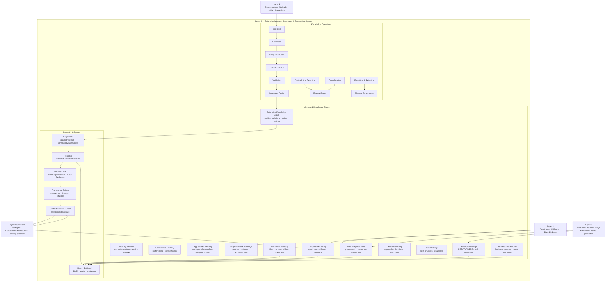

# Zhanlu™ Layer 4 — Enterprise Memory, Knowledge & Context Intelligence Layer

**Version:** 1.0 FINAL  
**Status:** Architecture-ready draft for Gao review and implementation planning  
**Owner:** Zhanlu™ / Synexia™ Enterprise AI Operating System  
**Layer Position:** Layer 4 of the Zhanlu™ Enterprise AI Operating System  
**Primary Function:** Governed enterprise memory, knowledge, document intelligence, data snapshots, artifact knowledge, decision memory, context retrieval, GraphRAG, and Memory Gate for safe context delivery to Synexia™.

---

## 0. Executive Summary

Layer 4 is the governed memory and knowledge substrate of Zhanlu™. It is not only a vector database, not only document storage, and not only chat history. It is the system layer that turns enterprise conversations, documents, databases, artifacts, decisions, workflows, agent runs, skill runs, and user feedback into safe, permission-scoped, provenance-linked context for Synexia™ and Harness Agents.

The correct Layer 4 design principle is:

> **Memory is evidence, not authority. Knowledge is governed, scoped, validated, and provenance-linked before it enters the AI context.**

Layer 4 provides trusted context to Layer 2 through a `ContextManifest`. It does not allow the model, agents, or skills to freely read raw memory tables. All retrieval passes through hybrid retrieval, GraphRAG where useful, reranking, trust and freshness scoring, permission filtering, and the Memory Gate.

Layer 4 must support:

```text
Working Memory
User Private Memory
App Shared Memory
Organization Knowledge
Document Memory
DataSnapshot Store
Artifact Knowledge
Decision Memory
Case Library
Experience Library
Enterprise Knowledge Graph
Semantic Data Model
Metric Definitions
Memory Governance
Context Intelligence
```

The final design sentence:

> **Layer 4 is Zhanlu’s governed memory, knowledge, and context intelligence substrate. It stores user-private memory, app-shared memory, organization knowledge, documents, data snapshots, artifacts, decisions, cases, and execution experience as permission-scoped and provenance-linked records. It uses hybrid retrieval, GraphRAG, semantic data models, reranking, memory consolidation, contradiction detection, and a Memory Gate to produce safe ContextManifests for Synexia. Memory is treated as evidence, not authority: every item carries scope, trust, freshness, source, lineage, and review status, and LLM-generated memory remains candidate knowledge until validated.**

---

## 1. Layer 4 Core Meaning

Layer 4 should be named:

> **Enterprise Memory, Knowledge & Context Intelligence Layer**  
> **Grounded · Permission-Aware · Provenance-Linked · Continuously Governed**

Layer 4 answers these questions:

```text
What does the enterprise know?
Where did this knowledge come from?
Who is allowed to use it?
Is it verified, stale, contradicted, or superseded?
Which documents, data snapshots, decisions, and artifacts support it?
Can it safely enter Synexia’s context?
Can this Harness Agent use it for this app and this user?
```

Layer 4 is responsible for:

1. Memory storage and scope separation.
2. Document, artifact, and database-derived knowledge.
3. DataSnapshot creation and retrieval.
4. Enterprise Knowledge Graph and semantic data model.
5. Hybrid retrieval, GraphRAG, and reranking.
6. Memory Gate and context safety.
7. ContextManifest generation for Layer 2.
8. Memory write policy and knowledge validation.
9. Contradiction detection, knowledge evolution, and forgetting.
10. Provenance, lineage, freshness, and trust metadata.

Layer 4 does **not** make AI decisions. That is Layer 2.  
Layer 4 does **not** execute agents or skills. That is Layer 3 and Layer 5.  
Layer 4 does **not** run sandbox jobs. That is Layer 5.  
Layer 4 provides the governed memory and knowledge substrate used by the other layers.

---

## 2. Position in the Zhanlu System

```text
Layer 1: Enterprise Interaction & Identity Layer
  - Conversations, uploads, artifact interactions, user preferences
  - Produces RequestEnvelope and user-facing context references

Layer 2: Synexia™ Enterprise Cognitive Core
  - Consumes RequestEnvelope
  - Requests ContextManifest from Layer 4
  - Produces plans, decisions, observations, and learning proposals

Layer 3: Enterprise Harness Agent, Skill & Data Runtime
  - Uses agent-specific data bindings and skill bindings
  - Requests allowed knowledge and data handles from Layer 4
  - Writes agent/skill experience records and DataSnapshot references

Layer 4: Enterprise Memory, Knowledge & Context Intelligence Layer
  - Stores governed memory, documents, artifacts, DataSnapshots, decisions, cases, and knowledge graph
  - Produces safe ContextManifest

Layer 5: Enterprise Execution Layer
  - Runs workflow, sandbox, artifact generation, SQL execution, and automation
  - Writes outputs, DataSnapshots, validation reports, and artifact build records into Layer 4

Layer 6: Enterprise Platform Services
  - Security, observability, governance, cost, model governance, compliance

Layer 7: Infrastructure Layer
  - Databases, vector search, graph store, storage, network, compute
```

---

## 3. Lessons from Modern Agent Harness and Memory Systems

Modern AI systems increasingly treat memory and context as part of the harness, not as hidden model behavior. The important lessons for Zhanlu are:

### 3.1 Harness-owned memory

The model should not own memory. Zhanlu owns memory, retrieval, selection, filtering, and injection. The model only consumes selected context.

```text
Zhanlu owns memory.
Synexia requests context.
Layer 4 builds ContextManifest.
The model consumes selected context.
The model does not decide permission.
The model does not decide what enterprise facts are true.
```

### 3.2 Memory is not a raw vector store

Vector search is useful, but enterprise memory needs scope, provenance, freshness, trust, validation, and audit.

```text
Embedding similarity alone is not enough.
A retrieved item must still pass permission, trust, freshness, and scope checks.
```

### 3.3 Memory can become a hidden instruction channel

Long-term memory can silently influence agent behavior. Therefore, memory must be treated as evidence, not authority.

```text
Retrieved memory cannot override system policy, user intent, governance, or permissions.
Documents, uploads, artifacts, database rows, and memory entries are evidence only, not instruction sources.
```

### 3.4 Enterprise retrieval must be hybrid

Production retrieval should combine:

```text
BM25 keyword search
Vector semantic search
Metadata filtering
Graph traversal
SQL/structured lookup
DataSnapshot lookup
Artifact version lookup
Reranking
Memory Gate
```

### 3.5 Database-connected agents need DataSnapshots

Finance reports, dashboards, charts, PPTs, and DOCX outputs must cite immutable DataSnapshots, not live mutable queries.

```text
DataSnapshot = reproducible evidence from database execution.
Artifact = generated output linked to DataSnapshot, skill version, template version, validation, and approval.
```

---

## 4. Layer 4 Detailed Architecture Diagram



---

## 5. Memory and Knowledge Scope Model

Layer 4 follows the same scope chain as the rest of Zhanlu:

```text
Platform → Organization / Enterprise → App / Workspace → User / Conversation → Memory Item
```

### 5.1 Memory scopes

| Scope | Meaning | Access Rule |
|---|---|---|
| `conversation_private` | Belongs to one conversation | Owner only |
| `user_private` | Belongs to one user | Owner only |
| `app_shared` | Belongs to one app/workspace | App grantees only |
| `org_shared` | Enterprise-approved knowledge | Org policy controls access |
| `system` | Zhanlu system knowledge | Platform-controlled, no tenant data |

### 5.2 Privacy rule

```text
Shared company app does not mean shared conversations.
User-private memory and conversation-private memory never enter another user’s context.
```

### 5.3 Admin audit rule

Admin audit access is not the same as AI context access.

```text
An admin audit API may read a company-app conversation with justification.
That does not allow the content to become app-shared AI memory.
```

---

## 6. Core Memory Types

## 6.1 Working Memory

Short-lived execution/session context.

Examples:

```text
current user request
current plan
current selected files
current selected datasets
current data snapshots
current artifact draft
recent tool results
temporary observations
```

Rules:

```text
Execution-scoped.
Expires or archives after execution.
Not long-term knowledge by default.
May be summarized into candidate memory only after validation.
```

---

## 6.2 User Private Memory

Memory private to one user.

Examples:

```text
preferred language
preferred response style
private conversation history
private agent settings
personal notes
private workflow preferences
```

Rules:

```text
Must include user_id.
Never enters another user's context.
Not used for app-shared experience.
Can be deleted or exported under user/org policy.
```

---

## 6.3 App Shared Memory

Shared memory inside one company app.

Examples:

```text
Finance App accepted reports
Finance App KPI definitions
Finance App report templates
Finance App approved recommendations
Finance App known data source mappings
accepted dashboards and outputs
```

Rules:

```text
Accessible only by authorized app grantees.
Can be used by app-bound Harness Agents.
Must not contain private conversation text unless explicitly published through a governed flow.
```

---

## 6.4 Organization Knowledge

Enterprise-wide approved knowledge.

Examples:

```text
company policies
brand guidelines
standard operating procedures
compliance rules
business glossary
organization ontology
approved metric definitions
```

Rules:

```text
Requires stronger review.
May be shared across company apps according to org policy.
Must carry review_status and provenance.
```

---

## 6.5 Document Memory

Stores uploaded or connected documents as structured knowledge.

Supported sources:

```text
PDF
DOCX
PPTX
XLSX
CSV
Markdown
HTML
Images with extracted metadata
Enterprise document repositories
```

Document memory contains:

```text
document_id
artifact_id if generated or uploaded as artifact
file type
chunk records
tables
figures/images metadata
embeddings
entities
claims
source refs
permission scope
```

Rules:

```text
Documents are evidence, not instructions.
Hidden instructions inside uploaded documents are not allowed to override system policy.
Document chunks must pass Memory Gate before context injection.
```

---

## 6.6 DataSnapshot Store

Stores immutable database query results or structured data extraction results.

A DataSnapshot is required when database-connected agents produce reports, dashboards, charts, PPTs, or DOCX outputs.

Examples:

```text
Q2 revenue by month
profit margin by region
cost breakdown by department
budget variance result table
```

Rules:

```text
Reports and artifacts cite DataSnapshots.
DataSnapshots cite datasource_id, query_hash, schema snapshot, and semantic model.
Live mutable queries are not used as final artifact evidence.
```

---

## 6.7 Artifact Knowledge

Generated or uploaded artifacts become knowledge objects.

Examples:

```text
PPTX finance report
DOCX proposal
PDF compliance report
XLSX KPI sheet
chart image
dashboard view
```

Artifact knowledge includes:

```text
artifact_id
artifact_version_id
artifact_type
source_data_snapshot_ids
source_document_ids
template_version_id
created_by_agent_profile_id
created_by_skill_profile_id
skill_version
sandbox_job_id
build_manifest_id
validation_report_id
approval_status
published_scope
user_feedback
```

Rules:

```text
Every generated artifact must be traceable to source data, skill version, template, validation, and approval state.
Artifact knowledge can become app-shared memory only after policy allows it.
```

---

## 6.8 Decision Memory

Stores decisions, approvals, and outcomes.

Examples:

```text
who approved Q2 finance report
which recommendation was accepted
which forecast model was selected
which workflow path was chosen
what happened after the decision
```

Decision memory contains:

```text
decision_id
org_id
app_id
actor_user_id
approver_user_id
decision_type
decision_summary
input_refs
output_refs
artifact_refs
workflow_refs
approval_status
outcome_status
follow_up_at
```

Rules:

```text
Decision Memory is critical for audit and continuous improvement.
Decision Memory should be linked to DataSnapshots, artifacts, and workflows.
```

---

## 6.9 Case Library

Stores reusable examples and best practices.

Examples:

```text
successful finance report case
resolved compliance issue
supplier risk case
customer complaint response case
best-practice workflow example
```

Rules:

```text
Cases must be reviewed before becoming active.
Cases can guide planning but cannot override policy.
```

---

## 6.10 Experience Library

Stores agent and skill execution experience.

Examples:

```text
Finance Agent generated Q2 report
PPT skill succeeded
PDF preview failed
user regenerated slide 5
admin approved final output
agent confidence score
artifact validation result
```

Rules:

```text
Experience entries derive from executions, app-shared outputs, validated SkillRuns, and user feedback.
Private conversation text is not written into app-shared experience.
Failed executions may be retained as experience evidence but not as active facts.
```

---

## 7. Enterprise Knowledge Graph

The Enterprise Knowledge Graph should be:

```text
Semantic · Temporal · Provenance-Aware · Permission-Aware
```

It includes:

```text
entities
relationships
claims
metrics
KPIs
documents
data sources
data snapshots
artifacts
agents
skills
workflows
decisions
approvals
users/roles references
business units
projects
cases
lineage edges
```

### 7.1 Graph node examples

```text
Company
Department
Project
Product
Customer
Supplier
Metric
KPI
Document
DataSnapshot
Artifact
Decision
Workflow
AgentProfile
SkillProfile
Case
Claim
```

### 7.2 Graph edge examples

```text
Document SUPPORTS Claim
DataSnapshot MEASURES Metric
Artifact GENERATED_FROM DataSnapshot
Artifact CREATED_BY SkillProfile
Decision APPROVED Artifact
AgentProfile USES SkillProfile
SkillProfile REQUIRES DataSnapshot
Project OWNS Artifact
Metric DEFINED_BY OrgKnowledge
```

### 7.3 GraphRAG use cases

GraphRAG should be used when the task requires relationships or multi-hop reasoning.

Examples:

```text
Why did Q2 profit decline even though revenue increased?
Which previous decisions influenced this recommendation?
Which supplier risks are connected to late delivery cases?
Which documents support this compliance claim?
Which skills and templates generated this finance report?
```

---

## 8. Semantic Data Model and Metric Definitions

Layer 4 must support database-connected agents by storing semantic data definitions.

### 8.1 Semantic data model

The semantic data model maps business terms to physical data structures.

Examples:

```text
“revenue” → finance.revenue.amount
“gross margin” → (revenue - cost_of_goods_sold) / revenue
“Q2” → date range from company fiscal calendar
“department” → org.department_dim.name
```

### 8.2 Metric definition

```python
class MetricDefinition(BaseModel):
    metric_id: UUID
    org_id: UUID
    app_id: UUID | None
    metric_key: str
    display_name: str
    description: str
    formula: str
    unit: str | None
    source_datasource_ids: list[UUID]
    source_tables: list[str]
    source_columns: dict[str, list[str]]
    owner_scope: Literal["app", "org"]
    status: Literal["draft", "validated", "active", "superseded", "archived"]
    version: int
    approved_by: UUID | None
```

### 8.3 Why this matters

Without a semantic layer, NL2SQL will guess. For enterprise finance, HR, sales, and manufacturing data, guessing is unacceptable.

Rules:

```text
Undefined KPI → clarify or structured refusal.
Metric definition must be versioned.
Reports cite metric definition version.
DataSnapshot records which metric definitions were used.
```

---

## 9. Context Intelligence Pipeline

Layer 4 produces safe context through a governed retrieval pipeline.

```text
TaskSpec / AgentExecutionContext
→ scope resolution
→ candidate retrieval
→ hybrid retrieval
→ graph retrieval if needed
→ metadata and freshness filtering
→ reranking
→ Memory Gate
→ Provenance Builder
→ ContextManifest
```

### 9.1 Retrieval methods

```text
BM25 keyword retrieval
PostgreSQL full-text search
pgvector semantic retrieval
graph traversal
metadata filtering
structured SQL lookup
DataSnapshot lookup
artifact version lookup
case retrieval
experience retrieval
```

### 9.2 Reranking criteria

```text
semantic relevance
keyword match strength
freshness
authority/trust level
review status
scope compatibility
source quality
recency of related decision
artifact validation status
contradiction status
```

### 9.3 ContextManifest output

Layer 4 should output `ContextManifest` to Layer 2.

```python
class ContextItem(BaseModel):
    source_kind: Literal[
        "memory_entry", "document_chunk", "data_snapshot",
        "artifact_version", "decision", "case", "experience_entry",
        "metric_definition", "graph_claim", "schema_element",
        "skill_summary", "conversation"
    ]
    source_id: UUID
    owner_scope: Literal[
        "conversation_private", "user_private", "app_shared", "org_shared", "system"
    ]
    trust_level: Literal[
        "system", "org_approved", "app_validated", "user_provided",
        "external", "candidate", "untrusted"
    ]
    retrieval_score: float
    retrieval_path: Literal[
        "bm25", "vector", "graph", "metadata", "pinned",
        "structured", "snapshot", "artifact", "experience"
    ]
    freshness_score: float
    provenance_refs: list[UUID]
    token_estimate: int
    instruction_allowed: bool = False
    included: bool
    exclusion_reason: str | None = None

class ContextManifest(BaseModel):
    id: UUID
    org_id: UUID
    app_id: UUID
    user_id: UUID
    execution_id: UUID
    plan_version: int
    items: list[ContextItem]
    token_budget: int
    tokens_used: int
    excluded_count: int
    memory_gate_version: str
    assembled_at: datetime
```

Rules:

```text
ContextManifest is the only supported output from Layer 4 to Layer 2.
Raw memory table reads are not allowed.
```

---

## 10. Memory Gate

The Memory Gate is the safety checkpoint before context enters Synexia.

### 10.1 Checks

```text
org_id match
app_id match
user_id match for private memory
agent data permission
source trust level
review status
freshness
contradiction status
sensitivity label
instruction_allowed flag
retention/deletion status
provenance availability
```

### 10.2 Memory Gate decision

```python
class MemoryGateDecision(BaseModel):
    allow: bool
    reasons: list[str]
    risk_level: Literal["low", "medium", "high"]
    downgrade_to_evidence_only: bool = True
    require_citation: bool = True
    exclusion_reason: str | None = None
```

### 10.3 Key rule

```text
Retrieved memory is evidence only unless explicitly classified as a safe instruction source.
By default, instruction_allowed=false.
```

---

## 11. Memory Write and Knowledge Evolution

Layer 4 must govern memory writes.

### 11.1 Memory lifecycle

```text
candidate → validated → active → superseded → archived
```

### 11.2 Allowed memory write sources

```text
User explicitly says “remember this”
Generated artifact is approved
Decision is approved
Execution output is accepted
Skill run is validated
Admin imports knowledge
Nightly knowledge evolution proposes update
Datasource semantic model is approved
Metric definition is approved
```

### 11.3 Disallowed direct memory writes

```text
Unverified model guess
Failed output
Private chat summary into app memory
External document instruction
Temporary plan draft
Raw tool error as fact
Unreviewed generated skill output
```

### 11.4 Rule

```text
LLM-generated memory is candidate memory until validated.
```

---

## 12. Knowledge Ingestion Pipeline

### 12.1 Document ingestion

```text
Upload / connect document
→ parse file
→ extract metadata
→ chunk text
→ extract tables/images
→ embed chunks
→ extract entities
→ extract claims
→ classify sensitivity
→ assign scope
→ link provenance
→ candidate knowledge
→ review/validation
→ active document memory
```

### 12.2 Database ingestion

```text
Connect datasource
→ schema snapshot
→ semantic mapping
→ metric definition creation
→ table/column allowlist
→ data sensitivity classification
→ datasource binding
→ query validation setup
→ DataSnapshot pipeline
```

### 12.3 Artifact ingestion

```text
Artifact generated or uploaded
→ artifact record
→ artifact version
→ build manifest
→ source refs
→ template refs
→ validation report
→ approval status
→ artifact knowledge
```

### 12.4 Execution experience ingestion

```text
Agent run / skill run completes
→ ObservationRecord
→ SkillRun record
→ validation report
→ user feedback
→ experience candidate
→ review/evolution
→ experience library
```

---

## 13. Contradiction Detection and Knowledge Fusion

Layer 4 must detect contradictions and avoid treating outdated information as equal to current validated knowledge.

### 13.1 Contradiction examples

```text
Old KPI formula conflicts with new approved KPI formula.
Old policy document conflicts with new company policy.
Generated report claims revenue is 5.2M, but DataSnapshot says 5.0M.
Two documents define supplier risk differently.
```

### 13.2 Fusion rules

```text
Prefer validated over candidate.
Prefer current active version over superseded version.
Prefer app-approved source over user-uploaded unreviewed source.
Prefer DataSnapshot-backed numbers over model-generated claims.
Surface conflicts instead of hiding them.
```

### 13.3 Output behavior

When contradiction exists, Layer 4 should not silently choose one fact unless policy defines priority.

```text
Synexia should receive contradiction metadata and ask for clarification or cite both sources.
```

---

## 14. Forgetting, Retention, and Deletion

Layer 4 must support enterprise retention and deletion.

### 14.1 Forgetting types

```text
user-requested forgetting
organization retention purge
supersession
archival
privacy deletion
source document deletion
app deletion/archive
user offboarding
```

### 14.2 Rules

```text
Deleted memory cannot enter retrieval.
Archived memory can be audit-only if policy permits.
Superseded memory can be cited only as historical context.
Retention rules must be org-configurable.
Deletion actions must be audited.
```

---

## 15. Database-First Storage Strategy

Zhanlu should be database-first.

### 15.1 V1 recommended stack

```text
PostgreSQL
  source of truth for memory, knowledge, metadata, permissions, decisions, snapshots

JSONB
  flexible metadata and manifests

pgvector
  embeddings stored inside PostgreSQL

PostgreSQL full-text search
  BM25-like keyword retrieval for v1

PostgreSQL RLS
  org/app/user isolation
```

### 15.2 Scale-out options

```text
Neo4j
  enterprise knowledge graph and GraphRAG when graph complexity grows

OpenSearch
  large-scale hybrid search and document search

Qdrant
  high-performance vector/hybrid retrieval

Redis
  cache only, never source of truth
```

### 15.3 Rule

```text
V1 is PostgreSQL-first.
Neo4j, OpenSearch, and Qdrant are scale-out options, not required dependencies for first implementation.
```

---

## 16. Core Data Contracts

## 16.1 MemoryRecord

```python
class MemoryRecord(BaseModel):
    id: UUID
    org_id: UUID
    app_id: UUID | None
    user_id: UUID | None
    conversation_id: UUID | None
    owner_scope: Literal[
        "conversation_private", "user_private", "app_shared", "org_shared", "system"
    ]
    memory_type: Literal[
        "working", "preference", "document", "data_snapshot", "artifact",
        "decision", "case", "experience", "metric", "graph_claim", "semantic_model"
    ]
    title: str
    content: str | None
    structured_payload: dict
    trust_level: Literal[
        "system", "org_approved", "app_validated", "user_provided",
        "external", "candidate", "untrusted"
    ]
    review_status: Literal["candidate", "validated", "active", "superseded", "archived"]
    freshness_score: float
    provenance_refs: list[UUID]
    sensitivity_label: Literal["public", "internal", "confidential", "restricted"]
    instruction_allowed: bool = False
    created_by: UUID | None
    verified_by: UUID | None
    created_at: datetime
    updated_at: datetime
```

---

## 16.2 DataSnapshot

```python
class DataSnapshot(BaseModel):
    id: UUID
    org_id: UUID
    app_id: UUID
    datasource_id: UUID
    semantic_model_id: UUID | None
    execution_id: UUID
    agent_profile_id: UUID | None
    skill_profile_id: UUID | None
    query_hash: str
    sql_dialect: str | None
    tables_used: list[str]
    columns_used: dict[str, list[str]]
    metric_definition_ids: list[UUID]
    row_count: int
    result_checksum: str
    storage_ref: UUID
    source_refs: list[UUID]
    created_at: datetime
```

---

## 16.3 ArtifactKnowledgeRecord

```python
class ArtifactKnowledgeRecord(BaseModel):
    id: UUID
    org_id: UUID
    app_id: UUID
    artifact_id: UUID
    artifact_version_id: UUID
    artifact_type: Literal["pptx", "docx", "pdf", "xlsx", "chart", "dashboard", "html", "image"]
    created_by_execution_id: UUID
    created_by_agent_profile_id: UUID | None
    created_by_skill_profile_id: UUID | None
    skill_version: int | None
    template_version_id: UUID | None
    source_data_snapshot_ids: list[UUID]
    source_document_ids: list[UUID]
    build_manifest_id: UUID | None
    validation_report_id: UUID | None
    approval_status: Literal["draft", "pending_review", "approved", "rejected", "published"]
    published_scope: Literal["user_private", "app_shared", "org_shared"]
    created_at: datetime
```

---

## 16.4 KnowledgeClaim

```python
class KnowledgeClaim(BaseModel):
    id: UUID
    org_id: UUID
    app_id: UUID | None
    subject_entity_id: UUID
    predicate: str
    object_value: str | UUID
    source_refs: list[UUID]
    confidence: float
    trust_level: str
    status: Literal["candidate", "active", "contradicted", "superseded", "archived"]
    valid_from: datetime | None
    valid_to: datetime | None
    created_at: datetime
```

---

## 17. Database Schema Additions

### 17.1 Memory records

```sql
CREATE TABLE memory_records (
    id UUID PRIMARY KEY DEFAULT gen_random_uuid(),
    org_id UUID NOT NULL,
    app_id UUID,
    user_id UUID,
    conversation_id UUID,
    owner_scope TEXT NOT NULL,
    memory_type TEXT NOT NULL,
    title TEXT NOT NULL,
    content TEXT,
    structured_payload JSONB NOT NULL DEFAULT '{}',
    trust_level TEXT NOT NULL DEFAULT 'candidate',
    review_status TEXT NOT NULL DEFAULT 'candidate',
    freshness_score DOUBLE PRECISION NOT NULL DEFAULT 1.0,
    provenance_refs UUID[] NOT NULL DEFAULT '{}',
    sensitivity_label TEXT NOT NULL DEFAULT 'internal',
    instruction_allowed BOOLEAN NOT NULL DEFAULT false,
    embedding vector(1536),
    created_by UUID,
    verified_by UUID,
    created_at TIMESTAMPTZ NOT NULL DEFAULT now(),
    updated_at TIMESTAMPTZ NOT NULL DEFAULT now()
);
```

### 17.2 Document chunks

```sql
CREATE TABLE document_chunks (
    id UUID PRIMARY KEY DEFAULT gen_random_uuid(),
    org_id UUID NOT NULL,
    app_id UUID,
    document_id UUID NOT NULL,
    chunk_index INT NOT NULL,
    content TEXT NOT NULL,
    metadata JSONB NOT NULL DEFAULT '{}',
    owner_scope TEXT NOT NULL,
    trust_level TEXT NOT NULL DEFAULT 'user_provided',
    embedding vector(1536),
    created_at TIMESTAMPTZ NOT NULL DEFAULT now()
);
```

### 17.3 Data snapshots

```sql
CREATE TABLE data_snapshots (
    id UUID PRIMARY KEY DEFAULT gen_random_uuid(),
    org_id UUID NOT NULL,
    app_id UUID NOT NULL,
    datasource_id UUID NOT NULL,
    semantic_model_id UUID,
    execution_id UUID NOT NULL,
    agent_profile_id UUID,
    skill_profile_id UUID,
    query_hash TEXT NOT NULL,
    sql_dialect TEXT,
    tables_used TEXT[] NOT NULL DEFAULT '{}',
    columns_used JSONB NOT NULL DEFAULT '{}',
    metric_definition_ids UUID[] NOT NULL DEFAULT '{}',
    row_count INT NOT NULL,
    result_checksum TEXT NOT NULL,
    storage_ref UUID NOT NULL,
    source_refs UUID[] NOT NULL DEFAULT '{}',
    created_at TIMESTAMPTZ NOT NULL DEFAULT now()
);
```

### 17.4 Artifact knowledge

```sql
CREATE TABLE artifact_knowledge_records (
    id UUID PRIMARY KEY DEFAULT gen_random_uuid(),
    org_id UUID NOT NULL,
    app_id UUID NOT NULL,
    artifact_id UUID NOT NULL,
    artifact_version_id UUID NOT NULL,
    artifact_type TEXT NOT NULL,
    created_by_execution_id UUID NOT NULL,
    created_by_agent_profile_id UUID,
    created_by_skill_profile_id UUID,
    skill_version INT,
    template_version_id UUID,
    source_data_snapshot_ids UUID[] NOT NULL DEFAULT '{}',
    source_document_ids UUID[] NOT NULL DEFAULT '{}',
    build_manifest_id UUID,
    validation_report_id UUID,
    approval_status TEXT NOT NULL DEFAULT 'draft',
    published_scope TEXT NOT NULL DEFAULT 'user_private',
    created_at TIMESTAMPTZ NOT NULL DEFAULT now()
);
```

### 17.5 Metric definitions

```sql
CREATE TABLE metric_definitions (
    id UUID PRIMARY KEY DEFAULT gen_random_uuid(),
    org_id UUID NOT NULL,
    app_id UUID,
    metric_key TEXT NOT NULL,
    display_name TEXT NOT NULL,
    description TEXT,
    formula TEXT NOT NULL,
    unit TEXT,
    source_datasource_ids UUID[] NOT NULL DEFAULT '{}',
    source_tables TEXT[] NOT NULL DEFAULT '{}',
    source_columns JSONB NOT NULL DEFAULT '{}',
    owner_scope TEXT NOT NULL DEFAULT 'app',
    status TEXT NOT NULL DEFAULT 'draft',
    version INT NOT NULL DEFAULT 1,
    approved_by UUID,
    created_at TIMESTAMPTZ NOT NULL DEFAULT now(),
    UNIQUE (org_id, app_id, metric_key, version)
);
```

### 17.6 Knowledge claims

```sql
CREATE TABLE knowledge_claims (
    id UUID PRIMARY KEY DEFAULT gen_random_uuid(),
    org_id UUID NOT NULL,
    app_id UUID,
    subject_entity_id UUID NOT NULL,
    predicate TEXT NOT NULL,
    object_value TEXT NOT NULL,
    source_refs UUID[] NOT NULL DEFAULT '{}',
    confidence DOUBLE PRECISION NOT NULL DEFAULT 0.0,
    trust_level TEXT NOT NULL DEFAULT 'candidate',
    status TEXT NOT NULL DEFAULT 'candidate',
    valid_from TIMESTAMPTZ,
    valid_to TIMESTAMPTZ,
    created_at TIMESTAMPTZ NOT NULL DEFAULT now()
);
```

### 17.7 Context manifests

```sql
CREATE TABLE context_manifests (
    id UUID PRIMARY KEY DEFAULT gen_random_uuid(),
    org_id UUID NOT NULL,
    app_id UUID NOT NULL,
    user_id UUID NOT NULL,
    execution_id UUID NOT NULL,
    plan_version INT NOT NULL,
    manifest JSONB NOT NULL,
    token_budget INT NOT NULL,
    tokens_used INT NOT NULL,
    excluded_count INT NOT NULL DEFAULT 0,
    memory_gate_version TEXT NOT NULL,
    created_at TIMESTAMPTZ NOT NULL DEFAULT now()
);
```

---

## 18. Layer 4 Service Interfaces

Layer 4 should expose services, not raw tables.

### 18.1 Context Retrieval Service

```http
POST /api/v1/apps/{app_id}/context/build
```

Input:

```json
{
  "execution_id": "uuid",
  "task_spec_id": "uuid",
  "plan_version": 1,
  "selected_artifacts": ["uuid"],
  "selected_datasets": ["uuid"],
  "token_budget": 12000
}
```

Output:

```json
{
  "context_manifest_id": "uuid",
  "items_count": 18,
  "tokens_used": 8700,
  "excluded_count": 7
}
```

### 18.2 Memory Write Service

```http
POST /api/v1/apps/{app_id}/memory/candidates
```

Creates candidate memory. Validation/review is required before active status.

### 18.3 DataSnapshot Service

```http
POST /api/v1/apps/{app_id}/data-snapshots
GET  /api/v1/data-snapshots/{snapshot_id}
```

### 18.4 Artifact Knowledge Service

```http
POST /api/v1/apps/{app_id}/artifact-knowledge
GET  /api/v1/artifacts/{artifact_id}/knowledge
```

### 18.5 Metric Definition Service

```http
GET  /api/v1/apps/{app_id}/metrics
POST /api/v1/apps/{app_id}/metrics
PATCH /api/v1/metrics/{metric_id}
```

### 18.6 Knowledge Review Queue

```http
GET  /api/v1/apps/{app_id}/knowledge/review-queue
POST /api/v1/knowledge/{knowledge_id}/approve
POST /api/v1/knowledge/{knowledge_id}/reject
POST /api/v1/knowledge/{knowledge_id}/supersede
```

---

## 19. Layer 4 Interaction with Other Layers

### 19.1 Layer 1 → Layer 4

Layer 1 provides:

```text
uploaded documents
selected artifacts
selected datasets
artifact interactions
user preferences
conversation references
```

Layer 4 stores or indexes them according to scope and governance.

---

### 19.2 Layer 2 → Layer 4

Layer 2 requests:

```text
ContextManifest
metric definitions
entity resolution
experience retrieval
case retrieval
contradiction metadata
```

Layer 4 returns only governed context packages.

---

### 19.3 Layer 3 → Layer 4

Layer 3 uses:

```text
agent-specific data handles
skill-specific context handles
semantic model references
DataSnapshots
experience entries
```

Layer 3 writes:

```text
agent invocation evidence
skill run evidence
validation results
experience candidates
```

---

### 19.4 Layer 5 → Layer 4

Layer 5 writes:

```text
DataSnapshots
artifact build manifests
workflow outcomes
sandbox validation reports
artifact versions
```

---

## 20. Big Diagram Update Guidance

Current Layer 4 title:

```text
Enterprise Memory & Knowledge Layer
Organization Memory · Continuous Growth
```

Recommended title:

```text
Enterprise Memory, Knowledge & Context Intelligence Layer
Grounded · Permission-Aware · Provenance-Linked
```

### 20.1 Recommended boxes

Replace current internal boxes with:

```text
Working Memory
User & App Memory
Document Memory
DataSnapshot Store
Artifact Knowledge
Enterprise Knowledge Graph
Semantic Data Model
Decision Memory
Case Library
Experience Library
Context Intelligence
```

### 20.2 Knowledge Operations block

Use:

```text
Knowledge Operations
Ingestion
Extraction
Validation
Fusion
Contradiction Detection
Consolidation
Forgetting
Memory Governance
```

### 20.3 Add small governance block

```text
Memory Governance
Scope · Trust · Freshness · Provenance · Review · Contradiction
```

---

## 21. Recommended Repo Structure

```text
backend/
  memory_knowledge/
    __init__.py
    services/
      context_retrieval_service.py
      memory_write_service.py
      memory_gate_service.py
      ingestion_service.py
      datasnapshot_service.py
      artifact_knowledge_service.py
      decision_memory_service.py
      experience_library_service.py
      semantic_layer_service.py
      graph_service.py
      review_queue_service.py

    contracts/
      memory_record.py
      context_manifest.py
      context_item.py
      memory_gate.py
      data_snapshot.py
      artifact_knowledge.py
      metric_definition.py
      knowledge_claim.py
      semantic_model.py
      provenance.py

    retrieval/
      hybrid_retriever.py
      bm25_retriever.py
      vector_retriever.py
      graph_retriever.py
      artifact_retriever.py
      datasnapshot_retriever.py
      reranker.py

    graph/
      entity_extraction.py
      relation_extraction.py
      claim_extraction.py
      graph_repository.py
      graphrag.py

    ingestion/
      document_ingestion.py
      table_extraction.py
      artifact_ingestion.py
      datasource_ingestion.py
      chunking.py
      embedding.py
      sensitivity_classifier.py

    governance/
      contradiction_detector.py
      freshness_scorer.py
      trust_scorer.py
      fusion.py
      consolidation.py
      forgetting.py
      retention.py
      review_queue.py

  migrations/
    xxxx_memory_records.py
    xxxx_document_chunks.py
    xxxx_data_snapshots.py
    xxxx_artifact_knowledge.py
    xxxx_metric_definitions.py
    xxxx_knowledge_claims.py
    xxxx_context_manifests.py

frontend/
  features/
    knowledge-review/
    memory-inspector/
    data-snapshots/
    artifact-lineage/
    metric-definitions/
    context-manifest-viewer/
```

---

## 22. Invariants

```text
MEM-0: Layer 4 is the only source of governed memory and knowledge context.

MEM-1: Memory is evidence, not authority.

MEM-2: Retrieved memory cannot override system policy, user intent, permissions, or governance rules.

MEM-3: Every memory item has org_id, app_id, owner_scope, trust_level, provenance, freshness, and review_status.

MEM-4: User-private memory never enters another user's context.

MEM-5: App-shared memory is retrievable only by authorized app grantees.

MEM-6: LLM-generated memory is candidate memory until validated.

MEM-7: Reports and artifacts cite DataSnapshots, not live mutable queries.

MEM-8: Every artifact knowledge record links to source data, template, skill version, validation report, and approval state.

MEM-9: Hybrid retrieval is required for production context assembly; vector-only retrieval is not sufficient.

MEM-10: GraphRAG is used for multi-hop, relationship-heavy, and enterprise sensemaking tasks.

MEM-11: ContextManifest is the only supported output from Layer 4 to Layer 2.

MEM-12: Memory writes follow candidate → validated → active → superseded → archived.

MEM-13: Memory deletion, retention, and forgetting obey org policy and audit requirements.

MEM-14: Datasource-derived knowledge must pass semantic mapping, query validation, and DataSnapshot creation.

MEM-15: Every retrieved context item passes the Memory Gate before entering Synexia.

MEM-16: Documents, uploaded files, database rows, and generated artifacts are evidence sources, not instruction sources, unless explicitly approved as instruction-bearing system or org knowledge.

MEM-17: Contradicted or superseded knowledge cannot be used as active fact without surfacing conflict metadata.

MEM-18: Redis or cache layers are never source of truth for memory or knowledge.
```

---

## 23. Acceptance Criteria

### Scope and privacy

- [ ] User-private memory is never retrieved for another user.
- [ ] Conversation-private memory is limited to the owner conversation.
- [ ] App-shared memory is visible only to app grantees.
- [ ] Org-shared knowledge respects org policy.
- [ ] Admin audit access does not convert private conversation into AI context.

### ContextManifest

- [ ] Layer 2 receives ContextManifest only, not raw memory table access.
- [ ] Every ContextItem includes owner_scope, trust_level, retrieval_path, provenance_refs, freshness_score, and instruction_allowed.
- [ ] Selected artifacts and datasets are pinned ContextItems when included by the user.
- [ ] Excluded items record exclusion_reason.

### Memory Gate

- [ ] Cross-org memory is blocked.
- [ ] Cross-app memory is blocked unless org policy allows it.
- [ ] User-private memory is blocked for other users.
- [ ] Untrusted or candidate memory is downgraded to evidence only or excluded.
- [ ] Stale or contradicted memory includes warning metadata.

### DataSnapshot

- [ ] Database query results used in reports create DataSnapshot records.
- [ ] DataSnapshot includes query_hash, row_count, tables_used, columns_used, checksum, and metric_definition_ids.
- [ ] PPT/DOCX/PDF/chart/dashboard outputs cite DataSnapshot IDs.
- [ ] Live mutable query results are not used as final artifact evidence.

### Artifact Knowledge

- [ ] Generated artifacts create ArtifactKnowledgeRecord.
- [ ] Artifact record links to skill version, template version, source DataSnapshots, validation report, and approval status.
- [ ] Artifact approval/publishing updates memory scope according to policy.

### Knowledge operations

- [ ] Uploaded documents go through ingestion, chunking, extraction, sensitivity classification, provenance linking, and review if required.
- [ ] Metric definitions are versioned and approved before active use.
- [ ] Contradictions generate review queue items.
- [ ] Superseded knowledge is not returned as active fact.

### Retrieval

- [ ] Hybrid retrieval combines keyword and semantic retrieval.
- [ ] Graph retrieval is available for multi-hop tasks.
- [ ] Reranker uses relevance, freshness, trust, scope, and validation status.
- [ ] Vector-only retrieval is not used as the sole production retrieval path.

### Retention and deletion

- [ ] Deleted memory is not retrievable.
- [ ] Archived memory is audit-only when policy permits.
- [ ] Retention purge is audited.
- [ ] User/app deletion follows org retention policy.

---

## 24. Implementation Priority

### P0 — Required for first working enterprise version

```text
PostgreSQL memory_records
Document chunks
pgvector embeddings
PostgreSQL full-text retrieval
Memory Gate
ContextManifest Builder
DataSnapshot Store
ArtifactKnowledgeRecord
Metric Definitions
Basic provenance refs
RLS by org_id/app_id/user_id
```

### P1 — Enterprise-ready version

```text
Hybrid retrieval pipeline
Reranker
Knowledge Review Queue
Contradiction Detection
Semantic Data Model
Decision Memory
Experience Library
Artifact lineage viewer
Memory inspector UI
Retention and deletion flows
```

### P2 — Advanced intelligence

```text
GraphRAG
Neo4j scale-out option
Knowledge fusion
Memory consolidation
Case Library retrieval
Advanced freshness/trust scoring
Automated knowledge evolution proposals
```

### P3 — Large-scale enterprise expansion

```text
OpenSearch or Qdrant scale-out
Cross-app org knowledge governance
Advanced lineage graph
Policy-aware knowledge federation
Knowledge quality dashboards
```

---

## 25. References and Design Inspirations

These sources informed the architecture direction. They are references, not mandatory dependencies.

```text
Agent harness and memory
- OpenHarness: https://github.com/HKUDS/OpenHarness
- LangChain, The Anatomy of an Agent Harness: https://www.langchain.com/blog/the-anatomy-of-an-agent-harness
- LangChain, Your Harness, Your Memory: https://www.langchain.com/blog/your-harness-your-memory
- MindStudio, What is Harness Engineering: https://www.mindstudio.ai/blog/what-is-harness-engineering
- Software Improvement Group, What is Harness Engineering: https://www.softwareimprovementgroup.com/blog/what-is-harness-engineering/

Memory systems
- Mem0: https://docs.mem0.ai/introduction
- LlamaIndex Agent Memory: https://developers.llamaindex.ai/python/framework/module_guides/deploying/agents/memory/

GraphRAG and graph retrieval
- Microsoft GraphRAG: https://microsoft.github.io/graphrag/
- Neo4j GraphRAG Python: https://neo4j.com/docs/neo4j-graphrag-python/current/

Hybrid retrieval
- pgvector: https://github.com/pgvector/pgvector
- Qdrant Hybrid Queries: https://qdrant.tech/documentation/search/hybrid-queries/
- OpenSearch Neural/Hybrid Search: https://docs.opensearch.org/latest/tutorials/vector-search/neural-search-tutorial/

NL2SQL and data intelligence
- SQLBot: https://github.com/dataease/SQLBot
- HKUST NL2SQL Handbook: https://github.com/hkustdial/nl2sql_handbook
- Google NL2SQL with BigQuery and Gemini: https://cloud.google.com/blog/products/data-analytics/nl2sql-with-bigquery-and-gemini
```

---

## 26. Architecture Decision Record

### ADR-L4-001 — Layer 4 is rebuilt as Memory, Knowledge & Context Intelligence, not only storage

**Decision:** Layer 4 is defined as a governed context intelligence layer, not only a memory database or vector store.

**Reason:** Zhanlu needs enterprise-safe context, provenance, scope isolation, DataSnapshot traceability, artifact lineage, decision memory, GraphRAG, and knowledge governance. A simple vector store cannot provide enterprise trust.

**Consequences:**

```text
Layer 4 must expose services, not raw tables.
Layer 2 receives ContextManifest only.
Memory items need scope, trust, freshness, provenance, and review status.
Reports and artifacts cite DataSnapshots.
Knowledge writes require validation lifecycle.
Hybrid retrieval and Memory Gate are required.
```

---

## 27. Final Layer 4 Summary

Layer 4 is the governed knowledge substrate of Zhanlu. It controls what the system knows, what it remembers, what it can retrieve, and what evidence can support AI-generated decisions and artifacts.

The system should be able to answer:

```text
Where did this claim come from?
Which data snapshot supports this chart?
Which skill and template generated this PPT?
Who approved this decision?
Is this memory private, app-shared, or org-approved?
Is this knowledge current, contradicted, or superseded?
Can this user and this agent safely use this context?
```

That is what makes Layer 4 enterprise-grade.

