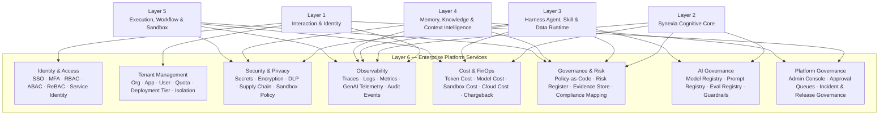

# Zhanlu™ Layer 6 — Enterprise Platform Services

**Version:** 1.0 FINAL  
**Status:** Architecture-ready draft for Gao review and implementation planning  
**Layer Position:** Layer 6 in the original Zhanlu™ Enterprise AI Operating System diagram  
**Layer Name:** Enterprise Platform Services  
**Layer Slogan:** Security · Tenancy · Observability · FinOps · Governance · AI Control Plane  
**Owner:** Zhanlu™ / Synexia™ Enterprise AI Operating System  
**Depends on:** Layer 1 Enterprise Interaction & Identity Layer, Layer 2 Synexia™ Cognitive Core, Layer 3 Enterprise Harness Agent, Skill & Data Runtime, Layer 4 Enterprise Memory, Knowledge & Context Intelligence Layer, Layer 5 Enterprise Execution Layer  
**Primary Function:** Shared platform control plane for identity, tenant isolation, security, privacy, observability, cost, policy, governance, model management, risk, compliance, and AI lifecycle management.

---

## 0. Executive Summary

Layer 6 is the **Enterprise Platform Services** layer of Zhanlu™. It is the shared control plane behind the entire system.

It is not the AI brain.  
It is not the agent runtime.  
It is not the memory layer.  
It is not the workflow or artifact execution layer.

Layer 6 provides the shared enterprise platform capabilities that every other layer depends on:

```text
identity
access control
tenancy
secrets
encryption
privacy
observability
cost governance
policy-as-code
risk management
model governance
prompt governance
evaluation governance
audit evidence
platform administration
```

The correct design principle is:

> **Enterprise Platform Services is Zhanlu’s shared control plane. It ensures that every request, agent action, skill run, model call, database query, sandbox job, memory write, workflow, and artifact build is permission-aware, traceable, costed, governed, and auditable.**

Without Layer 6, Zhanlu can work as a demo.  
With Layer 6, Zhanlu becomes an enterprise AI operating system.

---

## 1. Layer 6 Core Meaning

The main diagram currently describes Layer 6 as:

```text
Enterprise Platform Services
Secure · Governed · Reliable · Scalable
```

For the implementation architecture, the expanded meaning should be:

```text
Layer 6 — Enterprise Platform Services
Security · Tenancy · Observability · FinOps · Governance · AI Control Plane
```

Layer 6 contains eight major service domains:

```text
1. Identity & Access
2. Tenant Management
3. Security & Privacy
4. Observability
5. Cost & FinOps
6. Governance & Risk
7. AI Governance
8. Platform Governance
```

These domains are shared services. They must be called by Layers 1–5 rather than reimplemented independently inside each layer.

---

## 2. Relationship With Layers 1–5

Layer 6 is a platform control plane. It supports all previous layers.

```text
Layer 1 uses Layer 6 for:
- SSO
- MFA
- sessions
- tenant resolution
- rate limits
- user/group/app grants
- request audit
- admin console permissions

Layer 2 uses Layer 6 for:
- model routing policy
- prompt versioning
- policy evaluation
- confirmation risk levels
- budget limits
- traces
- AI governance
- evaluation results

Layer 3 uses Layer 6 for:
- agent registry governance
- skill review
- external skill supply-chain scanning
- tool permission
- secret handling
- sandbox policy
- agent/skill evaluation

Layer 4 uses Layer 6 for:
- memory governance
- data classification
- privacy policy
- retention policy
- lineage and provenance evidence
- knowledge review queues

Layer 5 uses Layer 6 for:
- workflow governance
- sandbox security
- artifact signing
- execution traces
- runtime cost
- incident events
```

Layer 6 must not duplicate all business logic. Instead, it should provide shared infrastructure and enforcement services.

---

## 3. Layer 6 Detailed Architecture Diagram



---

## 4. Domain 1 — Identity & Access

### 4.1 Purpose

Identity & Access defines who the actor is and what the actor can do.

It supports:

```text
human users
admins
service actors
API clients
business app integrations
agents
skills
workflows
sandbox jobs
external connectors
```

The key rule:

> **Identity tells Zhanlu who the actor is. Authorization tells Zhanlu what relationship the actor has to the org, app, agent, skill, datasource, memory, artifact, and action.**

### 4.2 Required Capabilities

```text
SSO
MFA
OIDC / OAuth 2.0
SAML 2.0
JWT sessions
refresh tokens
API keys
service identities
RBAC
ABAC
ReBAC
permission management
session risk scoring
admin audit permission
last-admin guard
no self-elevation
```

### 4.3 Recommended Technologies

| Need | Recommended Technology |
|---|---|
| Enterprise SSO | Keycloak, OIDC, OAuth 2.0, SAML 2.0 |
| Strong authentication | MFA, WebAuthn/passkeys |
| API authentication | scoped API keys, service actors |
| Role-based authorization | RBAC |
| Attribute-based authorization | ABAC |
| Relationship authorization | OpenFGA or SpiceDB |
| Session storage | PostgreSQL + Redis cache |

### 4.4 Identity and Authorization Objects

```text
organization
user
group
app
conversation
agent_profile
skill_profile
tool_profile
datasource
memory_item
data_snapshot
artifact
workflow
policy
model_route
```

### 4.5 Authorization Examples

```text
User can access Finance App.
User can create a private conversation in Finance App.
User cannot read another user's private conversation.
Finance Agent can use Finance Datasource.
Finance Agent can use Company Finance PPT Skill.
Finance Agent cannot access HR payroll datasource.
User can preview Q2 Finance PPT artifact.
User cannot export Q2 Finance PPT externally without confirmation.
Admin can audit company-app conversations only through audited API path.
```

### 4.6 Identity Invariants

```text
IAM-1: Client-supplied actor, org_id, user_id, role, or permission fields are never trusted.
IAM-2: All human and service actors resolve through the Identity & Access service.
IAM-3: Authorization must support RBAC, ABAC, and ReBAC patterns.
IAM-4: Service actors must be scoped to explicit apps and capabilities.
IAM-5: API keys cannot have broader permissions than their owning service actor.
IAM-6: Admin audit capability requires explicit permission and audit logging.
IAM-7: Every permission-changing action is itself audited.
```

---

## 5. Domain 2 — Tenant Management

### 5.1 Purpose

Tenant Management controls enterprise isolation, deployment profile, resource limits, and tenant lifecycle.

The scope chain remains:

```text
Platform → Enterprise / Organization → App / Workspace → Conversation
```

Layer 6 provides the shared tenant-control infrastructure behind this chain.

### 5.2 Required Capabilities

```text
organizations
apps/workspaces
users
groups
app grants
tenant quotas
deployment tier
dedicated deployment profile
data residency
tenant encryption keys
offboarding
retention policy
tenant migration
tenant-level policy packs
tenant-level model provider keys
```

### 5.3 Deployment Tiers

| Tier | Meaning | Use Case |
|---|---|---|
| shared | multi-tenant Zhanlu cloud | default SaaS deployment |
| dedicated | tenant-exclusive database/services | enterprise customer with stronger isolation |
| customer-owned | deployed inside customer Aliyun/account | data sovereignty or regulated customer |

### 5.4 Tenant Services

```text
Tenant Control Service
Tenant Quota Service
Tenant Key Service
Tenant Deployment Profile Service
Tenant Policy Pack Service
Tenant Audit Profile Service
Tenant Data Residency Service
Tenant Offboarding Service
```

### 5.5 Tenant Management Invariants

```text
TEN-1: Enterprise/org_id is the hard isolation wall.
TEN-2: Every platform service is org-aware by default.
TEN-3: App-owned resources are scoped by org_id and app_id.
TEN-4: Dedicated deployment must not require code changes.
TEN-5: Tenant-specific model keys and encryption keys are resolved server-side.
TEN-6: Tenant quotas must apply to model calls, sandbox jobs, storage, executions, and artifacts.
TEN-7: Tenant offboarding follows retention policy and audit requirements.
```

---

## 6. Domain 3 — Security & Privacy

### 6.1 Purpose

Security & Privacy protects secrets, data, code, skills, artifacts, sandboxes, model calls, and tenant content.

It must support the whole Zhanlu architecture, especially because Layer 3 allows custom agents, custom skills, custom datasources, external skill discovery, and user-created template skills.

### 6.2 Required Capabilities

```text
secret management
credential isolation
KMS / BYOK
envelope encryption
data encryption at rest
data encryption in transit
DLP / PII detection
prompt-injection defense
skill supply-chain scanning
container/package scanning
SBOM
artifact signing
sandbox policy
network egress control
break-glass access
key rotation
vulnerability management
security incident response
```

### 6.3 Secrets and Credentials

Secrets include:

```text
database credentials
API keys
model provider keys
OAuth tokens
connector credentials
SMTP credentials
enterprise system credentials
object/blob store credentials
signing keys
encryption keys
```

Rules:

```text
Agents never receive credentials.
Skills never receive raw credentials.
Prompts never contain credentials.
Memory never stores credentials.
Artifacts never embed credentials.
Sandbox jobs receive scoped handles only.
```

Recommended approach:

```text
credential_ref → Secret Vault / KMS → scoped runtime token → audited use
```

### 6.4 Privacy and DLP

Privacy service should support:

```text
PII detection
sensitive data classification
redaction
masking
anonymization
data sensitivity labeling
restricted-data routing
private conversation boundaries
memory write checks
artifact export checks
```

Data sensitivity tiers:

```text
public
internal
confidential
restricted
```

### 6.5 Skill and Supply-Chain Security

Layer 3 custom skills make this mandatory.

Every user-created or external skill package must pass:

```text
manifest validation
SKILL.md prompt-injection scan
script/static scan
dependency scan
license check
side-effect extraction
network egress review
sandbox test
validation report
review approval
signature / checksum creation
```

### 6.6 Security Invariants

```text
SEC-1: Secrets and credentials are never exposed to agents, skills, prompts, memory, artifacts, or frontend.
SEC-2: Every credential use is through a credential_ref and audited runtime resolution.
SEC-3: User-created and external skills are untrusted until reviewed and approved.
SEC-4: Code skills run only in sandbox with resource limits and network deny-by-default.
SEC-5: Artifact and skill packages should be checksummed and signed after approval.
SEC-6: Restricted data requires approved model route and approved execution environment.
SEC-7: Prompt-injection content from documents, skills, memory, or websites is treated as data, not authority.
SEC-8: Break-glass access requires customer consent, justification, and immutable audit evidence.
```

---

## 7. Domain 4 — Observability

### 7.1 Purpose

Observability makes Zhanlu explainable, debuggable, auditable, billable, and governable.

It must track every important object across Layers 1–5.

### 7.2 Required Observability Objects

```text
RequestEnvelope
TaskSpec
ContextManifest
PlanDAG
PolicyDecision
Brain/model call
AgentInvocation
SkillRun
ToolCall
DatasourceQuery
DataSnapshot
WorkflowRun
SandboxJob
ArtifactBuild
ArtifactValidation
ConfirmationRequest
AuditEvent
LearningProposal
```

### 7.3 Trace Chain

Every execution should share one trace chain:

```text
trace_id
  → envelope_id
  → execution_id
  → plan_id
  → node_key
  → model_call_id
  → agent_invocation_id
  → skill_run_id
  → tool_call_id
  → datasource_query_id
  → data_snapshot_id
  → workflow_run_id
  → sandbox_job_id
  → artifact_build_id
  → artifact_id
```

### 7.4 Telemetry Types

```text
traces
logs
metrics
events
audit records
cost records
policy decisions
validation reports
incident timeline
```

### 7.5 Recommended Technologies

| Need | Recommended Technology |
|---|---|
| Distributed tracing | OpenTelemetry |
| Metrics | Prometheus |
| Dashboards | Grafana |
| Logs | Loki / ELK / OpenSearch |
| AI traces | OpenTelemetry GenAI conventions, Langfuse or Phoenix-style tracing |
| Audit evidence | append-only PostgreSQL audit/evidence tables |

### 7.6 Observability Questions Zhanlu Must Answer

```text
Who requested this action?
Which app was used?
Which Synexia execution was created?
Which model was called?
Which prompt version was used?
Which agent profile was selected?
Which skill ran?
Which datasource was queried?
Which data snapshot was produced?
Which sandbox job generated the artifact?
Which validation passed or failed?
Which approval happened?
How much did it cost?
Why did it fail?
Who changed the policy afterwards?
```

### 7.7 Observability Invariants

```text
OBS-1: Every execution, agent run, skill run, model call, datasource query, sandbox job, workflow, and artifact build has a trace_id.
OBS-2: All traces include org_id and app_id.
OBS-3: Observability data must support debugging, audit, billing, compliance, and incident response.
OBS-4: Raw sensitive payloads are not logged unless explicitly allowed by tenant policy.
OBS-5: Failed runs preserve structured error evidence for recovery and evaluation.
OBS-6: Every high-risk action must have trace, policy decision, confirmation, and audit evidence.
```

---

## 8. Domain 5 — Cost & FinOps

### 8.1 Purpose

Cost & FinOps controls and explains the cost of AI and platform usage.

For Zhanlu, cost is not only cloud cost. It includes:

```text
model token cost
model API cost
embedding cost
reranking cost
sandbox runtime cost
workflow execution cost
database query cost
storage cost
artifact conversion cost
GPU/CPU runtime cost
network egress cost
connector cost
```

### 8.2 Cost Dimensions

Cost must be attributed by:

```text
org_id
app_id
user_id
conversation_id
execution_id
agent_id
skill_id
tool_id
datasource_id
model_id
artifact_id
workflow_id
sandbox_job_id
```

### 8.3 Cost Ledger

```sql
CREATE TABLE cost_ledger (
    id UUID PRIMARY KEY,
    org_id UUID NOT NULL,
    app_id UUID,
    user_id UUID,
    execution_id UUID,
    conversation_id UUID,
    agent_profile_id UUID,
    skill_profile_id UUID,
    model_id UUID,
    datasource_id UUID,
    artifact_id UUID,
    cost_type TEXT NOT NULL,
    -- model_tokens | embedding | rerank | sandbox | storage | query | workflow | network | cloud
    units NUMERIC,
    unit_name TEXT,
    estimated_cost NUMERIC NOT NULL,
    currency TEXT NOT NULL DEFAULT 'CNY',
    provider TEXT,
    metadata JSONB NOT NULL DEFAULT '{}',
    created_at TIMESTAMPTZ NOT NULL DEFAULT now()
);
```

### 8.4 Budget Controls

```text
tenant monthly budget
app budget
user budget
agent budget
skill budget
model-call budget
sandbox budget
artifact-generation budget
cost anomaly detection
budget warning
quota enforcement
chargeback reports
```

### 8.5 Finance PPT Cost Example

```text
Finance Agent generated Q2 PPT:
- model planning: ¥0.21
- context retrieval: ¥0.02
- SQL query: ¥0.03
- chart generation: ¥0.04
- sandbox PPT build: ¥0.18
- PDF preview conversion: ¥0.06
- storage: ¥0.01
Total: ¥0.55
```

### 8.6 Cost Invariants

```text
COST-1: Every model call, sandbox job, artifact build, workflow, and datasource query records cost metadata.
COST-2: Cost is tracked by org_id, app_id, execution_id, agent_id, skill_id, and model_id where available.
COST-3: Budget enforcement happens before expensive execution when possible.
COST-4: Budget exhaustion fails visibly, not silently.
COST-5: Cost ledger uses currency-aware fields, defaulting to CNY for China deployment.
COST-6: Cost reports support tenant billing, chargeback, anomaly detection, and product analytics.
```

---

## 9. Domain 6 — Governance & Risk

### 9.1 Purpose

Governance & Risk provides policy-as-code, risk scoring, compliance evidence, approval rules, and enterprise control mapping.

It is the shared policy control plane for Zhanlu.

### 9.2 Required Capabilities

```text
policy registry
policy packs
policy versioning
policy testing
policy deployment
policy rollback
risk register
risk scoring
approval policy
compliance evidence
control mapping
incident records
retention policy
data governance policy
export policy
human review requirements
```

### 9.3 Policy-as-Code Direction

V1 can use YAML policy packs.

Later, when policies become more complex, Zhanlu can adopt OPA/Rego.

Policy pack examples:

```text
default.yaml
finance.yaml
compliance.yaml
artifact.yaml
skill_review.yaml
model_routing.yaml
data_export.yaml
```

### 9.4 Example Policies

```text
No unconfirmed write.
No cross-org access.
No external email without approval.
No code skill without sandbox.
No high-impact skill without reviewer approval.
No model call with restricted data unless model route is approved.
No artifact publish without validation report.
No skill publication without review.
No datasource query outside agent data binding.
No memory write from unvalidated model output.
```

### 9.5 Risk Register

```sql
CREATE TABLE risk_register (
    id UUID PRIMARY KEY,
    org_id UUID NOT NULL,
    app_id UUID,
    risk_code TEXT NOT NULL,
    risk_title TEXT NOT NULL,
    risk_category TEXT NOT NULL,
    severity TEXT NOT NULL,
    likelihood TEXT,
    status TEXT NOT NULL DEFAULT 'open',
    owner_user_id UUID,
    mitigation_plan JSONB NOT NULL DEFAULT '{}',
    evidence_refs UUID[] NOT NULL DEFAULT '{}',
    created_at TIMESTAMPTZ NOT NULL DEFAULT now(),
    updated_at TIMESTAMPTZ NOT NULL DEFAULT now()
);
```

### 9.6 Evidence Store

Compliance evidence should include:

```text
policy decision records
audit logs
approval events
model evaluation reports
red-team reports
artifact validation reports
skill review reports
security scan reports
cost reports
incident reports
risk acceptance records
```

### 9.7 Governance Invariants

```text
GOV-1: No layer implements an independent policy engine that bypasses Platform Governance.
GOV-2: Policy versions are recorded in every execution version stamp.
GOV-3: High-risk AI actions require policy decision, approval evidence, and audit records.
GOV-4: Policy changes require versioning and audit trail.
GOV-5: Compliance evidence must be exportable for enterprise review.
GOV-6: Risk acceptance must be explicit, time-bound, and auditable.
GOV-7: Retention and deletion policies must apply to conversations, artifacts, memory, data snapshots, traces, and audit records.
```

---

## 10. Domain 7 — AI Governance

### 10.1 Purpose

AI Governance controls models, prompts, evaluations, guardrails, risk classification, and AI lifecycle.

It ensures Zhanlu does not only use AI, but manages AI responsibly.

### 10.2 Required Capabilities

```text
model registry
model provider registry
model route policy
prompt registry
prompt pack versioning
evaluation registry
golden task sets
red-team tests
guardrail registry
bias/fairness checks
model approval workflow
model deprecation
model risk classification
human oversight evidence
AI incident reporting
```

### 10.3 Model Registry

```sql
CREATE TABLE model_registry (
    id UUID PRIMARY KEY,
    provider TEXT NOT NULL,
    model_name TEXT NOT NULL,
    deployment_mode TEXT NOT NULL,
    -- shared_provider | tenant_key | self_hosted | dedicated_endpoint
    status TEXT NOT NULL DEFAULT 'candidate',
    -- candidate | approved | restricted | deprecated | disabled
    allowed_data_sensitivity TEXT[] NOT NULL DEFAULT '{public,internal}',
    allowed_task_kinds TEXT[] NOT NULL DEFAULT '{}',
    max_context_tokens INT,
    supports_tools BOOLEAN NOT NULL DEFAULT false,
    supports_json_schema BOOLEAN NOT NULL DEFAULT false,
    supports_vision BOOLEAN NOT NULL DEFAULT false,
    supports_audio BOOLEAN NOT NULL DEFAULT false,
    cost_profile JSONB NOT NULL DEFAULT '{}',
    evaluation_report JSONB,
    created_at TIMESTAMPTZ NOT NULL DEFAULT now()
);
```

### 10.4 Model Routing Policy

Model selection should depend on:

```text
task kind
risk tier
data sensitivity
tenant deployment tier
cost budget
latency budget
required modality
required context length
approved model list
customer-specific provider key
```

Example:

```text
Low-risk FAQ → fast low-cost model.
Finance PPT planning → stronger reasoning model.
Restricted customer data → tenant-approved model route only.
High-risk compliance analysis → approved model + human review.
Dedicated deployment → customer-supplied model key or private endpoint.
```

### 10.5 Prompt Registry

Prompts are not security boundaries, but they must be versioned.

```sql
CREATE TABLE prompt_registry (
    id UUID PRIMARY KEY,
    prompt_key TEXT NOT NULL,
    task_kind TEXT,
    version TEXT NOT NULL,
    content_hash TEXT NOT NULL,
    status TEXT NOT NULL DEFAULT 'draft',
    -- draft | approved | deprecated | disabled
    owner_user_id UUID,
    approved_by UUID,
    created_at TIMESTAMPTZ NOT NULL DEFAULT now()
);
```

### 10.6 Evaluation Registry

Evaluation types:

```text
golden task evaluation
privacy leakage test
policy regression test
retrieval quality test
agent routing test
skill execution test
artifact quality test
NL2SQL correctness test
bias/fairness test
red-team test
cost regression test
latency regression test
```

### 10.7 Guardrail Registry

Guardrails include:

```text
input guardrails
output guardrails
tool-call guardrails
data-sensitivity guardrails
memory-write guardrails
artifact-export guardrails
external-send guardrails
code-skill guardrails
```

### 10.8 AI Governance Invariants

```text
AIG-1: Every model used by Zhanlu must exist in the Model Registry.
AIG-2: Every model route must obey tenant policy, data sensitivity, risk tier, and budget.
AIG-3: Every prompt pack used in an execution is versioned and recorded.
AIG-4: Evaluation reports are required before approving high-impact model routes.
AIG-5: Guardrail versions are recorded for high-risk executions.
AIG-6: Red-team and regression tests must run before publishing high-impact model, prompt, policy, or skill changes.
AIG-7: Model self-assessment is never accepted as governance evidence by itself.
AIG-8: Human oversight evidence is required for high-risk AI actions.
```

---

## 11. Domain 8 — Platform Governance

### 11.1 Purpose

Platform Governance is the enterprise administration and operations surface.

It provides the admin console and operational workflows that govern the platform.

### 11.2 Required Capabilities

```text
admin console
approval queues
policy packs
model approval
skill approval
agent approval
risk dashboard
audit dashboard
cost dashboard
incident dashboard
release management
configuration management
evidence export
operations governance
data governance
AI governance
platform governance
```

### 11.3 Admin Console Views

```text
Organizations
Users
Groups
Apps
Grants
Sessions
Agents
Skills
Datasources
Models
Prompts
Policies
Guardrails
Executions
Artifacts
Costs
Risks
Incidents
Audit Logs
Evidence Store
Review Queues
```

### 11.4 Approval Queues

```text
skill review queue
agent review queue
model approval queue
prompt approval queue
policy approval queue
artifact publish queue
memory candidate review queue
data export approval queue
high-risk action queue
risk acceptance queue
```

### 11.5 Incident Management

Incident types:

```text
security incident
privacy incident
model incident
policy incident
skill incident
artifact incident
datasource incident
cost anomaly
performance degradation
cross-tenant access attempt
sandbox escape attempt
```

### 11.6 Platform Governance Invariants

```text
PGOV-1: Admin UI is not a bypass; it consumes the same authorization and audit APIs.
PGOV-2: Approval queues write immutable decision records.
PGOV-3: Incident records link to trace_id, affected org/app, risk category, evidence, and resolution.
PGOV-4: Platform configuration changes are versioned and audited.
PGOV-5: Evidence export must support enterprise audit and customer review.
```

---

## 12. Enterprise Platform Services Data Model

### 12.1 Core Platform Tables

```text
organizations
users
groups
group_members
apps
app_grants
sessions
request_envelopes
audit_log
```

### 12.2 Platform Service Tables

```text
tenant_profiles
tenant_quotas
tenant_keys
tenant_policy_packs
service_identities
api_keys
permission_edges
secret_refs
security_scans
policy_registry
policy_decisions
risk_register
evidence_records
model_registry
model_routes
prompt_registry
evaluation_registry
guardrail_registry
cost_ledger
platform_incidents
approval_requests
platform_config_versions
```

### 12.3 Evidence Records

```sql
CREATE TABLE evidence_records (
    id UUID PRIMARY KEY,
    org_id UUID NOT NULL,
    app_id UUID,
    evidence_type TEXT NOT NULL,
    -- audit | policy_decision | approval | evaluation | scan | incident | validation | cost | model_route
    source_kind TEXT NOT NULL,
    source_id UUID NOT NULL,
    trace_id UUID,
    summary TEXT,
    metadata JSONB NOT NULL DEFAULT '{}',
    created_at TIMESTAMPTZ NOT NULL DEFAULT now()
);
```

### 12.4 Policy Decisions

```sql
CREATE TABLE policy_decisions (
    id UUID PRIMARY KEY,
    org_id UUID NOT NULL,
    app_id UUID,
    actor_user_id UUID,
    execution_id UUID,
    action TEXT NOT NULL,
    resource_kind TEXT,
    resource_id UUID,
    policy_pack_version TEXT NOT NULL,
    decision TEXT NOT NULL,
    -- allow | deny | require_confirm | require_review
    risk_tier TEXT NOT NULL DEFAULT 'low',
    reasons JSONB NOT NULL DEFAULT '[]',
    created_at TIMESTAMPTZ NOT NULL DEFAULT now()
);
```

### 12.5 Model Routes

```sql
CREATE TABLE model_routes (
    id UUID PRIMARY KEY,
    org_id UUID,
    app_id UUID,
    route_name TEXT NOT NULL,
    task_kind TEXT,
    risk_tier TEXT,
    data_sensitivity TEXT,
    model_id UUID NOT NULL,
    provider_credential_ref UUID,
    status TEXT NOT NULL DEFAULT 'active',
    budget_policy JSONB NOT NULL DEFAULT '{}',
    created_at TIMESTAMPTZ NOT NULL DEFAULT now()
);
```

---

## 13. API Surface

### 13.1 Identity and Access

```text
GET    /platform/me
GET    /platform/sessions
POST   /platform/api-keys
DELETE /platform/api-keys/{id}
GET    /platform/permissions/check
POST   /platform/permissions/batch-check
```

### 13.2 Tenant Management

```text
GET    /platform/tenants/{org_id}
PATCH  /platform/tenants/{org_id}
GET    /platform/tenants/{org_id}/quotas
PATCH  /platform/tenants/{org_id}/quotas
GET    /platform/tenants/{org_id}/deployment-profile
PATCH  /platform/tenants/{org_id}/deployment-profile
```

### 13.3 Security and Privacy

```text
POST   /platform/security/scan-skill
POST   /platform/security/scan-artifact
POST   /platform/security/dlp/check
GET    /platform/security/secrets/{secret_ref}/usage
POST   /platform/security/break-glass/request
```

### 13.4 Observability

```text
GET    /platform/traces/{trace_id}
GET    /platform/executions/{execution_id}/trace
GET    /platform/audit/events
GET    /platform/incidents
POST   /platform/incidents
```

### 13.5 Cost and FinOps

```text
GET    /platform/costs/summary
GET    /platform/costs/by-agent
GET    /platform/costs/by-skill
GET    /platform/costs/by-model
GET    /platform/budgets
PATCH  /platform/budgets/{id}
```

### 13.6 Governance and Risk

```text
GET    /platform/policies
POST   /platform/policies
GET    /platform/policy-decisions
GET    /platform/risks
POST   /platform/risks
PATCH  /platform/risks/{id}
GET    /platform/evidence
```

### 13.7 AI Governance

```text
GET    /platform/models
POST   /platform/models
PATCH  /platform/models/{id}
GET    /platform/model-routes
POST   /platform/model-routes
GET    /platform/prompts
POST   /platform/prompts
GET    /platform/evaluations
POST   /platform/evaluations/run
GET    /platform/guardrails
POST   /platform/guardrails
```

### 13.8 Platform Governance

```text
GET    /platform/admin/dashboard
GET    /platform/review-queues
POST   /platform/review-queues/{id}/approve
POST   /platform/review-queues/{id}/reject
GET    /platform/config/versions
POST   /platform/config/rollback
GET    /platform/evidence/export
```

---

## 14. Finance PPT Example — Platform Services Support

User asks:

```text
Finance Agent, make a Q2 finance PPT report.
```

Layer 6 supports the flow as follows:

```text
Identity & Access:
- confirms user identity
- checks Finance App access
- checks artifact preview/export permissions

Tenant Management:
- enforces org_id/app_id scope
- checks tenant quotas
- resolves deployment tier

Security & Privacy:
- keeps finance database credentials in vault
- checks data sensitivity
- enforces sandbox network policy
- scans generated artifact if needed

Observability:
- links envelope_id, execution_id, agent_invocation_id, skill_run_id, datasource_query_id, artifact_build_id

Cost & FinOps:
- records model, retrieval, SQL query, sandbox, preview, storage cost

Governance & Risk:
- requires confirmation for app-shared artifact publish or external export
- stores policy decision evidence

AI Governance:
- chooses approved model route for finance data
- records prompt/model/guardrail/eval versions

Platform Governance:
- shows approval, audit, cost, artifact, and trace in admin console
```

This makes the finance PPT flow enterprise-ready.

---

## 15. Big Diagram Update Guidance

Current block:

```text
Enterprise Platform Services
Secure · Governed · Reliable · Scalable
```

Recommended block title:

```text
Enterprise Platform Services
Security · Tenancy · Observability · FinOps · Governance · AI Control Plane
```

### Existing sub-blocks to keep

```text
Identity & Access
Tenant Management
Security & Privacy
Observability
Cost & FinOps
Governance & Risk
AI Governance
Platform Governance
```

### Recommended content updates

```text
Identity & Access
SSO · MFA · RBAC · ABAC · ReBAC · Service Identity

Tenant Management
Multi-tenancy · Dedicated Tier · Quotas · Tenant Keys · Data Residency

Security & Privacy
Secrets · KMS/BYOK · DLP · Supply Chain · Sandbox Policy · Encryption

Observability
OpenTelemetry · GenAI Traces · Logs · Metrics · Audit · Incident Timeline

Cost & FinOps
Token Cost · Sandbox Cost · Cloud Cost · FOCUS · Budget · Chargeback

Governance & Risk
Policy-as-Code · Risk Register · Evidence Store · Compliance Mapping

AI Governance
Model Registry · Prompt Registry · Evals · Red Team · Bias/Fairness · Guardrails

Platform Governance
Policy Packs · Admin Console · Approval Queues · Release & Incident Governance
```

---

## 16. Implementation Priority

### P0 — Required for first enterprise-ready release

```text
JWT session service
basic RBAC
org/app tenant profile
PostgreSQL RLS integration
append-only audit log
basic policy registry
basic policy decision records
OpenTelemetry trace IDs
model registry minimal version
prompt version registry
cost ledger minimal version
secret_ref pattern
admin console basics
```

### P1 — Required for stronger enterprise deployment

```text
OIDC/SAML SSO
OpenFGA/SpiceDB-style ReBAC
tenant quota service
Secret Vault / KMS integration
DLP/PII scanning
skill supply-chain scanning
AI cost dashboard
model routing policy
risk register
evidence store
review queues
incident management
```

### P2 — Advanced enterprise governance

```text
BYOK
customer-owned deployment profiles
OPA/Rego policy engine
FOCUS-compatible cost export
OpenCost integration
AI governance dashboard
red-team evaluation registry
bias/fairness evaluation
artifact signing
SBOM and SLSA-style provenance
compliance evidence export
```

### P3 — Large-scale / regulated enterprise expansion

```text
dedicated tenant infrastructure automation
cross-region data residency
advanced anomaly detection
continuous compliance monitoring
third-party GRC integration
enterprise SIEM integration
model lifecycle approval workflows
AI incident response automation
```

---

## 17. Repo Touch List

```text
backend/
  platform/
    identity/
      service.py
      sessions.py
      api_keys.py
      service_actors.py
    authorization/
      rbac.py
      abac.py
      rebac_adapter.py
      permission_check.py
    tenancy/
      tenant_profiles.py
      quotas.py
      deployment_profiles.py
      tenant_keys.py
    security/
      secrets.py
      kms.py
      dlp.py
      scans.py
      supply_chain.py
      break_glass.py
    observability/
      traces.py
      metrics.py
      audit_events.py
      incident_timeline.py
    cost/
      ledger.py
      budgets.py
      chargeback.py
      anomaly.py
    governance/
      policies.py
      policy_decisions.py
      risk_register.py
      evidence_store.py
      approvals.py
    ai_governance/
      model_registry.py
      model_routes.py
      prompt_registry.py
      eval_registry.py
      guardrail_registry.py
    admin/
      dashboard.py
      review_queues.py
      evidence_export.py
      config_versions.py

frontend/
  features/platform/
    admin-dashboard/
    identity-access/
    tenant-management/
    security-privacy/
    observability/
    cost-finops/
    governance-risk/
    ai-governance/
    platform-governance/
    review-queues/
    evidence-export/

migrations/
  xxxx_platform_identity.py
  xxxx_platform_tenancy.py
  xxxx_platform_security.py
  xxxx_platform_observability.py
  xxxx_platform_cost.py
  xxxx_platform_governance.py
  xxxx_platform_ai_governance.py
```

---

## 18. Acceptance Criteria

### Identity & Access

- [ ] Client-supplied identity fields are ignored and logged.
- [ ] Service actors are scoped to explicit org/app/capabilities.
- [ ] Permission check works for user, app, agent, skill, datasource, artifact, and action.
- [ ] Admin audit permission cannot be self-elevated.

### Tenant Management

- [ ] All platform records include org_id where required.
- [ ] App-owned records include app_id where required.
- [ ] Tenant quota exhaustion blocks expensive execution before cost is incurred where possible.
- [ ] Dedicated deployment profile can be resolved without code changes.

### Security & Privacy

- [ ] Agents and skills cannot access raw credentials.
- [ ] Credential use creates audit evidence.
- [ ] External/user-created skill packages enter review before approval.
- [ ] Code skill without sandbox policy is rejected.
- [ ] Restricted data cannot use unapproved model route.

### Observability

- [ ] One trace connects RequestEnvelope to final artifact.
- [ ] Model calls, agent invocations, skill runs, datasource queries, sandbox jobs, and artifact builds are traceable.
- [ ] High-risk execution includes policy decision, approval event, and audit evidence.
- [ ] Failed execution preserves structured error evidence.

### Cost & FinOps

- [ ] Model call cost is recorded.
- [ ] Sandbox job cost is recorded.
- [ ] Artifact build cost is recorded.
- [ ] Costs are queryable by org/app/agent/skill/model.
- [ ] Budget exhaustion produces visible failure or confirmation.

### Governance & Risk

- [ ] Policy decision record is created for high-risk action.
- [ ] Policy version is stored in execution metadata.
- [ ] Risk register supports open/mitigated/accepted/closed states.
- [ ] Evidence records link to source objects.

### AI Governance

- [ ] Every model used exists in model registry.
- [ ] Every prompt pack used is versioned.
- [ ] Model route checks data sensitivity and tenant policy.
- [ ] Evaluation reports are linked to high-impact model route approval.

### Platform Governance

- [ ] Admin console uses normal authorization APIs.
- [ ] Review queue approvals create immutable records.
- [ ] Platform configuration changes are versioned and audited.
- [ ] Evidence export is available for customer review.

---

## 19. Named Invariants

```text
PLT-0: Platform Services is the shared control plane for security, tenancy, observability, cost, governance, and AI management.

PLT-1: No layer implements its own independent identity, permission, policy, or audit logic.

PLT-2: All platform services are org-aware and app-aware by default.

PLT-3: Every execution, agent run, skill run, model call, datasource query, sandbox job, workflow, memory write, and artifact build has a trace_id.

PLT-4: Every model, prompt, policy, skill, tool, guardrail, and validator version used in an execution is recorded.

PLT-5: Secrets and credentials are never exposed to agents, skills, prompts, memory, artifacts, or frontend.

PLT-6: Cost is tracked by org_id, app_id, user_id, agent_id, skill_id, model_id, execution_id, and artifact_id where applicable.

PLT-7: High-risk AI actions require policy evaluation, approval evidence, and audit records.

PLT-8: Model usage is controlled by data sensitivity, tenant policy, cost budget, and deployment tier.

PLT-9: User-created skills and external packages must pass supply-chain scanning and review before publication.

PLT-10: Observability data must support debugging, audit, billing, compliance, and incident response.

PLT-11: AI Governance must maintain model registry, prompt registry, evaluation registry, risk register, and guardrail registry.

PLT-12: Dedicated deployment customers can use tenant-specific model keys, encryption keys, deployment profiles, and data-residency policy.

PLT-13: Admin UI is not a bypass; it consumes the same authorization and audit APIs as other clients.

PLT-14: Platform policy changes are versioned, tested, auditable, and rollbackable.

PLT-15: Compliance evidence must be linked to source trace, execution, policy decision, approval, validation, or incident record.
```

---

## 20. Architecture Decision Record

### ADR-PLT-001 — Platform Services is a control plane, not another business layer

**Decision:** Layer 6 is implemented as shared platform services called by Layers 1–5.

**Why:** Identity, tenancy, security, observability, cost, policy, and AI governance must be consistent across the whole system. If each layer implements these independently, Zhanlu will become inconsistent and unsafe.

**Consequence:** Layers 1–5 must use shared platform APIs for identity, policy, trace, cost, secrets, model registry, evidence, and governance.

---

### ADR-PLT-002 — Start YAML policy packs, allow OPA/Rego later

**Decision:** Use YAML policy packs in v1. Move to OPA/Rego only when policy complexity or customer requirements demand it.

**Why:** YAML policies are simpler for first implementation. OPA/Rego adds power but increases learning and operational complexity.

**Consequence:** Policy registry must be designed with versioning and migration path to OPA/Rego.

---

### ADR-PLT-003 — PostgreSQL remains source of truth for governance evidence

**Decision:** Audit logs, policy decisions, cost records, evidence records, risk records, model registry records, and approval records are stored in PostgreSQL.

**Why:** Zhanlu is database-first. Governance evidence must be queryable, backed up, versioned, and permission-scoped.

**Consequence:** External observability tools may store traces and logs, but critical governance evidence remains in Zhanlu-controlled database tables.

---

### ADR-PLT-004 — AI governance is first-class, not optional

**Decision:** Model registry, prompt registry, evaluation registry, guardrail registry, and model routing policy are part of Layer 6 from the architecture phase.

**Why:** Enterprise customers will ask which model was used, why it was allowed, what data it processed, which prompt version was used, what evaluation passed, and who approved it.

**Consequence:** Every execution should record model, prompt, policy, guardrail, and validator versions.

---

## 21. Final Design Sentence

**Layer 6, Enterprise Platform Services, is Zhanlu’s shared control plane for identity, tenancy, security, privacy, observability, cost, governance, risk, model management, prompt management, evaluation, and AI lifecycle control. It ensures that every request, model call, agent invocation, skill run, datasource query, sandbox job, workflow, memory write, artifact build, approval, and policy decision is scoped, permission-checked, traceable, costed, governed, and auditable.**
