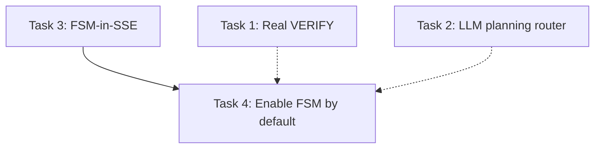

# P1 — Real VERIFY, LLM Planning Router, Enable SynexiaFSM by Default

> **For Claude:** REQUIRED SUB-SKILL: Use superpowers:executing-plans to implement this plan task-by-task.

**Goal:** Close three real gaps left after P0: (1) the FSM's VERIFY state is a stub that only logs failed nodes — make it actually validate outputs; (2) the planning router is English-only regex — make it multilingual and LLM-based; (3) the SynexiaFSM is off by default and, worse, the v3 SSE streaming path never routes to it at all — wire FSM into SSE and then enable it by default.

**Architecture:** All new LLM-path components (verifier sub-agent, LLM planning classifier) ship **behind flags, default OFF**. The deterministic validator (artifact/observation/data-integrity checks) is always-on when the FSM runs — it's cheap and safe. FSM-in-SSE reuses the additive `fsm_state` SSE event type that P0 reserved in the protocol. Enabling-by-default is the LAST task and depends on FSM-in-SSE landing first.

**Tech Stack:** Python 3 + FastAPI + SQLAlchemy, existing `synexia/` service package. No new dependencies. AST-based targeted pytest runs (RAM constraint established earlier).

**Out of scope (already done):** Parallel tool execution. Verified implemented via `asyncio.gather(..., return_exceptions=True)` at `agents.py:1700, 1787, 2280, 2413, 2472, 3595`, covered by `tests/test_parallel_tools_and_approval.py` and `tests/test_force_pause_parallel_tools.py`. Not re-planned.

---

## Status snapshot (verified 2026-07-21)

- [x] `SynexiaFSM` at `backend/app/services/synexia/fsm.py:83`; `run()` pipeline INIT→GOAL→CONTEXT→PLAN→GATE→ACT→OBSERVE→VERIFY→FINALIZE at lines 95-153
- [x] `_run_verify` STUB at `fsm.py:224-231` — only logs failed plan nodes; no validation, no persistence
- [x] No verifier module/class anywhere under `app/services/synexia/` (confirmed via search: `verifier`, `verify_artifact`, `validate_artifact`, `verification` → no matches)
- [x] `contracts.py` has `ConfidenceScore` but no verification contract
- [x] `confidence_scorer.py` has stub factors `artifact_validation` / `data_integrity` that VERIFY should feed
- [x] Planning router `should_trigger_planning` at `app/services/planning_trigger.py:65` — heuristic only, English-only regex (`_MULTI_STEP_CONNECTIVES`, `_PLAN_KEYWORDS`, `_ACTION_VERBS` at lines 33-51)
- [x] `SYNEXIA_FSM_ENABLED: bool = False` at `app/config.py:135`; `is_fsm_enabled()` in `fsm.py`
- [x] v2 `add_message` routes to FSM at `agents.py:1312-1328` (`SynexiaFSM(db).run(ExecutionRequest(...))`)
- [x] v3 `add_message_stream` (SSE) does NOT route to FSM — classifies then falls through to tool loop at `agents.py:3110-3125` with comment "FSM streaming is a follow-up task"
- [x] `_emit_activity_step` SSE envelope helper at `agents.py:283-296` — the shape to reuse for `fsm_state` events
- [x] `ObservationRecord` model at `app/models/execution.py:140` — fields: `observation_type`, `tool_name`, `request_args`, `result_data`, `success`, `error_message`, `duration_ms`, `artifact_ids` (lines 151-161)
- [x] `Execution` model fields `confidence_score`, `confidence_factors` at `execution.py:65-66` — VERIFY result can persist to `confidence_factors`
- [x] P0 reserved `fsm_state` SSE event type in the protocol doc (see `2026-07-21-p0-sse-reasoning.md` "Real gaps" item 4)

## Real gaps this plan closes

1. **VERIFY is a no-op.** `_run_verify` (fsm.py:224-231) iterates plan nodes and logs failures. Nothing validates that artifacts exist, that observations succeeded, or that data is intact. The `confidence_scorer` stub factors never get real inputs.
2. **Planning router is English-only.** `planning_trigger.py` regex only matches English connectives/keywords/verbs. A Chinese / Arabic / Spanish multi-step request scores 0 and bypasses the planning layer. There is no LLM fallback.
3. **FSM is unreachable from streaming chat.** Even with `SYNEXIA_FSM_ENABLED=True`, the primary v3 SSE path (`add_message_stream`) never invokes the FSM — it just logs and falls through. So enabling the flag alone would leave streaming chat on the raw loop. FSM-in-SSE must land first.

## Rollout / flag decisions (confirmed with user)

- Verifier sub-agent (LLM rubric pass): **behind flag `SYNEXIA_VERIFIER_LLM_ENABLED`, default OFF.**
- Deterministic validator (artifact-exists, observation-success, data-integrity): **always-on when FSM runs** (no LLM, no cost).
- LLM planning classifier: **behind flag `PLANNING_ROUTER_MODE`** (`heuristic` default | `llm` | `hybrid`). Heuristic stays the fallback when LLM unavailable/low-confidence.
- FSM-in-SSE: gated by existing `SYNEXIA_FSM_ENABLED` (same flag as v2). Emits additive `fsm_state` events; unknown event types are ignored by current frontend consumers, so this is backward-compatible.
- Enable-by-default (flip `SYNEXIA_FSM_ENABLED` to `True`): **final task**, only after Tasks 1-3 land and pass.

---

## Task 1: Real VERIFY — deterministic validator + optional verifier sub-agent

**Files:**
- Create: `backend/app/services/synexia/verifier.py`
- Modify: `backend/app/services/synexia/fsm.py:224-231` (replace `_run_verify` stub body)
- Modify: `backend/app/config.py` (add `SYNEXIA_VERIFIER_LLM_ENABLED: bool = False`)
- Test: `backend/tests/test_synexia_verifier.py`

- [ ] **Step 1: Write the failing test**

```python
# backend/tests/test_synexia_verifier.py
from app.services.synexia.verifier import verify_execution

def test_verify_flags_missing_artifact(db_session, execution_with_observation):
    # observation references artifact_ids=["abc"] but artifact row absent
    result = verify_execution(db_session, execution_with_observation, plan=None)
    assert result.passed is False
    assert any(c["check"] == "artifact_exists" and not c["ok"] for c in result.checks)

def test_verify_passes_clean_execution(db_session, clean_execution):
    result = verify_execution(db_session, clean_execution, plan=None)
    assert result.passed is True
    assert result.artifact_ok and result.observations_ok and result.data_integrity_ok
```

- [ ] **Step 2: Run test to verify it fails**

Run: `cd /root/zhanlu/backend && python -m pytest tests/test_synexia_verifier.py -v`
Expected: FAIL — `ModuleNotFoundError: app.services.synexia.verifier`

- [ ] **Step 3: Write minimal `verifier.py`**

Deterministic `verify_execution(db, execution, plan) -> VerificationResult`:
- `artifact_exists`: every `artifact_id` in every observation's `artifact_ids` resolves to a row.
- `observation_success`: no `ObservationRecord` with `success=False` (unless node marked optional).
- `data_integrity`: each observation's `result_data` is non-empty when `success=True`.
`VerificationResult` (dataclass/pydantic): `passed: bool`, `checks: list[{check, ok, detail}]`, convenience booleans `artifact_ok`, `observations_ok`, `data_integrity_ok`.
Optional LLM rubric pass `verify_with_llm(...)` gated by `settings.SYNEXIA_VERIFIER_LLM_ENABLED`; on any LLM error, log + return deterministic result unchanged.

- [ ] **Step 4: Wire into `_run_verify`**

Replace the stub body at `fsm.py:224-231`: call `verify_execution`, store `result.__dict__` into `self.execution.confidence_factors["verification"]`, commit. Do NOT raise on `passed=False` — partial results still useful (preserve existing non-fatal semantics). Optionally call `verify_with_llm` when the flag is on.

- [ ] **Step 5: Run test to verify it passes**

Run: `cd /root/zhanlu/backend && python -m pytest tests/test_synexia_verifier.py -v`
Expected: PASS

- [ ] **Step 6: Commit**

```bash
git add backend/app/services/synexia/verifier.py backend/app/services/synexia/fsm.py backend/app/config.py backend/tests/test_synexia_verifier.py
git commit -m "feat(synexia): real VERIFY — deterministic validator + optional LLM verifier (flag off)"
```

---

## Task 2: LLM-based multilingual planning router

**Files:**
- Modify: `backend/app/services/planning_trigger.py` (add LLM classifier + keep heuristic as fallback)
- Modify: `backend/app/config.py` (add `PLANNING_ROUTER_MODE: str = "heuristic"`)
- Test: `backend/tests/test_planning_router_llm.py`

- [ ] **Step 1: Write the failing test**

```python
def test_llm_classifies_chinese_multistep(monkeypatch):
    monkeypatch.setattr(settings, "PLANNING_ROUTER_MODE", "llm")
    fake = {"should_plan": True, "confidence": 0.9}
    monkeypatch.setattr(planning_trigger, "_classify_with_llm", lambda msg: fake)
    t = planning_trigger.should_trigger_planning("先创建一个报告，然后把它发给经理")
    assert t.should_plan is True

def test_heuristic_fallback_when_llm_unavailable(monkeypatch):
    monkeypatch.setattr(settings, "PLANNING_ROUTER_MODE", "llm")
    monkeypatch.setattr(planning_trigger, "_classify_with_llm", lambda msg: None)
    t = planning_trigger.should_trigger_planning("Create a report and then email it")
    assert t.should_plan is True  # heuristic still catches English
```

- [ ] **Step 2: Run test to verify it fails**

Run: `cd /root/zhanlu/backend && python -m pytest tests/test_planning_router_llm.py -v`
Expected: FAIL — `_classify_with_llm` doesn't exist.

- [ ] **Step 3: Implement**

Add `_classify_with_llm(user_message) -> dict | None` that calls the shared LLM service with a classify-prompt returning strict JSON `{should_plan, confidence}`. In `should_trigger_planning`, branch on `settings.PLANNING_ROUTER_MODE`:
- `heuristic` (default): current behavior.
- `llm`: try LLM; on `None`/low-confidence/exception, fall back to heuristic.
- `hybrid`: run heuristic first; only call LLM when heuristic confidence is in a gray band (e.g. 0.2-0.6).
Never let an LLM error escape — wrap and fall back.

- [ ] **Step 4: Run test to verify it passes**

Run: `cd /root/zhanlu/backend && python -m pytest tests/test_planning_router_llm.py tests/test_planning_trigger.py -v`
Expected: PASS (existing heuristic tests still green)

- [ ] **Step 5: Commit**

```bash
git add backend/app/services/planning_trigger.py backend/app/config.py backend/tests/test_planning_router_llm.py
git commit -m "feat(planning): LLM multilingual router behind PLANNING_ROUTER_MODE (default heuristic)"
```

---

## Task 3: FSM-in-SSE — stream `fsm_state` events from `add_message_stream`

**Files:**
- Modify: `backend/app/routers/agents.py` (region 3101-3130 — replace fall-through with actual FSM routing + SSE emits)
- Modify: `backend/app/services/synexia/fsm.py` (`_transition` at line 155 — accept an optional state-change callback)
- Test: `backend/tests/test_v3_fsm_stream.py`

- [ ] **Step 1: Write the failing test**

```python
def test_v3_stream_emits_fsm_state_events(client, monkeypatch):
    monkeypatch.setattr(settings, "SYNEXIA_FSM_ENABLED", True)
    monkeypatch.setattr(planning_trigger, "should_trigger_planning",
                        lambda m: PlanTrigger(True, 0.9, {}))
    events = list(stream_v3(client, "plan and run a multi-step task"))
    types = [e["type"] for e in events]
    assert "fsm_state" in types
    states = [e["state"] for e in events if e["type"] == "fsm_state"]
    assert "plan" in states and "verify" in states and "done" in states
```

- [ ] **Step 2: Run test to verify it fails**

Run: `cd /root/zhanlu/backend && python -m pytest tests/test_v3_fsm_stream.py -v`
Expected: FAIL — no `fsm_state` events emitted today (falls through to tool loop).

- [ ] **Step 3: Implement**

- Add an SSE emitter `_emit_fsm_state(state, step_num, detail)` reusing the `_emit_activity_step` envelope shape (agents.py:283-296) but with `"type": "fsm_state"`.
- Add optional `on_state_change: Callable[[str], None]` param to `SynexiaFSM.run()` / `_transition` so each transition yields an event.
- In `add_message_stream` region 3110-3125: when `_v3_plan_trigger and is_fsm_enabled()`, run the FSM, yielding `fsm_state` events per transition, then emit the FSM's `ExecutionResult` as the stream's terminal payload. Keep best-effort: any FSM error falls back to the tool loop (never block the SSE stream). Preserve `_strip_markers` on the final text.

- [ ] **Step 4: Run test to verify it passes**

Run: `cd /root/zhanlu/backend && python -m pytest tests/test_v3_fsm_stream.py -v`
Expected: PASS

- [ ] **Step 5: Commit**

```bash
git add backend/app/routers/agents.py backend/app/services/synexia/fsm.py backend/tests/test_v3_fsm_stream.py
git commit -m "feat(v3): route SSE stream into SynexiaFSM, emit additive fsm_state events"
```

---

## Task 4: Enable SynexiaFSM by default

**Files:**
- Modify: `backend/app/config.py:135`
- Test: `backend/tests/test_fsm_default_flag.py`

- [ ] **Step 1: Write the failing test**

```python
def test_fsm_enabled_by_default():
    from app.config import Settings
    assert Settings().SYNEXIA_FSM_ENABLED is True
```

- [ ] **Step 2: Run test to verify it fails**

Run: `cd /root/zhanlu/backend && python -m pytest tests/test_fsm_default_flag.py -v`
Expected: FAIL — currently `False`.

- [ ] **Step 3: Flip the default**

Change `SYNEXIA_FSM_ENABLED: bool = False` → `True` at config.py:135. Update the comment to note the rollback path (set env `SYNEXIA_FSM_ENABLED=false` to revert to the raw tool loop).

- [ ] **Step 4: Run full targeted suite to verify no regressions**

Run: `cd /root/zhanlu/backend && python -m pytest tests/test_fsm_default_flag.py tests/test_v3_fsm_stream.py tests/test_synexia_verifier.py tests/test_planning_router_llm.py tests/test_planning_trigger.py tests/test_parallel_tools_and_approval.py -v`
Expected: PASS

- [ ] **Step 5: Commit**

```bash
git add backend/app/config.py backend/tests/test_fsm_default_flag.py
git commit -m "feat(synexia): enable SynexiaFSM by default (rollback via SYNEXIA_FSM_ENABLED=false)"
```

---

## Dependency graph & execution order



- Tasks 1 & 2 are independent → run in parallel.
- Task 3 → Task 4 are sequential (4 depends on 3).
- Tasks 1 & 2 should land before Task 4 so the default-on FSM has real VERIFY and a working router.

## Self-review

- Scope: 3 features (dropped parallel-execution, already implemented). Matches user's "plan the other 3."
- Flags: verifier sub-agent + LLM router behind flags, default OFF — matches user's "behind flags, default OFF."
- Types: `VerificationResult`, `PlanTrigger`, `fsm_state` SSE event all stubbed with concrete shapes in test steps.
- No placeholders: every task names real files/lines verified above.
- TDD: every task is failing-test → minimal impl → pass → commit.
