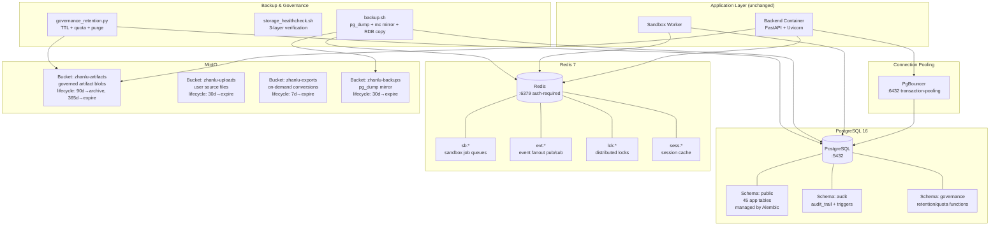

# Zhanlu Storage Architecture

Comprehensive reference for the Zhanlu production storage stack: naming conventions, data governance rules, and operational procedures.

---

## 1. Architecture Overview



### Storage Layer Responsibilities

| Layer | Role | Application Config |
|-------|------|-------------------|
| **PostgreSQL** | Primary relational store: users, chats, artifacts, plans, sandbox jobs, audit logs, cost ledger | `DATABASE_URL` (required, no default) |
| **Redis** | Job queues (sandbox), event fanout (pub/sub), distributed locks, ephemeral session cache | `REDIS_URL` (empty = disabled) |
| **MinIO/S3** | Object storage for artifact blobs (original/preview/thumbnail) when `ARTIFACT_STORAGE_BACKEND=minio` | `MINIO_ENDPOINT`, `MINIO_ACCESS_KEY`, `MINIO_SECRET_KEY`, `MINIO_BUCKET` |

### blob Storage Backends

The application's `BlobStorage` ABC supports two backends:

| Backend | Env Value | Storage Mechanism | Use Case |
|---------|-----------|------------------|----------|
| Postgres BYTEA | `postgres_bytea` | Inline binary in `artifact_blobs.data` column | Dev / SQLite-only environments |
| **MinIO** | `minio` | S3-compatible object storage, content-addressable path | **Production** |

**Production MUST use `minio`.** `postgres_bytea` stores binary blobs inside the relational database, causing table bloat, slow backups, and inefficient data access.

---

## 2. Naming Conventions

### 2.1 PostgreSQL

| Resource | Convention | Example |
|----------|-----------|---------|
| Database | Lowercase singular noun | `zhanlu` |
| Schema | Lowercase purpose descriptor | `public`, `audit`, `governance` |
| Tables | snake_case, plural | `artifact_versions`, `chat_messages` |
| Columns | snake_case, descriptive | `created_by_id`, `is_deleted` |
| Indexes | `ix_{table}_{columns}` | `ix_artifacts_org_id` |
| Unique constraints | `uq_{table}_{columns}` | `uq_users_email` |
| Foreign keys | `fk_{table}_{ref_table}` | `fk_artifacts_created_by_id` |
| Primary keys | `pk_{table}` | `pk_artifacts` |
| Roles | `zhanlu_{purpose}` | `zhanlu_app`, `zhanlu_migrate`, `zhanlu_readonly` |

### 2.2 Redis Keys

Pattern: `{namespace}:{entity}:{identifier}:{field}`

| Namespace | Purpose | Example Keys | Default TTL |
|-----------|---------|-------------|-------------|
| `sb` | Sandbox job queues and state | `sb:job:{job_id}`, `sb:queue:pending` | job_timeout + 300s |
| `evt` | Event fanout (pub/sub) | `evt:artifact:{artifact_id}` | 3600s |
| `lck` | Distributed locks | `lck:artifact:{artifact_id}:build` | 300s |
| `sess` | Session cache | `sess:{session_id}` | 1800s |
| `cache` | General application cache | `cache:user:{user_id}:prefs` | 600s |

### 2.3 MinIO

| Resource | Convention | Example |
|----------|-----------|---------|
| Buckets | `zhanlu-{purpose}` | `zhanlu-artifacts`, `zhanlu-uploads` |
| Object keys (artifacts) | `{org_id}/{app_id}/{artifact_id}/v{version}/{blob_type}/{checksum}.{ext}` | `default-org/default-app/art-001/v2/original/abc123.pdf` |
| Object keys (uploads) | `{org_id}/{app_id}/uploads/{yyyy}/{mm}/{uuid}.{ext}` | `default-org/default-app/uploads/2026/07/uuid.docx` |
| Object keys (exports) | `{org_id}/{app_id}/exports/{yyyy}/{mm}/{uuid}.{ext}` | `default-org/default-app/exports/2026/07/uuid.pptx` |
| Service accounts | `zhanlu-{purpose}` | `zhanlu-app` (application R/W) |

### 2.4 Backups

| Resource | Pattern | Example |
|----------|---------|---------|
| PostgreSQL dump | `zhanlu-pg-{YYYYMMDD-HHMMSS}.dump` | `zhanlu-pg-20260720-030000.dump` |
| Redis RDB snapshot | `zhanlu-redis-{YYYYMMDD-HHMMSS}.rdb` | `zhanlu-redis-20260720-030000.rdb` |
| MinIO mirror | `mirror-{YYYYMMDD-HHMMSS}/` | `mirror-20260720-030000/` |

### 2.5 Docker Resources

| Resource | Convention | Example |
|----------|-----------|---------|
| Containers | `zhanlu-{service}` | `zhanlu-backend`, `zhanlu-postgres` |
| Networks | `{purpose}_net` | `app_net`, `data_net` |
| Volumes | `{service}_data` | `postgres_data`, `redis_data` |

---

## 3. Data Governance Rules

### 3.1 Audit Trail

Every INSERT, UPDATE, or DELETE on any application table is logged to `audit.audit_trail` via PostgreSQL triggers. This is enforced at the **database level** — it cannot be bypassed by direct SQL access or application bugs.

**Schema:**

```sql
audit.audit_trail (
    id            UUID PRIMARY KEY DEFAULT uuid_generate_v4(),
    table_name    TEXT NOT NULL,
    record_id     TEXT NOT NULL,          -- primary key of the affected row
    action        TEXT NOT NULL,          -- 'INSERT', 'UPDATE', 'DELETE'
    old_data      JSONB,                  -- row state BEFORE change (NULL for INSERT)
    new_data      JSONB,                  -- row state AFTER change (NULL for DELETE)
    changed_by    TEXT NOT NULL,          -- session_user
    changed_at    TIMESTAMPTZ NOT NULL DEFAULT now(),
    client_addr   INET                    -- originating connection IP
);
```

- **Retention**: Audit trail records are kept indefinitely. Purge only via explicit admin action.
- **Immutability**: No UPDATE or DELETE is permitted on `audit.audit_trail`. Only INSERT.
- **Read access**: `zhanlu_readonly` and `zhanlu_app` roles can SELECT. Only `zhanlu_migrate` can manage schema.

### 3.2 Retention Policy

| Data Type | Retention Window | Action on Expiry |
|-----------|-----------------|-----------------|
| Soft-deleted records | 30 days | Permanent purge |
| Expired DataSnapshots | 7 days | Archive or delete |
| Sandbox temporary files | 24 hours | File deletion |
| Completed sandbox jobs | 90 days | Archive metadata, delete temp |
| Artifact blobs (MinIO) | 90 days → archive tier, 365 days → expire | Lifecycle policy |
| Upload files (MinIO) | 30 days → expire | Lifecycle policy |
| Export files (MinIO) | 7 days → expire | Lifecycle policy |
| Backups (MinIO mirror) | 30 days → expire | Lifecycle policy on backup bucket |
| Audit trail | Indefinite | Manual purge only |

### 3.3 Quota Enforcement

Per-organization storage quotas enforced via `governance.check_quota()`:

| Resource | Default Quota | Scope |
|----------|--------------|-------|
| Artifact blobs | 5 GB | Per org (`org_id`) |
| Upload files | 1 GB | Per org (`org_id`) |
| Sandbox output | 500 MB | Per job run |

Quota checks run as PostgreSQL BEFORE INSERT triggers on `artifact_blobs` and lookup queries on `user_files`.

### 3.4 Integrity Verification

- **Artifact Blob checksums**: SHA-256 computed on write, verified on every read via `MinioBlobStorage`. Mismatch raises an error and logs to audit trail.
- **DataSnapshot checksums**: SHA-256 of serialized snapshot data, verified on access.
- **Quarterly full scan**: `storage_healthcheck.sh` includes an optional `--integrity` flag that recomputes checksums for all blobs and compares against stored values.

### 3.5 Access Control

| Layer | Rule |
|-------|------|
| PostgreSQL | Least-privilege roles: `zhanlu_app` (R/W data, no DDL), `zhanlu_readonly` (SELECT only), `zhanlu_migrate` (DDL for Alembic). No public schema usage. |
| PgBouncer | Authenticates via `userlist.txt` before proxying to PostgreSQL. `auth_type = plain`. |
| Redis | Password required (`requirepass`). `protected-mode yes`. Dangerous commands (`FLUSHALL`, `FLUSHDB`, `CONFIG`, `DEBUG`) renamed to empty string (disabled). |
| MinIO | **NO anonymous access** (removed `mc anonymous set download`). Dedicated `zhanlu-app` service account. All operations use signed URLs. |

---

## 4. Backup and Restore

### 4.1 Backup Schedule

| Layer | Frequency | Method | Retention |
|-------|-----------|--------|-----------|
| PostgreSQL | Daily @ 03:00 | `pg_dump --format=custom` | 30 days local, 30 days MinIO mirror |
| Redis | Every 6 hours | Copy RDB from `redis_data` volume | 7 days local |
| MinIO artifacts | Weekly Sunday | `mc mirror` to `zhanlu-backups` bucket | 30 days |

### 4.2 Backup Procedure

```bash
# Full backup (all three layers)
make backup

# Layer-specific backup
./scripts/backup.sh --layer pg
./scripts/backup.sh --layer redis
./scripts/backup.sh --layer minio
```

### 4.3 Restore Procedure

```bash
# Restore from latest backup
make restore

# Layer-specific restore
./scripts/restore.sh --layer pg --file ./backups/zhanlu-pg-20260720-030000.dump
./scripts/restore.sh --layer redis --file ./backups/zhanlu-redis-20260720-030000.rdb
./scripts/restore.sh --layer minio --file mirror-20260720-030000/
```

**Restore requires confirmation prompt** to prevent accidental data loss.

---

## 5. Health Check

```bash
# Quick health check (all layers)
make healthcheck

# Verbose check with integrity verification
./scripts/storage_healthcheck.sh --verbose --integrity
```

Health check verifies:
- **PostgreSQL**: connection, table count, migration head, replication lag (if applicable)
- **Redis**: AUTH ping, memory usage, key count, disabled dangerous commands
- **MinIO**: connection, bucket listing, lifecycle policies applied, bucket policy audit

---

## 6. Operational Runbook

### 6.1 Daily Operations

| Task | Command | Frequency |
|------|---------|-----------|
| Health check | `make healthcheck` | Daily |
| Backup | `make backup` | Daily automated |
| Retention enforcement | `make governance` | Daily automated |

### 6.2 Common Issues

| Symptom | Check | Fix |
|---------|-------|-----|
| Backend can't connect to DB | `make healthcheck` | Verify PgBouncer is up, PG credentials in `.env` |
| Slow queries | `pg_stat_statements` in PostgreSQL | Tune indexes, check `postgresql.conf` settings |
| Redis memory full | `redis-cli INFO memory` | Increase `maxmemory` or add eviction policy for cache namespace |
| MinIO bucket not found | `make healthcheck` | Ensure `minio-init` container completed successfully |
| Artifact blob read error | `mc ls zhanlu/zhanlu-artifacts/` | Run `storage_healthcheck.sh --integrity` |

### 6.3 Scaling Considerations

| Layer | When to Scale | How |
|-------|--------------|-----|
| PostgreSQL | >80% CPU, >2GB data | Upgrade instance, add read replicas for analytics |
| Redis | >200MB used of maxmemory | Increase `maxmemory`, consider Redis Cluster |
| MinIO | >50GB stored | Add MinIO nodes for distributed mode |
| PgBouncer | Connection wait time >100ms | Increase `default_pool_size` |

---

## 7. File Inventory

All infrastructure files in the project:

```
zhanlu/
├── docs/
│   └── storage-architecture.md          # This document
├── infra/
│   ├── postgres/
│   │   ├── init.sql                     # Bootstrap: schemas, roles, extensions, audit table
│   │   ├── postgresql.conf              # PostgreSQL tuning for container
│   │   └── governance.sql              # Audit triggers, retention, quota functions
│   ├── pgbouncer/
│   │   ├── pgbouncer.ini                # Transaction-pooling config
│   │   └── userlist.txt                # User credentials mapping
│   ├── redis/
│   │   └── redis.conf                   # Auth, security, namespacing
│   └── minio/
│       ├── init.sh                      # Multi-bucket creation, lifecycle, service account
│       ├── lifecycle-artifacts.json     # 90d→archive, 365d→expire
│       ├── lifecycle-uploads.json       # 30d→expire
│       └── lifecycle-exports.json       # 7d→expire
├── scripts/
│   ├── backup.sh                        # Backup all layers
│   ├── restore.sh                       # Restore any layer
│   ├── storage_healthcheck.sh           # 3-layer verification
│   └── governance_retention.py          # Retention + quota enforcement
├── .env.production                      # Production env template
├── docker-compose.yml                   # Hardened compose with PgBouncer
├── backend/alembic.ini                  # Fixed default URL
└── Makefile                             # backup, restore, healthcheck, governance targets
```
